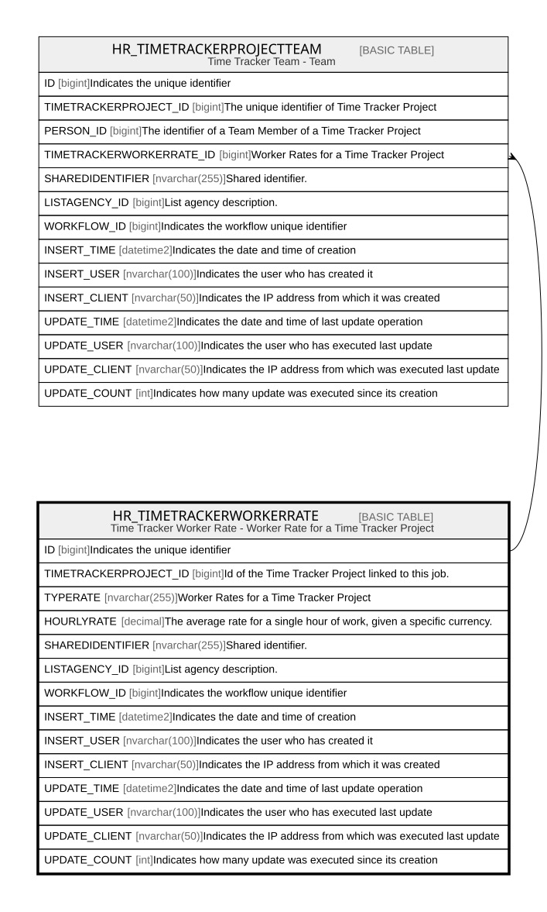

# HR_TIMETRACKERWORKERRATE

## Description

Time Tracker Worker Rate - Worker Rate for a Time Tracker Project  

## Columns

| Name | Type | Default | Nullable | Children | Comment |
| ---- | ---- | ------- | -------- | -------- | ------- |
| ID | bigint |  | false | [HR_TIMETRACKERPROJECTTEAM](HR_TIMETRACKERPROJECTTEAM.md) | Indicates the unique identifier |
| TIMETRACKERPROJECT_ID | bigint |  | false |  | Id of the Time Tracker Project linked to this job. |
| TYPERATE | nvarchar(255) |  | true |  | Worker Rates for a Time Tracker Project |
| HOURLYRATE | decimal |  | true |  | The average rate for a single hour of work, given a specific currency. |
| SHAREDIDENTIFIER | nvarchar(255) |  | true |  | Shared identifier. |
| LISTAGENCY_ID | bigint |  | true |  | List agency description. |
| WORKFLOW_ID | bigint |  | true |  | Indicates the workflow unique identifier |
| INSERT_TIME | datetime2 | (sysutcdatetime()) | false |  | Indicates the date and time of creation |
| INSERT_USER | nvarchar(100) | (N'MAIN') | false |  | Indicates the user who has created it |
| INSERT_CLIENT | nvarchar(50) | (N'localhost') | false |  | Indicates the IP address from which it was created |
| UPDATE_TIME | datetime2 | (sysutcdatetime()) | false |  | Indicates the date and time of last update operation |
| UPDATE_USER | nvarchar(100) | (N'MAIN') | false |  | Indicates the user who has executed last update |
| UPDATE_CLIENT | nvarchar(50) | (N'localhost') | false |  | Indicates the IP address from which was executed last update |
| UPDATE_COUNT | int | ((0)) | false |  | Indicates how many update was executed since its creation |

## Constraints

| Name | Type | Definition |
| ---- | ---- | ---------- |
| PK_HR_TIMETRACKERWORKERRATE | PRIMARY KEY | CLUSTERED, unique, part of a PRIMARY KEY constraint, [ ID ] |

## Indexes

| Name | Definition |
| ---- | ---------- |
| PK_HR_TIMETRACKERWORKERRATE | CLUSTERED, unique, part of a PRIMARY KEY constraint, [ ID ] |

## Relations

---

> Generated by [tbls](https://github.com/k1LoW/tbls)
