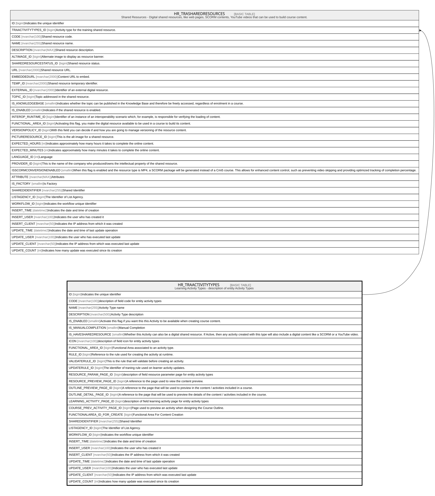

# HR_TRAACTIVITYTYPES

## Description

Learning Activity Types - description of entity Activity Types  

## Columns

| Name | Type | Default | Nullable | Children | Comment |
| ---- | ---- | ------- | -------- | -------- | ------- |
| ID | bigint |  | false | [HR_TRASHAREDRESOURCES](HR_TRASHAREDRESOURCES.md) | Indicates the unique identifier |
| CODE | nvarchar(100) |  | false |  | description of field code for entity activity types |
| NAME | nvarchar(255) |  | false |  | Activity Type name |
| DESCRIPTION | nvarchar(500) |  | true |  | Activity Type description |
| IS_ENABLED | smallint |  | true |  | Activate this flag if you want this this Activity to be available when creating course content. |
| IS_MANUALCOMPLETION | smallint |  | true |  | Manual Completion |
| IS_HAVESHAREDRESOURCE | smallint |  | true |  | Whether this Activity can also be a digital shared resource. If Active, then any activity created with this type will also include a digital content like a SCORM or a YouTube video. |
| ICON | nvarchar(100) |  | true |  | description of field icon for entity activity types |
| FUNCTIONAL_AREA_ID | bigint |  | true |  | Functional Area associated to an activity type. |
| RULE_ID | bigint |  | true |  | Reference to the rule used for creating the activity at runtime. |
| VALIDATERULE_ID | bigint |  | true |  | This is the rule that will validate before creating an activity. |
| UPDATERULE_ID | bigint |  | true |  | The identifier of traning rule used on learner activity updates. |
| RESOURCE_PARAM_PAGE_ID | bigint |  | true |  | description of field resource parameter page for entity activity types |
| RESOURCE_PREVIEW_PAGE_ID | bigint |  | true |  | A reference to the page used to view the content preview. |
| OUTLINE_PREVIEW_PAGE_ID | bigint |  | true |  | A reference to the page that will be used to preview in the content / activities included in a course. |
| OUTLINE_DETAIL_PAGE_ID | bigint |  | true |  | A reference to the page that will be used to preview the details of the content / activities included in the course. |
| LEARNING_ACTIVITY_PAGE_ID | bigint |  | true |  | description of field learning activity page for entity activity types |
| COURSE_PREV_ACTIVITY_PAGE_ID | bigint |  | true |  | Page used to preview an activity when designing the Course Outline. |
| FUNCTIONALAREA_ID_FOR_CREATE | bigint |  | true |  | Functional Area For Content Creation |
| SHAREDIDENTIFIER | nvarchar(255) |  | true |  | Shared Identifier |
| LISTAGENCY_ID | bigint |  | true |  | The Identifier of List Agency. |
| WORKFLOW_ID | bigint |  | true |  | Indicates the workflow unique identifier |
| INSERT_TIME | datetime2 |  | false |  | Indicates the date and time of creation |
| INSERT_USER | nvarchar(100) |  | false |  | Indicates the user who has created it |
| INSERT_CLIENT | nvarchar(50) |  | false |  | Indicates the IP address from which it was created |
| UPDATE_TIME | datetime2 |  | false |  | Indicates the date and time of last update operation |
| UPDATE_USER | nvarchar(100) |  | false |  | Indicates the user who has executed last update |
| UPDATE_CLIENT | nvarchar(50) |  | false |  | Indicates the IP address from which was executed last update |
| UPDATE_COUNT | int |  | false |  | Indicates how many update was executed since its creation |

## Constraints

| Name | Type | Definition |
| ---- | ---- | ---------- |
| PK_HR_TRAACTIVITYTYPES | PRIMARY KEY | CLUSTERED, unique, part of a PRIMARY KEY constraint, [ ID ] |
| UQ_HR_TRAACTIVITYTYPES | UNIQUE | NONCLUSTERED, unique, part of a UNIQUE constraint, [ CODE ] |

## Indexes

| Name | Definition |
| ---- | ---------- |
| PK_HR_TRAACTIVITYTYPES | CLUSTERED, unique, part of a PRIMARY KEY constraint, [ ID ] |
| UQ_HR_TRAACTIVITYTYPES | NONCLUSTERED, unique, part of a UNIQUE constraint, [ CODE ] |

## Relations

---

> Generated by [tbls](https://github.com/k1LoW/tbls)
