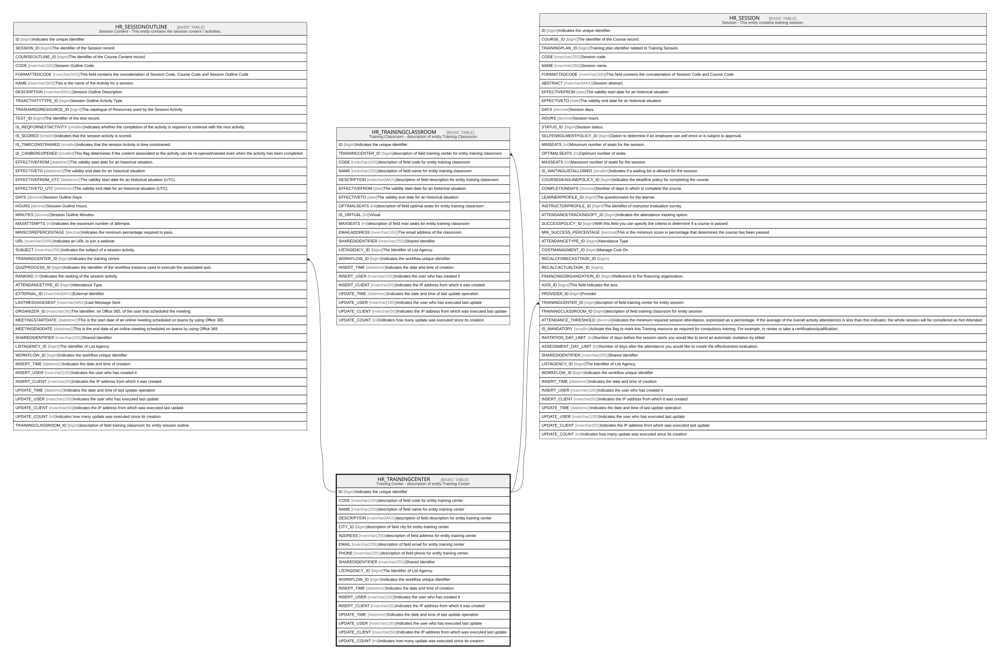

# HR_TRAININGCENTER

## Description

Training Center - description of entity Training Center  

## Columns

| Name | Type | Default | Nullable | Children | Comment |
| ---- | ---- | ------- | -------- | -------- | ------- |
| ID | bigint |  | false | [HR_SESSIONOUTLINE](HR_SESSIONOUTLINE.md) [HR_TRAININGCLASSROOM](HR_TRAININGCLASSROOM.md) [HR_SESSION](HR_SESSION.md) | Indicates the unique identifier |
| CODE | nvarchar(100) |  | false |  | description of field code for entity training center |
| NAME | nvarchar(255) |  | true |  | description of field name for entity training center |
| DESCRIPTION | nvarchar(MAX) |  | true |  | description of field description for entity training center |
| CITY_ID | bigint |  | true |  | description of field city for entity training center |
| ADDRESS | nvarchar(255) |  | true |  | description of field address for entity training center |
| EMAIL | nvarchar(255) |  | true |  | description of field email for entity training center |
| PHONE | nvarchar(255) |  | true |  | description of field phone for entity training center |
| SHAREDIDENTIFIER | nvarchar(255) |  | true |  | Shared Identifier |
| LISTAGENCY_ID | bigint |  | true |  | The Identifier of List Agency. |
| WORKFLOW_ID | bigint |  | true |  | Indicates the workflow unique identifier |
| INSERT_TIME | datetime2 | (sysutcdatetime()) | false |  | Indicates the date and time of creation |
| INSERT_USER | nvarchar(100) | (N'MAIN') | false |  | Indicates the user who has created it |
| INSERT_CLIENT | nvarchar(50) | (N'localhost') | false |  | Indicates the IP address from which it was created |
| UPDATE_TIME | datetime2 | (sysutcdatetime()) | false |  | Indicates the date and time of last update operation |
| UPDATE_USER | nvarchar(100) | (N'MAIN') | false |  | Indicates the user who has executed last update |
| UPDATE_CLIENT | nvarchar(50) | (N'localhost') | false |  | Indicates the IP address from which was executed last update |
| UPDATE_COUNT | int | ((0)) | false |  | Indicates how many update was executed since its creation |

## Constraints

| Name | Type | Definition |
| ---- | ---- | ---------- |
| PK_HR_TRAININGCENTER | PRIMARY KEY | CLUSTERED, unique, part of a PRIMARY KEY constraint, [ ID ] |
| UQ_HR_TRAININGCENTER | UNIQUE | NONCLUSTERED, unique, part of a UNIQUE constraint, [ CODE ] |

## Indexes

| Name | Definition |
| ---- | ---------- |
| PK_HR_TRAININGCENTER | CLUSTERED, unique, part of a PRIMARY KEY constraint, [ ID ] |
| UQ_HR_TRAININGCENTER | NONCLUSTERED, unique, part of a UNIQUE constraint, [ CODE ] |

## Relations

---

> Generated by [tbls](https://github.com/k1LoW/tbls)
