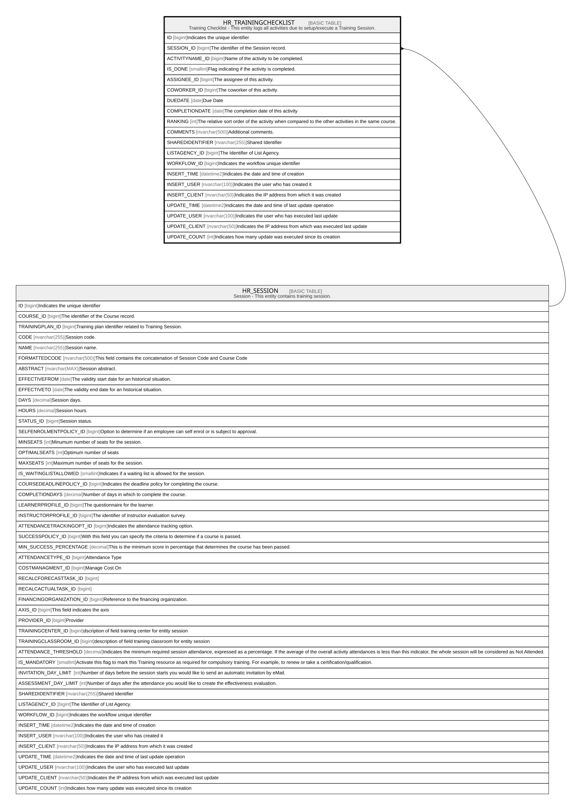

# HR_TRAININGCHECKLIST

## Description

Training Checklist - This entity logs all activities due to setup/execute a Training Session.  

## Columns

| Name | Type | Default | Nullable | Parents | Comment |
| ---- | ---- | ------- | -------- | ------- | ------- |
| ID | bigint |  | false |  | Indicates the unique identifier |
| SESSION_ID | bigint |  | false | [HR_SESSION](HR_SESSION.md) | The identifier of the Session record. |
| ACTIVITYNAME_ID | bigint |  | false |  | Name of the activity to be completed. |
| IS_DONE | smallint |  | false |  | Flag indicating if the activity is completed. |
| ASSIGNEE_ID | bigint |  | true |  | The assignee of this activity. |
| COWORKER_ID | bigint |  | true |  | The coworker of this activity. |
| DUEDATE | date |  | true |  | Due Date |
| COMPLETIONDATE | date |  | true |  | The completion date of this activity |
| RANKING | int |  | true |  | The relative sort order of the activity when compared to the other activities in the same course. |
| COMMENTS | nvarchar(500) |  | true |  | Additional comments. |
| SHAREDIDENTIFIER | nvarchar(255) |  | true |  | Shared Identifier |
| LISTAGENCY_ID | bigint |  | true |  | The Identifier of List Agency. |
| WORKFLOW_ID | bigint |  | true |  | Indicates the workflow unique identifier |
| INSERT_TIME | datetime2 |  | false |  | Indicates the date and time of creation |
| INSERT_USER | nvarchar(100) |  | false |  | Indicates the user who has created it |
| INSERT_CLIENT | nvarchar(50) |  | false |  | Indicates the IP address from which it was created |
| UPDATE_TIME | datetime2 |  | false |  | Indicates the date and time of last update operation |
| UPDATE_USER | nvarchar(100) |  | false |  | Indicates the user who has executed last update |
| UPDATE_CLIENT | nvarchar(50) |  | false |  | Indicates the IP address from which was executed last update |
| UPDATE_COUNT | int |  | false |  | Indicates how many update was executed since its creation |

## Constraints

| Name | Type | Definition |
| ---- | ---- | ---------- |
| PK__HR_TRAIN__3214EC27CC553769 | PRIMARY KEY | CLUSTERED, unique, part of a PRIMARY KEY constraint, [ ID ] |
| FK__HR_TRAINI__SESSI__375CC467 | FOREIGN KEY | FOREIGN KEY(SESSION_ID) REFERENCES HR_SESSION(ID) ON UPDATE NO_ACTION ON DELETE CASCADE |

## Indexes

| Name | Definition |
| ---- | ---------- |
| PK__HR_TRAIN__3214EC27CC553769 | CLUSTERED, unique, part of a PRIMARY KEY constraint, [ ID ] |

## Relations

---

> Generated by [tbls](https://github.com/k1LoW/tbls)
