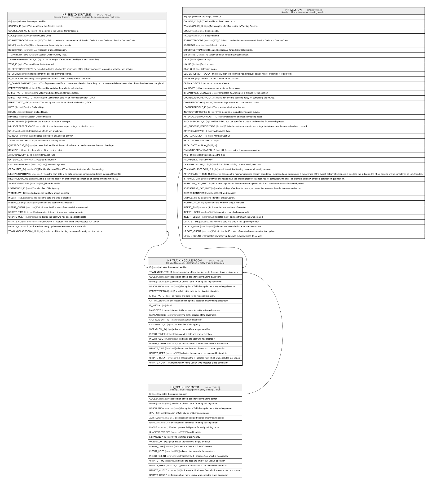

# HR_TRAININGCLASSROOM

## Description

Training Classroom - description of entity Training Classroom  

## Columns

| Name | Type | Default | Nullable | Children | Parents | Comment |
| ---- | ---- | ------- | -------- | -------- | ------- | ------- |
| ID | bigint |  | false | [HR_SESSIONOUTLINE](HR_SESSIONOUTLINE.md) [HR_SESSION](HR_SESSION.md) |  | Indicates the unique identifier |
| TRAININGCENTER_ID | bigint |  | true |  | [HR_TRAININGCENTER](HR_TRAININGCENTER.md) | description of field training center for entity training classroom |
| CODE | nvarchar(100) |  | false |  |  | description of field code for entity training classroom |
| NAME | nvarchar(255) |  | true |  |  | description of field name for entity training classroom |
| DESCRIPTION | nvarchar(MAX) |  | true |  |  | description of field description for entity training classroom |
| EFFECTIVEFROM | date |  | true |  |  | The validity start date for an historical situation. |
| EFFECTIVETO | date |  | true |  |  | The validity end date for an historical situation. |
| OPTIMALSEATS | int |  | true |  |  | description of field optimal seats for entity training classroom |
| IS_VIRTUAL | int |  | true |  |  | Virtual |
| MAXSEATS | int |  | true |  |  | description of field max seats for entity training classroom |
| EMAILADDRESS | nvarchar(100) |  | true |  |  | The email address of the classroom. |
| SHAREDIDENTIFIER | nvarchar(255) |  | true |  |  | Shared Identifier |
| LISTAGENCY_ID | bigint |  | true |  |  | The Identifier of List Agency. |
| WORKFLOW_ID | bigint |  | true |  |  | Indicates the workflow unique identifier |
| INSERT_TIME | datetime2 | (sysutcdatetime()) | false |  |  | Indicates the date and time of creation |
| INSERT_USER | nvarchar(100) | (N'MAIN') | false |  |  | Indicates the user who has created it |
| INSERT_CLIENT | nvarchar(50) | (N'localhost') | false |  |  | Indicates the IP address from which it was created |
| UPDATE_TIME | datetime2 | (sysutcdatetime()) | false |  |  | Indicates the date and time of last update operation |
| UPDATE_USER | nvarchar(100) | (N'MAIN') | false |  |  | Indicates the user who has executed last update |
| UPDATE_CLIENT | nvarchar(50) | (N'localhost') | false |  |  | Indicates the IP address from which was executed last update |
| UPDATE_COUNT | int | ((0)) | false |  |  | Indicates how many update was executed since its creation |

## Constraints

| Name | Type | Definition |
| ---- | ---- | ---------- |
| PK_HR_TRAININGCLASSROOM | PRIMARY KEY | CLUSTERED, unique, part of a PRIMARY KEY constraint, [ ID ] |
| UQ_HR_TRAININGCLASSROOM | UNIQUE | NONCLUSTERED, unique, part of a UNIQUE constraint, [ CODE, TRAININGCENTER_ID ] |
| FK_TRACLASSROOM_TRACENTER | FOREIGN KEY | FOREIGN KEY(TRAININGCENTER_ID) REFERENCES HR_TRAININGCENTER(ID) ON UPDATE NO_ACTION ON DELETE CASCADE |

## Indexes

| Name | Definition |
| ---- | ---------- |
| PK_HR_TRAININGCLASSROOM | CLUSTERED, unique, part of a PRIMARY KEY constraint, [ ID ] |
| UQ_HR_TRAININGCLASSROOM | NONCLUSTERED, unique, part of a UNIQUE constraint, [ CODE, TRAININGCENTER_ID ] |

## Relations

---

> Generated by [tbls](https://github.com/k1LoW/tbls)
