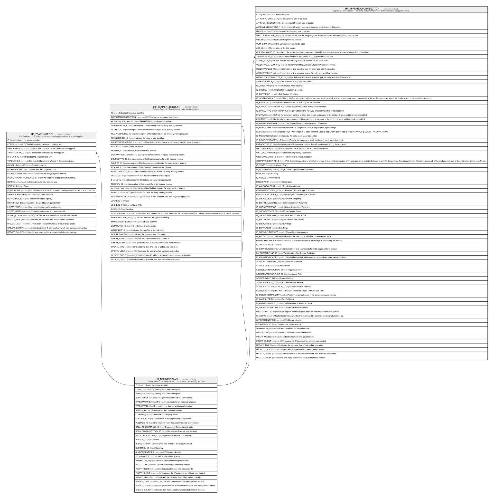

# HR_TRAININGPLAN

## Description

Training Plan - This entity will be a container for the Training Request  

## Columns

| Name | Type | Default | Nullable | Children | Comment |
| ---- | ---- | ------- | -------- | -------- | ------- |
| ID | bigint |  | false | [HR_TRAININGPOOL](HR_TRAININGPOOL.md) [HR_TRAININGREQUEST](HR_TRAININGREQUEST.md) [HR_APPRAISALFORMSECTION](HR_APPRAISALFORMSECTION.md) | Indicates the unique identifier |
| CODE | nvarchar(100) |  | false |  | Training Plan Code description |
| NAME | nvarchar(255) |  | false |  | Training Plan Code description |
| DESCRIPTION | nvarchar(MAX) |  | true |  | Training Plan field description desc. |
| EFFECTIVEFROM | date |  | true |  | The validity start date for an historical situation. |
| EFFECTIVETO | date |  | true |  | The validity end date for an historical situation. |
| STATUS_ID | bigint |  | true |  | Training Plan field status description. |
| COMPANY_ID | bigint |  | true |  | Identifier of Company record. |
| ORGUNIT_ID | bigint |  | true |  | The identifier of the organizational unit record. |
| PULLTASK_ID | bigint |  | true |  | Pull Request From Regulatory Training Task Identifier |
| RECALCBUDGETTASK_ID | bigint |  | true |  | Recalculate Budget task identifier |
| RECALCFORECASTTASK_ID | bigint |  | true |  | Recalculate Forecast task identifier |
| RECALCACTUALTASK_ID | bigint |  | true |  | Recalculate Actual task identifier |
| REASON_ID | bigint |  | true |  | Reason |
| BUDGETAMOUNT | decimal |  | true |  | This field indicates the budget amount |
| CURRENCY_ID | bigint |  | true |  | Currency |
| SHAREDIDENTIFIER | nvarchar(255) |  | true |  | Shared Identifier |
| LISTAGENCY_ID | bigint |  | true |  | The Identifier of List Agency. |
| WORKFLOW_ID | bigint |  | true |  | Indicates the workflow unique identifier |
| INSERT_TIME | datetime2 | (sysutcdatetime()) | false |  | Indicates the date and time of creation |
| INSERT_USER | nvarchar(100) | (N'MAIN') | false |  | Indicates the user who has created it |
| INSERT_CLIENT | nvarchar(50) | (N'localhost') | false |  | Indicates the IP address from which it was created |
| UPDATE_TIME | datetime2 | (sysutcdatetime()) | false |  | Indicates the date and time of last update operation |
| UPDATE_USER | nvarchar(100) | (N'MAIN') | false |  | Indicates the user who has executed last update |
| UPDATE_CLIENT | nvarchar(50) | (N'localhost') | false |  | Indicates the IP address from which was executed last update |
| UPDATE_COUNT | int | ((0)) | false |  | Indicates how many update was executed since its creation |

## Constraints

| Name | Type | Definition |
| ---- | ---- | ---------- |
| PK_HR_TRAININGPLAN | PRIMARY KEY | CLUSTERED, unique, part of a PRIMARY KEY constraint, [ ID ] |
| UQ_HR_TRAININGPLAN | UNIQUE | NONCLUSTERED, unique, part of a UNIQUE constraint, [ CODE ] |

## Indexes

| Name | Definition |
| ---- | ---------- |
| PK_HR_TRAININGPLAN | CLUSTERED, unique, part of a PRIMARY KEY constraint, [ ID ] |
| UQ_HR_TRAININGPLAN | NONCLUSTERED, unique, part of a UNIQUE constraint, [ CODE ] |

## Relations

---

> Generated by [tbls](https://github.com/k1LoW/tbls)
