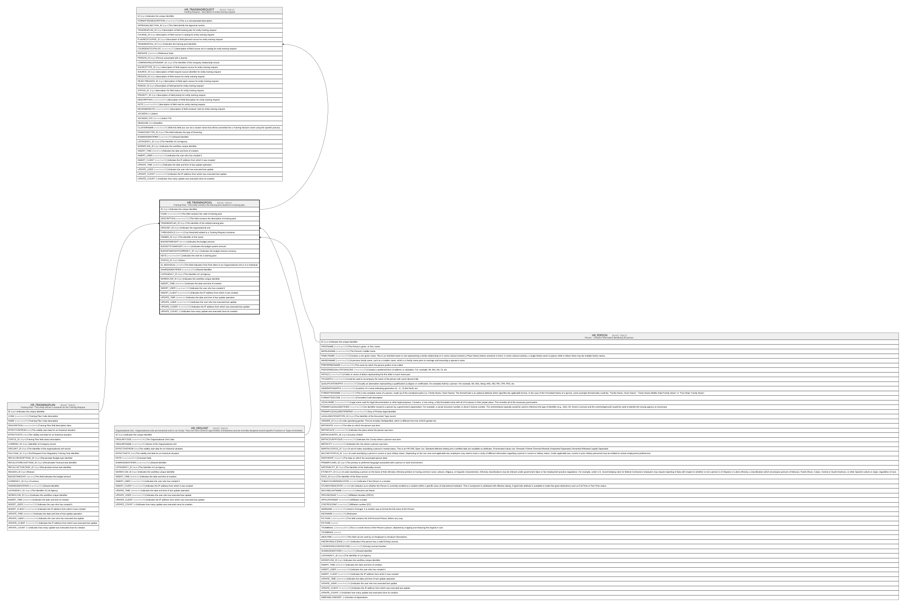

# HR_TRAININGPOOL

## Description

Training Pool - This entity contains the training pool related to a training plan.  

## Columns

| Name | Type | Default | Nullable | Children | Parents | Comment |
| ---- | ---- | ------- | -------- | -------- | ------- | ------- |
| ID | bigint |  | false | [HR_TRAININGREQUEST](HR_TRAININGREQUEST.md) |  | Indicates the unique identifier |
| CODE | nvarchar(100) |  | false |  |  | This field contains the code of training pool. |
| DESCRIPTION | nvarchar(255) |  | false |  |  | This field contains the description of training pool. |
| TRAININGPLAN_ID | bigint |  | false |  | [HR_TRAININGPLAN](HR_TRAININGPLAN.md) | The identifier of the related training plan. |
| ORGUNIT_ID | bigint |  | true |  | [HR_ORGUNIT](HR_ORGUNIT.md) | Indicates the organizational unit. |
| THREASHOLD | decimal |  | true |  |  | Cost threshold related to a Training Request container. |
| OWNER_ID | bigint |  | false |  | [HR_PERSON](HR_PERSON.md) | The identifier of the owner. |
| BUDGETAMOUNT | decimal |  | true |  |  | Indicates the budget amount. |
| BUDGETSYSAMOUNT | decimal |  | true |  |  | Indicates the budget system amount. |
| BUDGETAMOUNTCURRENCY_ID | bigint |  | true |  |  | Indicates the budget amount currency. |
| NOTE | nvarchar(MAX) |  | true |  |  | Indicates the note for a training pool. |
| STATUS_ID | bigint |  | true |  |  | Status |
| IS_INDIVIDUAL | smallint |  | true |  |  | This field indicates if the Pool refers to an Organizational Unit or it is Individual |
| SHAREDIDENTIFIER | nvarchar(255) |  | true |  |  | Shared Identifier |
| LISTAGENCY_ID | bigint |  | true |  |  | The Identifier of List Agency. |
| WORKFLOW_ID | bigint |  | true |  |  | Indicates the workflow unique identifier |
| INSERT_TIME | datetime2 | (sysutcdatetime()) | false |  |  | Indicates the date and time of creation |
| INSERT_USER | nvarchar(100) | (N'MAIN') | false |  |  | Indicates the user who has created it |
| INSERT_CLIENT | nvarchar(50) | (N'localhost') | false |  |  | Indicates the IP address from which it was created |
| UPDATE_TIME | datetime2 | (sysutcdatetime()) | false |  |  | Indicates the date and time of last update operation |
| UPDATE_USER | nvarchar(100) | (N'MAIN') | false |  |  | Indicates the user who has executed last update |
| UPDATE_CLIENT | nvarchar(50) | (N'localhost') | false |  |  | Indicates the IP address from which was executed last update |
| UPDATE_COUNT | int | ((0)) | false |  |  | Indicates how many update was executed since its creation |

## Constraints

| Name | Type | Definition |
| ---- | ---- | ---------- |
| PK_TRAININGPOOL | PRIMARY KEY | CLUSTERED, unique, part of a PRIMARY KEY constraint, [ ID ] |
| FK_TRAININGPOOL_ORGUNIT | FOREIGN KEY | FOREIGN KEY(ORGUNIT_ID) REFERENCES HR_ORGUNIT(ID) ON UPDATE NO_ACTION ON DELETE NO_ACTION |
| FK_TRAININGPOOL_PERSON | FOREIGN KEY | FOREIGN KEY(OWNER_ID) REFERENCES HR_PERSON(ID) ON UPDATE NO_ACTION ON DELETE NO_ACTION |
| FK_TRAININGPOOL_TRAININGPLAN | FOREIGN KEY | FOREIGN KEY(TRAININGPLAN_ID) REFERENCES HR_TRAININGPLAN(ID) ON UPDATE NO_ACTION ON DELETE CASCADE |

## Indexes

| Name | Definition |
| ---- | ---------- |
| PK_TRAININGPOOL | CLUSTERED, unique, part of a PRIMARY KEY constraint, [ ID ] |

## Relations

---

> Generated by [tbls](https://github.com/k1LoW/tbls)
