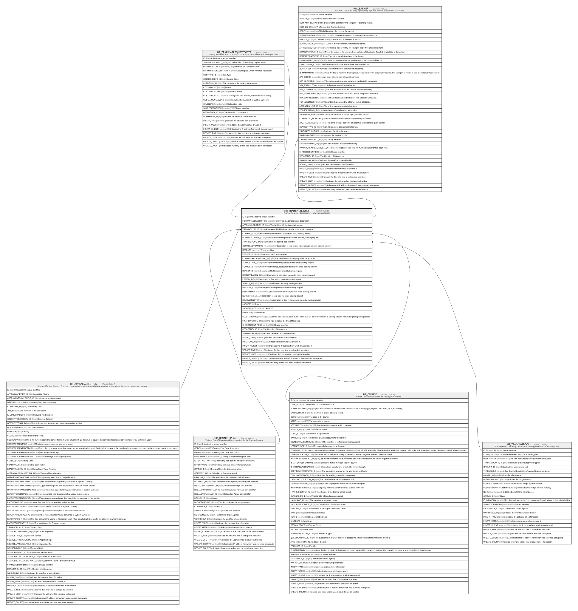

# HR_TRAININGREQUEST

## Description

Training Request - description of entity training request  

## Columns

| Name | Type | Default | Nullable | Children | Parents | Comment |
| ---- | ---- | ------- | -------- | -------- | ------- | ------- |
| ID | bigint |  | false | [HR_TRAININGREQUESTCOSTS](HR_TRAININGREQUESTCOSTS.md) [HR_LEARNER](HR_LEARNER.md) |  | Indicates the unique identifier |
| FORMATTEDDESCRIPTION | nvarchar(255) |  | true |  |  | This is a concatenated description. |
| APPRAISALSECTION_ID | bigint |  | true |  | [HR_APPRAISALSECTION](HR_APPRAISALSECTION.md) | This field identify the Appraisal section. |
| TRAININGPLAN_ID | bigint |  | false |  | [HR_TRAININGPLAN](HR_TRAININGPLAN.md) | description of field training plan for entity training request |
| COURSE_ID | bigint |  | true |  | [HR_COURSE](HR_COURSE.md) | description of field course in catalog for entity training request |
| PLANNEDCOURSE_ID | bigint |  | true |  |  | description of field planned course for entity training request |
| TRAININGPOOL_ID | bigint |  | true |  | [HR_TRAININGPOOL](HR_TRAININGPOOL.md) | Indicates the training pool identifier. |
| COURSENOTCATALOG | nvarchar(255) |  | true |  |  | description of field course not in catalog for enity training request |
| REFDATE | datetime2 |  | true |  |  | Reference Date |
| PERSON_ID | bigint |  | true |  |  | Person associated with a learner. |
| COMPANYRELATIONSHIP_ID | bigint |  | true |  |  | The identifier of the company relationship record. |
| SOURCETYPE_ID | bigint |  | true |  |  | description of field request source for entity training request |
| SOURCE_ID | bigint |  | true |  |  | description of field request source identifier for entity training request |
| REASON_ID | bigint |  | true |  |  | description of field reason for entity training request |
| REJECTREASON_ID | bigint |  | true |  |  | description of field reject reason for entity training request |
| PERIOD_ID | bigint |  | true |  |  | Description of field period for entity training request |
| STATUS_ID | bigint |  | true |  |  | description for field status for entity training request |
| PRIORITY_ID | bigint |  | true |  |  | description of field priority for entity training request |
| DESCRIPTION | nvarchar(MAX) |  | true |  |  | description of field description for entity training request |
| NOTE | nvarchar(MAX) |  | true |  |  | description of field note for entity training request |
| REVIEWERNOTE | nvarchar(MAX) |  | true |  |  | description of field reviewer note for entity training request |
| JOCKERS | int |  | true |  |  | Jokers |
| JOCKERS_FTE | decimal |  | true |  |  | Joker FTE |
| DEADLINE | date |  | true |  |  | Deadline |
| CLUSTERNAME | nvarchar(255) |  | true |  |  | With this field you can set a cluster name that will be converted into a Training Session name using the specific process. |
| FINANCINGTYPE_ID | bigint |  | true |  |  | This field indicates the type of financing |
| SHAREDIDENTIFIER | nvarchar(255) |  | true |  |  | Shared Identifier |
| LISTAGENCY_ID | bigint |  | true |  |  | The Identifier of List Agency. |
| WORKFLOW_ID | bigint |  | true |  |  | Indicates the workflow unique identifier |
| INSERT_TIME | datetime2 | (sysutcdatetime()) | false |  |  | Indicates the date and time of creation |
| INSERT_USER | nvarchar(100) | (N'MAIN') | false |  |  | Indicates the user who has created it |
| INSERT_CLIENT | nvarchar(50) | (N'localhost') | false |  |  | Indicates the IP address from which it was created |
| UPDATE_TIME | datetime2 | (sysutcdatetime()) | false |  |  | Indicates the date and time of last update operation |
| UPDATE_USER | nvarchar(100) | (N'MAIN') | false |  |  | Indicates the user who has executed last update |
| UPDATE_CLIENT | nvarchar(50) | (N'localhost') | false |  |  | Indicates the IP address from which was executed last update |
| UPDATE_COUNT | int | ((0)) | false |  |  | Indicates how many update was executed since its creation |

## Constraints

| Name | Type | Definition |
| ---- | ---- | ---------- |
| PK_HR_TRAININGREQUEST | PRIMARY KEY | CLUSTERED, unique, part of a PRIMARY KEY constraint, [ ID ] |
| FK_TRAININGREQUEST_APPRSEC | FOREIGN KEY | FOREIGN KEY(APPRAISALSECTION_ID) REFERENCES HR_APPRAISALSECTION(ID) ON UPDATE NO_ACTION ON DELETE CASCADE |
| FK_TRAININGREQUEST_COURSE | FOREIGN KEY | FOREIGN KEY(COURSE_ID) REFERENCES HR_COURSE(ID) ON UPDATE NO_ACTION ON DELETE NO_ACTION |
| FK_TRAININGREQUEST_TRAGPLAN | FOREIGN KEY | FOREIGN KEY(TRAININGPLAN_ID) REFERENCES HR_TRAININGPLAN(ID) ON UPDATE NO_ACTION ON DELETE CASCADE |
| FK_TRAININGREQUEST_TRAPOOL | FOREIGN KEY | FOREIGN KEY(TRAININGPOOL_ID) REFERENCES HR_TRAININGPOOL(ID) ON UPDATE NO_ACTION ON DELETE NO_ACTION |

## Indexes

| Name | Definition |
| ---- | ---------- |
| PK_HR_TRAININGREQUEST | CLUSTERED, unique, part of a PRIMARY KEY constraint, [ ID ] |

## Relations

---

> Generated by [tbls](https://github.com/k1LoW/tbls)
