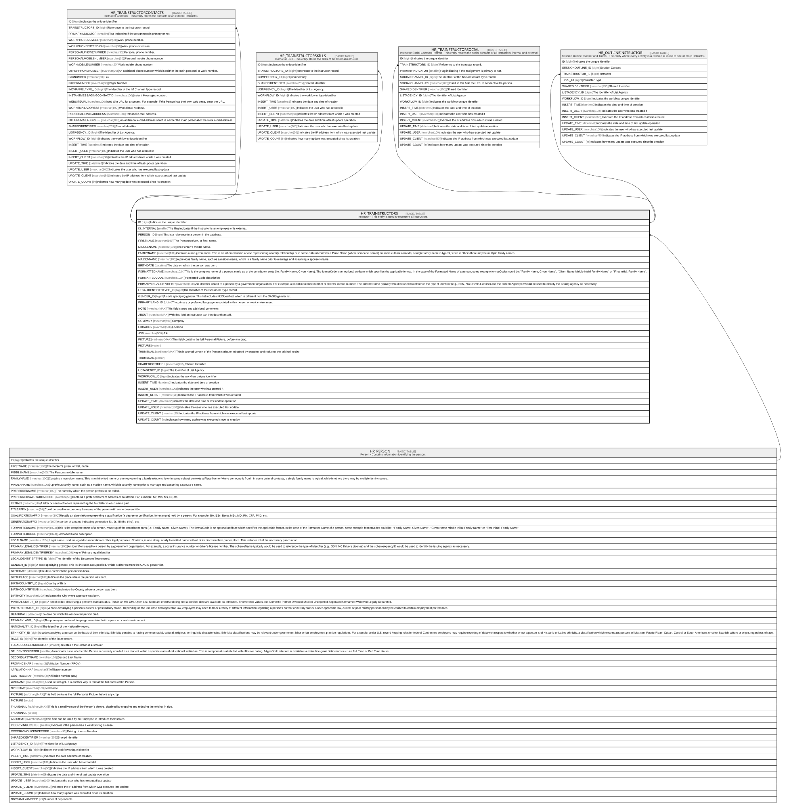

# HR_TRAINSTRUCTORS

## Description

Instructor - This entity is used to represent all instructors.  

## Columns

| Name | Type | Default | Nullable | Children | Parents | Comment |
| ---- | ---- | ------- | -------- | -------- | ------- | ------- |
| ID | bigint |  | false | [HR_TRAINSTRUCTORCONTACTS](HR_TRAINSTRUCTORCONTACTS.md) [HR_TRAINSTRUCTORSKILLS](HR_TRAINSTRUCTORSKILLS.md) [HR_TRAINSTRUCTORSOCIAL](HR_TRAINSTRUCTORSOCIAL.md) [HR_OUTLINEINSTRUCTOR](HR_OUTLINEINSTRUCTOR.md) |  | Indicates the unique identifier |
| IS_INTERNAL | smallint |  | true |  |  | This flag indicates if the instructor is an employee or is external. |
| PERSON_ID | bigint |  | true |  | [HR_PERSON](HR_PERSON.md) | This is a reference to a person in the database. |
| FIRSTNAME | nvarchar(100) |  | true |  |  | The Person's given, or first, name. |
| MIDDLENAME | nvarchar(100) |  | true |  |  | The Person's middle name. |
| FAMILYNAME | nvarchar(100) |  | true |  |  | Contains a non-given name. This is an inherited name or one representing a family relationship or in some cultural contexts a Place Name (where someone is from). In some cultural contexts, a single family name is typical, while in others there may be multiple family names. |
| MAIDENNAME | nvarchar(100) |  | true |  |  | A previous family name, such as a maiden name, which is a family name prior to marriage and assuming a spouse's name. |
| BIRTHDATE | datetime |  | true |  |  | The date on which the person was born. |
| FORMATTEDNAME | nvarchar(1024) |  | true |  |  | This is the complete name of a person, made up of the constituent parts (i.e. Family Name, Given Name). The formatCode is an optional attribute which specifies the applicable format. In the case of the Formatted Name of a person, some example formatCodes could be: ''Family Name, Given Name'', ''Given Name Middle Initial Family Name'' or ''First Initial. Family Name''. |
| FORMATTEDCODE | nvarchar(1024) |  | true |  |  | Formatted Code description |
| PRIMARYLEGALIDENTIFIER | nvarchar(100) |  | true |  |  | An identifier issued to a person by a government organization. For example, a social insurance number or driver's license number. The schemeName typically would be used to reference the type of identifier (e.g., SSN, NC Drivers License) and the schemeAgencyID would be used to identify the issuing agency as necessary. |
| LEGALIDENTIFIERTYPE_ID | bigint |  | true |  |  | The Identifier of the Document Type record. |
| GENDER_ID | bigint |  | true |  |  | A code specifying gender. This list includes NotSpecified, which is different from the OAGIS gender list. |
| PRIMARYLANG_ID | bigint |  | true |  |  | The primary or preferred language associated with a person or work environment. |
| NOTE | nvarchar(MAX) |  | true |  |  | This field stores any additional comments. |
| ABOUT | nvarchar(MAX) |  | true |  |  | With this field an instructor can introduce themself. |
| COMPANY | nvarchar(500) |  | true |  |  | Company |
| LOCATION | nvarchar(500) |  | true |  |  | Location |
| JOB | nvarchar(500) |  | true |  |  | Job |
| PICTURE | varbinary(MAX) |  | true |  |  | This field contains the full Personal Picture, before any crop. |
| PICTURE | vector |  | true |  |  |  |
| THUMBNAIL | varbinary(MAX) |  | true |  |  | This is a small verson of the Person's picture, obtained by cropping and reducing the original in size. |
| THUMBNAIL | vector |  | true |  |  |  |
| SHAREDIDENTIFIER | nvarchar(255) |  | true |  |  | Shared Identifier |
| LISTAGENCY_ID | bigint |  | true |  |  | The Identifier of List Agency. |
| WORKFLOW_ID | bigint |  | true |  |  | Indicates the workflow unique identifier |
| INSERT_TIME | datetime2 | (sysutcdatetime()) | false |  |  | Indicates the date and time of creation |
| INSERT_USER | nvarchar(100) | (N'MAIN') | false |  |  | Indicates the user who has created it |
| INSERT_CLIENT | nvarchar(50) | (N'localhost') | false |  |  | Indicates the IP address from which it was created |
| UPDATE_TIME | datetime2 | (sysutcdatetime()) | false |  |  | Indicates the date and time of last update operation |
| UPDATE_USER | nvarchar(100) | (N'MAIN') | false |  |  | Indicates the user who has executed last update |
| UPDATE_CLIENT | nvarchar(50) | (N'localhost') | false |  |  | Indicates the IP address from which was executed last update |
| UPDATE_COUNT | int | ((0)) | false |  |  | Indicates how many update was executed since its creation |

## Constraints

| Name | Type | Definition |
| ---- | ---- | ---------- |
| PK_HR_TRAINSTRUCTORS | PRIMARY KEY | CLUSTERED, unique, part of a PRIMARY KEY constraint, [ ID ] |
| FK_HR_TRAINSTRUCTORS_HR_PERSON | FOREIGN KEY | FOREIGN KEY(PERSON_ID) REFERENCES HR_PERSON(ID) ON UPDATE NO_ACTION ON DELETE CASCADE |

## Indexes

| Name | Definition |
| ---- | ---------- |
| PK_HR_TRAINSTRUCTORS | CLUSTERED, unique, part of a PRIMARY KEY constraint, [ ID ] |

## Relations

---

> Generated by [tbls](https://github.com/k1LoW/tbls)
