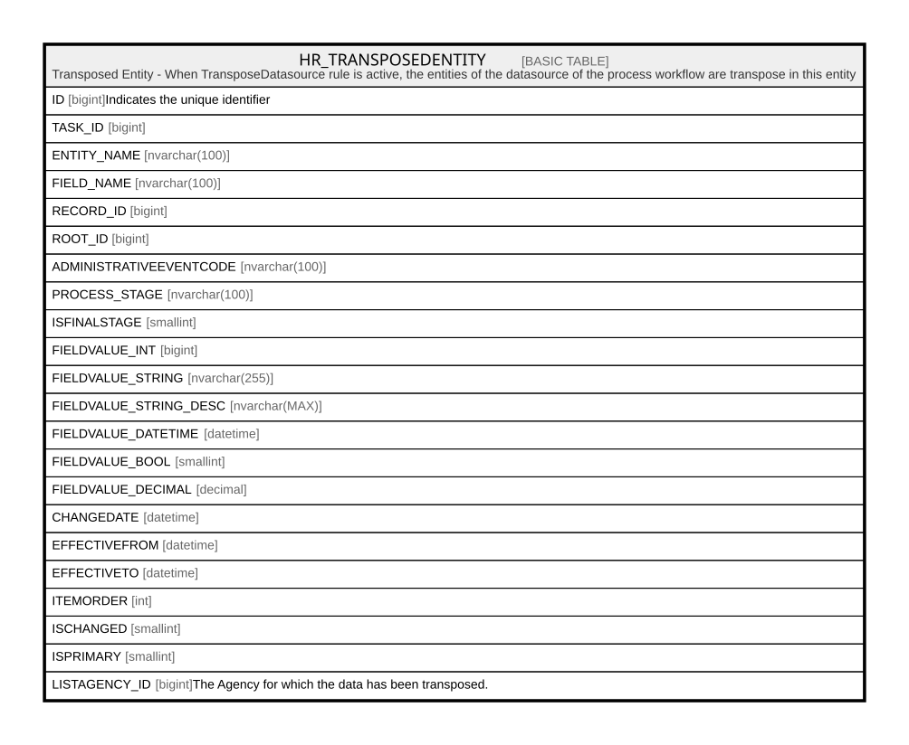

# HR_TRANSPOSEDENTITY

## Description

Transposed Entity - When TransposeDatasource rule is active, the entities of the datasource of the process workflow are transpose in this entity  

## Columns

| Name | Type | Default | Nullable | Comment |
| ---- | ---- | ------- | -------- | ------- |
| ID | bigint |  | false | Indicates the unique identifier |
| TASK_ID | bigint |  | false |  |
| ENTITY_NAME | nvarchar(100) |  | false |  |
| FIELD_NAME | nvarchar(100) |  | false |  |
| RECORD_ID | bigint |  | false |  |
| ROOT_ID | bigint |  | false |  |
| ADMINISTRATIVEEVENTCODE | nvarchar(100) |  | true |  |
| PROCESS_STAGE | nvarchar(100) |  | true |  |
| ISFINALSTAGE | smallint |  | true |  |
| FIELDVALUE_INT | bigint |  | true |  |
| FIELDVALUE_STRING | nvarchar(255) |  | true |  |
| FIELDVALUE_STRING_DESC | nvarchar(MAX) |  | true |  |
| FIELDVALUE_DATETIME | datetime |  | true |  |
| FIELDVALUE_BOOL | smallint |  | true |  |
| FIELDVALUE_DECIMAL | decimal |  | true |  |
| CHANGEDATE | datetime |  | true |  |
| EFFECTIVEFROM | datetime |  | true |  |
| EFFECTIVETO | datetime |  | true |  |
| ITEMORDER | int |  | true |  |
| ISCHANGED | smallint |  | true |  |
| ISPRIMARY | smallint |  | true |  |
| LISTAGENCY_ID | bigint |  | true | The Agency for which the data has been transposed. |

## Constraints

| Name | Type | Definition |
| ---- | ---- | ---------- |
| PK_TRANSPOSEDENTITY | PRIMARY KEY | CLUSTERED, unique, part of a PRIMARY KEY constraint, [ ID ] |
| UQ_TRANSPOSEDENTITY | UNIQUE | NONCLUSTERED, unique, part of a UNIQUE constraint, [ TASK_ID, ENTITY_NAME, FIELD_NAME, RECORD_ID, LISTAGENCY_ID ] |

## Indexes

| Name | Definition |
| ---- | ---------- |
| PK_TRANSPOSEDENTITY | CLUSTERED, unique, part of a PRIMARY KEY constraint, [ ID ] |
| UQ_TRANSPOSEDENTITY | NONCLUSTERED, unique, part of a UNIQUE constraint, [ TASK_ID, ENTITY_NAME, FIELD_NAME, RECORD_ID, LISTAGENCY_ID ] |

## Relations

---

> Generated by [tbls](https://github.com/k1LoW/tbls)
