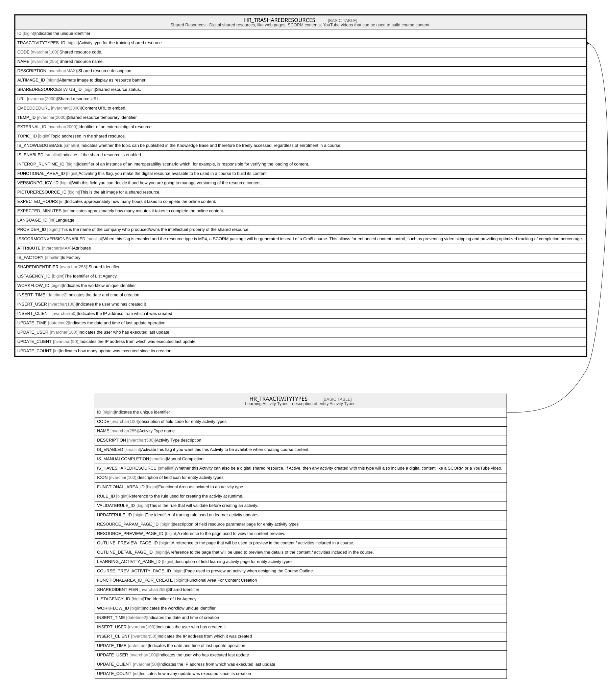

# HR_TRASHAREDRESOURCES

## Description

Shared Resources - Digital shared resources, like web pages, SCORM contents, YouTube videos that can be used to build course content.  

## Columns

| Name | Type | Default | Nullable | Parents | Comment |
| ---- | ---- | ------- | -------- | ------- | ------- |
| ID | bigint |  | false |  | Indicates the unique identifier |
| TRAACTIVITYTYPES_ID | bigint |  | false | [HR_TRAACTIVITYTYPES](HR_TRAACTIVITYTYPES.md) | Activity type for the training shared resource. |
| CODE | nvarchar(100) |  | false |  | Shared resource code. |
| NAME | nvarchar(255) |  | true |  | Shared resource name. |
| DESCRIPTION | nvarchar(MAX) |  | true |  | Shared resource description. |
| ALTIMAGE_ID | bigint |  | true |  | Alternate image to display as resource banner. |
| SHAREDRESOURCESTATUS_ID | bigint |  | true |  | Shared resource status. |
| URL | nvarchar(2000) |  | true |  | Shared resource URL. |
| EMBEDDEDURL | nvarchar(2000) |  | true |  | Content URL to embed. |
| TEMP_ID | nvarchar(2000) |  | true |  | Shared resource temporary identifier. |
| EXTERNAL_ID | nvarchar(2000) |  | true |  | Identifier of an external digital resource. |
| TOPIC_ID | bigint |  | true |  | Topic addressed in the shared resource. |
| IS_KNOWLEDGEBASE | smallint |  | true |  | Indicates whether the topic can be published in the Knowledge Base and therefore be freely accessed, regardless of enrolment in a course. |
| IS_ENABLED | smallint |  | true |  | Indicates if the shared resource is enabled. |
| INTEROP_RUNTIME_ID | bigint |  | true |  | Identifier of an instance of an interoperability scenario which, for example, is responsible for verifying the loading of content. |
| FUNCTIONAL_AREA_ID | bigint |  | true |  | Activating this flag, you make the digital resource available to be used in a course to build its content. |
| VERSIONPOLICY_ID | bigint |  | true |  | With this field you can decide if and how you are going to manage versioning of the resource content. |
| PICTURERESOURCE_ID | bigint |  | true |  | This is the alt image for a shared resource. |
| EXPECTED_HOURS | int |  | true |  | Indicates approximately how many hours it takes to complete the online content. |
| EXPECTED_MINUTES | int |  | true |  | Indicates approximately how many minutes it takes to complete the online content. |
| LANGUAGE_ID | int |  | true |  | Language |
| PROVIDER_ID | bigint |  | true |  | This is the name of the company who produced/owns the intellectual property of the shared resource. |
| ISSCORMCONVERSIONENABLED | smallint |  | true |  | When this flag is enabled and the resource type is MP4, a SCORM package will be generated instead of a Cmi5 course. This allows for enhanced content control, such as preventing video skipping and providing optimized tracking of completion percentage. |
| ATTRIBUTE | nvarchar(MAX) |  | true |  | Attributes |
| IS_FACTORY | smallint |  | true |  | Is Factory |
| SHAREDIDENTIFIER | nvarchar(255) |  | true |  | Shared Identifier |
| LISTAGENCY_ID | bigint |  | true |  | The Identifier of List Agency. |
| WORKFLOW_ID | bigint |  | true |  | Indicates the workflow unique identifier |
| INSERT_TIME | datetime2 |  | false |  | Indicates the date and time of creation |
| INSERT_USER | nvarchar(100) |  | false |  | Indicates the user who has created it |
| INSERT_CLIENT | nvarchar(50) |  | false |  | Indicates the IP address from which it was created |
| UPDATE_TIME | datetime2 |  | false |  | Indicates the date and time of last update operation |
| UPDATE_USER | nvarchar(100) |  | false |  | Indicates the user who has executed last update |
| UPDATE_CLIENT | nvarchar(50) |  | false |  | Indicates the IP address from which was executed last update |
| UPDATE_COUNT | int |  | false |  | Indicates how many update was executed since its creation |

## Constraints

| Name | Type | Definition |
| ---- | ---- | ---------- |
| PK_HR_TRASHAREDRESOURCES | PRIMARY KEY | CLUSTERED, unique, part of a PRIMARY KEY constraint, [ ID ] |
| UQ_HR_TRASHAREDRESOURCES | UNIQUE | NONCLUSTERED, unique, part of a UNIQUE constraint, [ TRAACTIVITYTYPES_ID, CODE ] |
| FK_SHAREDRESOUR_ACTIVITYTYPES | FOREIGN KEY | FOREIGN KEY(TRAACTIVITYTYPES_ID) REFERENCES HR_TRAACTIVITYTYPES(ID) ON UPDATE NO_ACTION ON DELETE NO_ACTION |

## Indexes

| Name | Definition |
| ---- | ---------- |
| PK_HR_TRASHAREDRESOURCES | CLUSTERED, unique, part of a PRIMARY KEY constraint, [ ID ] |
| UQ_HR_TRASHAREDRESOURCES | NONCLUSTERED, unique, part of a UNIQUE constraint, [ TRAACTIVITYTYPES_ID, CODE ] |

## Relations

---

> Generated by [tbls](https://github.com/k1LoW/tbls)
