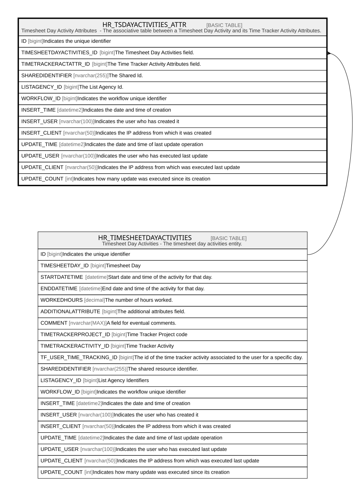

# HR_TSDAYACTIVITIES_ATTR

## Description

Timesheet Day Activity Attributes  - The associative table between a Timesheet Day Activity and its Time Tracker Activity Attributes.  

## Columns

| Name | Type | Default | Nullable | Parents | Comment |
| ---- | ---- | ------- | -------- | ------- | ------- |
| ID | bigint |  | false |  | Indicates the unique identifier |
| TIMESHEETDAYACTIVITIES_ID | bigint |  | false | [HR_TIMESHEETDAYACTIVITIES](HR_TIMESHEETDAYACTIVITIES.md) | The Timesheet Day Activities field. |
| TIMETRACKERACTATTR_ID | bigint |  | false |  | The Time Tracker Activity Attributes field. |
| SHAREDIDENTIFIER | nvarchar(255) |  | true |  | The Shared Id. |
| LISTAGENCY_ID | bigint |  | true |  | The List Agency Id. |
| WORKFLOW_ID | bigint |  | true |  | Indicates the workflow unique identifier |
| INSERT_TIME | datetime2 | (sysutcdatetime()) | false |  | Indicates the date and time of creation |
| INSERT_USER | nvarchar(100) | (N'MAIN') | false |  | Indicates the user who has created it |
| INSERT_CLIENT | nvarchar(50) | (N'localhost') | false |  | Indicates the IP address from which it was created |
| UPDATE_TIME | datetime2 | (sysutcdatetime()) | false |  | Indicates the date and time of last update operation |
| UPDATE_USER | nvarchar(100) | (N'MAIN') | false |  | Indicates the user who has executed last update |
| UPDATE_CLIENT | nvarchar(50) | (N'localhost') | false |  | Indicates the IP address from which was executed last update |
| UPDATE_COUNT | int | ((0)) | false |  | Indicates how many update was executed since its creation |

## Constraints

| Name | Type | Definition |
| ---- | ---- | ---------- |
| PK_HR_TSDAYACTIVITIES_ATTR | PRIMARY KEY | CLUSTERED, unique, part of a PRIMARY KEY constraint, [ ID ] |
| FK_TIMESHEETDAYACT_ATTR | FOREIGN KEY | FOREIGN KEY(TIMESHEETDAYACTIVITIES_ID) REFERENCES HR_TIMESHEETDAYACTIVITIES(ID) ON UPDATE NO_ACTION ON DELETE CASCADE |

## Indexes

| Name | Definition |
| ---- | ---------- |
| PK_HR_TSDAYACTIVITIES_ATTR | CLUSTERED, unique, part of a PRIMARY KEY constraint, [ ID ] |

## Relations

---

> Generated by [tbls](https://github.com/k1LoW/tbls)
