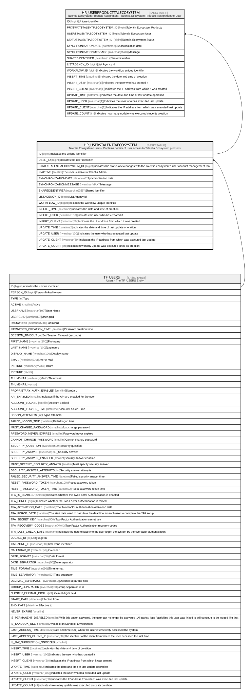

# HR_USERSTALENTIAECOSYSTEM

## Description

Talentia Ecosystem Users - Contains details of user access to Talentia Ecosystem products  

## Columns

| Name | Type | Default | Nullable | Children | Parents | Comment |
| ---- | ---- | ------- | -------- | -------- | ------- | ------- |
| ID | bigint |  | false | [HR_USERPRODUCTTALECOSYSTEM](HR_USERPRODUCTTALECOSYSTEM.md) |  | Indicates the unique identifier |
| USER_ID | bigint |  | false |  | [TF_USERS](TF_USERS.md) | Indicates the user identifier |
| STATUSTALENTIAECOSYSTEM_ID | bigint | ((3019225)) | false |  |  | Indicates the status of exchanges with the Talentia ecosystem's user account management tool |
| ISACTIVE | smallint | ((1)) | true |  |  | The user is active in Talentia Admin |
| SYNCHRONIZATIONDATE | datetime2 |  | true |  |  | Synchronization date |
| SYNCHRONIZATIONMESSAGE | nvarchar(MAX) |  | true |  |  | Message |
| SHAREDIDENTIFIER | nvarchar(255) |  | true |  |  | Shared idenifier |
| LISTAGENCY_ID | bigint |  | true |  |  | List Agency id |
| WORKFLOW_ID | bigint |  | true |  |  | Indicates the workflow unique identifier |
| INSERT_TIME | datetime2 | (sysutcdatetime()) | false |  |  | Indicates the date and time of creation |
| INSERT_USER | nvarchar(100) | (N'MAIN') | false |  |  | Indicates the user who has created it |
| INSERT_CLIENT | nvarchar(50) | (N'localhost') | false |  |  | Indicates the IP address from which it was created |
| UPDATE_TIME | datetime2 | (sysutcdatetime()) | false |  |  | Indicates the date and time of last update operation |
| UPDATE_USER | nvarchar(100) | (N'MAIN') | false |  |  | Indicates the user who has executed last update |
| UPDATE_CLIENT | nvarchar(50) | (N'localhost') | false |  |  | Indicates the IP address from which was executed last update |
| UPDATE_COUNT | int | ((0)) | false |  |  | Indicates how many update was executed since its creation |

## Constraints

| Name | Type | Definition |
| ---- | ---- | ---------- |
| PK_HR_USERSTALENTIAECOSYSTEM | PRIMARY KEY | CLUSTERED, unique, part of a PRIMARY KEY constraint, [ ID ] |
| UQ_USERSTALECOSYS_USER | UNIQUE | NONCLUSTERED, unique, part of a UNIQUE constraint, [ USER_ID ] |
| FK_HR_USERSTALENTIAECO_USERS | FOREIGN KEY | FOREIGN KEY(USER_ID) REFERENCES TF_USERS(ID) ON UPDATE NO_ACTION ON DELETE CASCADE |

## Indexes

| Name | Definition |
| ---- | ---------- |
| PK_HR_USERSTALENTIAECOSYSTEM | CLUSTERED, unique, part of a PRIMARY KEY constraint, [ ID ] |
| UQ_USERSTALECOSYS_USER | NONCLUSTERED, unique, part of a UNIQUE constraint, [ USER_ID ] |

## Relations

---

> Generated by [tbls](https://github.com/k1LoW/tbls)
