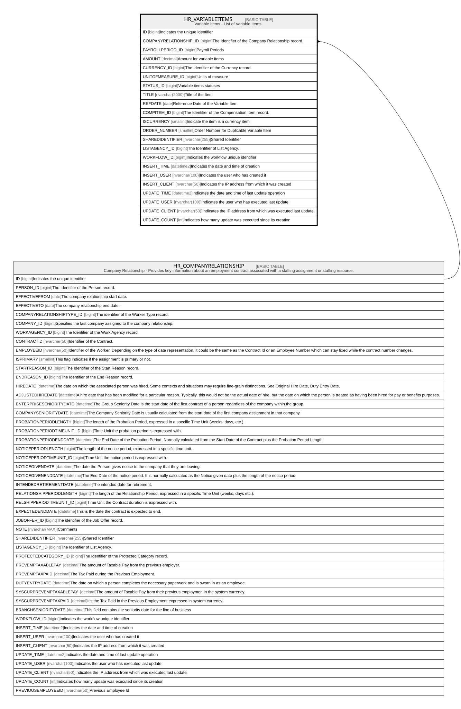

# HR_VARIABLEITEMS

## Description

Variable Items - List of Variable Items.  

## Columns

| Name | Type | Default | Nullable | Parents | Comment |
| ---- | ---- | ------- | -------- | ------- | ------- |
| ID | bigint |  | false |  | Indicates the unique identifier |
| COMPANYRELATIONSHIP_ID | bigint |  | true | [HR_COMPANYRELATIONSHIP](HR_COMPANYRELATIONSHIP.md) | The Identifier of the Company Relationship record. |
| PAYROLLPERIOD_ID | bigint |  | false |  | Payroll Periods |
| AMOUNT | decimal |  | true |  | Amount for variable items |
| CURRENCY_ID | bigint |  | true |  | The Identifier of the Currency record. |
| UNITOFMEASURE_ID | bigint |  | true |  | Units of measure |
| STATUS_ID | bigint |  | true |  | Variable items statuses |
| TITLE | nvarchar(2000) |  | true |  | Title of the Item |
| REFDATE | date |  | true |  | Reference Date of the Variable Item |
| COMPITEM_ID | bigint |  | true |  | The Identifier of the Compensation Item record. |
| ISCURRENCY | smallint |  | true |  | Indicate the item is a currency item |
| ORDER_NUMBER | smallint |  | true |  | Order Number for Duplicable Variable Item |
| SHAREDIDENTIFIER | nvarchar(255) |  | true |  | Shared Identifier |
| LISTAGENCY_ID | bigint |  | true |  | The Identifier of List Agency. |
| WORKFLOW_ID | bigint |  | true |  | Indicates the workflow unique identifier |
| INSERT_TIME | datetime2 | (sysutcdatetime()) | false |  | Indicates the date and time of creation |
| INSERT_USER | nvarchar(100) | (N'MAIN') | false |  | Indicates the user who has created it |
| INSERT_CLIENT | nvarchar(50) | (N'localhost') | false |  | Indicates the IP address from which it was created |
| UPDATE_TIME | datetime2 | (sysutcdatetime()) | false |  | Indicates the date and time of last update operation |
| UPDATE_USER | nvarchar(100) | (N'MAIN') | false |  | Indicates the user who has executed last update |
| UPDATE_CLIENT | nvarchar(50) | (N'localhost') | false |  | Indicates the IP address from which was executed last update |
| UPDATE_COUNT | int | ((0)) | false |  | Indicates how many update was executed since its creation |

## Constraints

| Name | Type | Definition |
| ---- | ---- | ---------- |
| PK_VARIABLEITEM | PRIMARY KEY | CLUSTERED, unique, part of a PRIMARY KEY constraint, [ ID ] |
| FK_COMPREL_VARIABLEITEMS | FOREIGN KEY | FOREIGN KEY(COMPANYRELATIONSHIP_ID) REFERENCES HR_COMPANYRELATIONSHIP(ID) ON UPDATE NO_ACTION ON DELETE CASCADE |

## Indexes

| Name | Definition |
| ---- | ---------- |
| PK_VARIABLEITEM | CLUSTERED, unique, part of a PRIMARY KEY constraint, [ ID ] |
| IDX_VARIABLEITEM_COMPITEM | NONCLUSTERED, [ COMPITEM_ID ] |
| IDX_VARIABLEITEM_STATUS | NONCLUSTERED, [ STATUS_ID ] |
| IDX_VARIABLEITEM_UNIT | NONCLUSTERED, [ UNITOFMEASURE_ID ] |
| IDX_VARIABLEITEM_CURRENCY | NONCLUSTERED, [ CURRENCY_ID ] |
| IDX_VARIABLEITEM_PERIOD | NONCLUSTERED, [ PAYROLLPERIOD_ID ] |
| IDX_VARIABLEITEM | NONCLUSTERED, unique, [ COMPITEM_ID, ORDER_NUMBER, COMPANYRELATIONSHIP_ID, PAYROLLPERIOD_ID ] |

## Relations

---

> Generated by [tbls](https://github.com/k1LoW/tbls)
