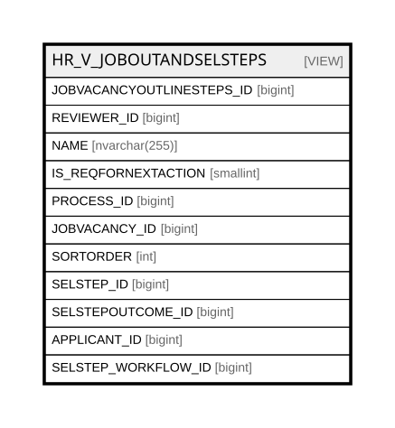

# HR_V_JOBOUTANDSELSTEPS

## Description

<details>
<summary><strong>Table Definition</strong></summary>

```sql
-- Talentia Software - All right reserved
-- Type: VIEW                     Name: HR_V_JOBOUTANDSELSTEPS
-- Date: 09-04-2026 07:27:59 (UTC)
-- 
-- ChangeLogId: 00000000-0000-0000-0000-000000000000
-- ChangeSetId: 2de83400-85e2-40d2-9340-821f2c960fe2
-- Original file name: C:\repos\Talentia-Software\hcm-core/DB/ProductDB/EDM\Schema\Views\HR_V_JOBOUTANDSELSTEPS.xml


CREATE VIEW [HR_V_JOBOUTANDSELSTEPS]
 ( JOBVACANCYOUTLINESTEPS_ID, REVIEWER_ID, NAME, IS_REQFORNEXTACTION, PROCESS_ID, JOBVACANCY_ID, SORTORDER, SELSTEP_ID, SELSTEPOUTCOME_ID, APPLICANT_ID, SELSTEP_WORKFLOW_ID ) 
 AS 
( SELECT JOBOUT.ID JOBVACANCYOUTLINESTEPS_ID, JOBOUT.REVIEWER_ID , TMPSTEPS.NAME, TMPSTEPS.IS_REQFORNEXTACTION, TMPSTEPS.PROCESS_ID, 
JOBOUT.JOBVACANCY_ID, TMPSTEPS.SORTORDER, SELSTEP.ID SELSTEP_ID, SELSTEP.OUTCOME_ID SELSTEPOUTCOME_ID, APP.ID APPLICANT_ID, 
SELSTEP.WORKFLOW_ID SELSTEP_WORKFLOW_ID
	FROM HR_APPLICANT APP 
	LEFT JOIN HR_JOBVACANCYOUTLINESTEPS JOBOUT ON JOBOUT.JOBVACANCY_ID = APP.JOBVACANCY_ID
	JOIN HR_SELECTIONPROCESSTMPSTEPS TMPSTEPS ON JOBOUT.SELECTIONPROCESSTMPSTEP_ID = TMPSTEPS.ID
	LEFT JOIN HR_SELECTIONSTEP SELSTEP ON JOBOUT.ID = SELSTEP.JOBVACANCYOUTLSTEP_ID AND SELSTEP.APPLICANT_ID = APP.ID
	WHERE JOBOUT.JOBVACANCY_ID = APP.JOBVACANCY_ID )

```

</details>

## Columns

| Name | Type | Default | Nullable | Comment |
| ---- | ---- | ------- | -------- | ------- |
| JOBVACANCYOUTLINESTEPS_ID | bigint |  | true |  |
| REVIEWER_ID | bigint |  | true |  |
| NAME | nvarchar(255) |  | false |  |
| IS_REQFORNEXTACTION | smallint |  | true |  |
| PROCESS_ID | bigint |  | true |  |
| JOBVACANCY_ID | bigint |  | true |  |
| SORTORDER | int |  | true |  |
| SELSTEP_ID | bigint |  | true |  |
| SELSTEPOUTCOME_ID | bigint |  | true |  |
| APPLICANT_ID | bigint |  | false |  |
| SELSTEP_WORKFLOW_ID | bigint |  | true |  |

## Referenced Tables

| Name | Columns | Comment | Type |
| ---- | ------- | ------- | ---- |
| [HR_APPLICANT](HR_APPLICANT.md) | 27 | Applicant - It’s an application for a vacancy by a candidate, regardless if internal or external.<br /> | BASIC TABLE |
| [HR_JOBVACANCYOUTLINESTEPS](HR_JOBVACANCYOUTLINESTEPS.md) | 16 | Job Vacancy Outline Steps - In a Job Vacancy definition, the steps needed to select a candidate.<br /> | BASIC TABLE |
| [HR_SELECTIONPROCESSTMPSTEPS](HR_SELECTIONPROCESSTMPSTEPS.md) | 21 | Selection Process Template Steps - Selection Process Template Steps<br /> | BASIC TABLE |
| [HR_SELECTIONSTEP](HR_SELECTIONSTEP.md) | 28 | Selection Step - Indicates step in the selection process, for a selected candidate. Includes the date of the appointment, who will do the interview and the outcome.<br /> | BASIC TABLE |

## Relations



---

> Generated by [tbls](https://github.com/k1LoW/tbls)
