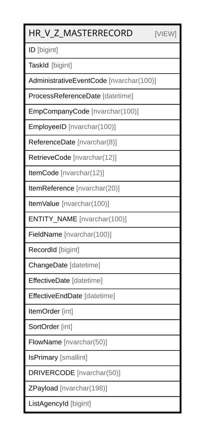

# HR_V_Z_MASTERRECORD

## Description

<details>
<summary><strong>Table Definition</strong></summary>

```sql
-- Talentia Software - All right reserved
-- Type: VIEW                     Name: HR_V_Z_MASTERRECORD
-- Date: 09-04-2026 07:27:59 (UTC)
-- 
-- ChangeLogId: 00000000-0000-0000-0000-000000000000
-- ChangeSetId: 0f1d5509-2789-40e3-9fb4-206bcd9c90e0
-- Original file name: C:\repos\Talentia-Software\hcm-core/DB/ProductDB/EDM\Schema\Views\HR_V_Z_MASTERRECORD.xml


CREATE VIEW [HR_V_Z_MASTERRECORD]
 ( ID, TaskId, AdministrativeEventCode, ProcessReferenceDate, EmpCompanyCode, EmployeeID, ReferenceDate, RetrieveCode, ItemCode, ItemReference, ItemValue, ENTITY_NAME, FieldName, RecordId, ChangeDate, EffectiveDate, EffectiveEndDate, ItemOrder, SortOrder, FlowName, IsPrimary, DRIVERCODE, ZPayload, ListAgencyId ) 
 AS 
( SELECT DISTINCT
	ROW_NUMBER() OVER (ORDER BY ZVF.TaskId, ZVF.EmpCompanyCode, ZVF.EmployeeID, ZVF.SortOrder, ZVF.ReferenceDate, ZVF.EffectiveEndDate, ZVF.EffectiveDate, ZVF.ChangeDate) AS ID,
	ZVF.TaskId,
	ZVF.AdministrativeEventCode,
	ZVF.ProcessReferenceDate,
	ZVF.EmpCompanyCode,
	ZVF.EmployeeID,
	ZVF.ReferenceDate,
	ZVF.RetrieveCode,
	ZVF.ItemCode,
	ZVF.ItemReference,
	ZVF.ItemValue,
	ZVF.ENTITY_NAME,
	ZVF.FieldName,
	ZVF.RecordId,
	ZVF.ChangeDate,
	ZVF.EffectiveDate,
	ZVF.EffectiveEndDate,
	ZVF.ItemOrder,
	ZVF.SortOrder,
	ZVF.FlowName,
	ZVF.IsPrimary,
	ZVF.DRIVERCODE,
	-- Payload to transmit
	CAST(ZVF.EmpCompanyCode AS nvarchar(20)) + ';' +
	CAST(ZVF.EmployeeId AS nvarchar(20)) + ';' +
	CAST(ZVF.ReferenceDate AS nvarchar(8)) + ';' +
	CAST(ZVF.RetrieveCode AS nvarchar(12)) + ';' +
	CAST(ZVF.ItemCode AS nvarchar(12)) + ';' +
	CAST(ZVF.ItemReference AS nvarchar(20)) + ';' +
	CAST(COALESCE(ZVF.ItemValue, ' ') AS nvarchar(100)) AS ZPayload,
	ZVF.ListAgencyId
FROM
(
SELECT
    VFD.TaskId,
	VFD.AdministrativeEventCode,
	VFD.ProcessReferenceDate,
	-- Zucchetti key.
	VFD.EmpCompanyCode,
	VFD.EmployeeID,
	CONVERT(nvarchar(8), VFD.ReferenceDate, 112) AS ReferenceDate,
	VFD.RECEPTION_CODE AS RetrieveCode,
	VFD.ItemCode,
	-- The Item Reference may depend on the data retrieved: use a function.
	dbo.HR_Z_GetItemReference
	(
		VFD.TaskID,
		TEN.RECORD_ID,
		VFD.ITEMCODE,
		VFD.ITEMREFERENCE,
		TEN.ENTITY_NAME,
		TEN.FieldName
	) AS ItemReference,
	-- The value comes from a function in order to return manipulated data or data as is.
	---- If NULL, return a blank char (in order to build the vertical reception correctly).
	--COALESCE (
		dbo.HR_Z_GetAdmEvTransposedValue
			(
				VFD.TaskId,
				VFD.RecordID,
				VFD.ItemCode,
				VFD.ItemReference,
				VFD.FIELD_TYPE,
				TEN.FIELDVALUE_INT,
				TEN.FIELDVALUE_STRING,
				TEN.FIELDVALUE_STRING_DESC,
				TEN.FIELDVALUE_DATETIME,
				TEN.FIELDVALUE_BOOL,
				TEN.FIELDVALUE_DECIMAL,
				VFD.DEFAULTVALUE
			--),
			--' '
	) AS ItemValue,
	-- CoreHR task data.
	TEN.ENTITY_NAME,
	TEN.FieldName,
	TEN.RECORD_ID AS RecordId,
	-- Dates.
	COALESCE(TEN.CHANGEDATE, 
		(
			SELECT 
				MAX(CHG.CHANGEDATE)
			FROM
				HR_TRANSPOSEDENTITY CHG
			WHERE
				CHG.TASK_ID = VFD.TaskID
		) ) AS ChangeDate,
	COALESCE(TEN.EFFECTIVEFROM, '1900-01-01') AS EffectiveDate,
	COALESCE(TEN.EFFECTIVETO, '2999-12-31') AS EffectiveEndDate,
	-- Sort.
	TEN.ITEMORDER AS ItemOrder,
	VFD.SORTORDER AS SortOrder,
	-- To be managed
	VFD.ZFLOWNAME AS FlowName,
	TEN.ISPRIMARY AS IsPrimary,
	VFD.DRIVERCODE,
	VFD.LISTAGENCY_ID AS ListAgencyId
FROM
	(
		-- Extract the keys for the vertical representation.
		SELECT
			TaskID
			, ProcessReferenceDate
			, AdministrativeEventCode
			, RootID
			, RecordID
			, EmpCompanyCode
			, EmployeeID
			, ReferenceDate
			, ZFLOWNAME
			, ITEMCODE
			, ITEMREFERENCE
			, RECEPTION_CODE
			, ENTITY_NAME
			, FIELD_NAME
			, FIELD_TYPE
			, DEFAULTVALUE
			, SORTORDER
			, ENTITYCLUSTERCODE
			, DRIVERCODE
			, LISTAGENCY_ID
		FROM
			(
				-- Extract the keys for the entity-field pairs defined in the data dictionary.
				SELECT DISTINCT 
					TRE.TASK_ID TaskID
					, PRC.REFERENCE_DATE ProcessReferenceDate
					, TRE.ADMINISTRATIVEEVENTCODE AdministrativeEventCode
					, TRE.ROOT_ID RootID
					, TRE.RECORD_ID RecordID
					, dbo.HR_Z_GetCompanyCode(TRE.TASK_ID, TRE.ROOT_ID, PRC.REFERENCE_DATE) EmpCompanyCode
					, dbo.HR_Z_GetEmployeeID(TRE.TASK_ID, TRE.ROOT_ID, TRE.RECORD_ID, PRC.REFERENCE_DATE) EmployeeID
					, dbo.HR_Z_GetEffectiveStartDate(TRE.TASK_ID, TRE.ROOT_ID, TRE.RECORD_ID, PRC.REFERENCE_DATE, TRE.ENTITY_NAME, ZFD.ENTITYCLUSTERCODE) ReferenceDate
					, ZFD.ZFLOWNAME
					, ZFD.ITEMCODE
					, ZFD.ITEMREFERENCE
					, ZFD.RECEPTION_CODE
					, ZFD.ENTITY_NAME
					, ZFD.FIELD_NAME
					, ZFD.FIELD_TYPE
					, ZFD.DEFAULTVALUE
					, ZFD.SORTORDER
					, ZFD.ENTITYCLUSTERCODE
					, ZFD.DRIVERCODE
					, TRE.LISTAGENCY_ID
				FROM
					HR_TRANSPOSEDENTITY TRE
					--INNER JOIN TF_WFRT_TASKS TSK ON TSK.ID = TRE.TASK_ID
					--INNER JOIN TF_WFRT_PROCESSES PRC ON PRC.ID = TSK.INSTANCE_ID
					INNER JOIN TF_WFRT_PROCESSES PRC ON PRC.ID = TRE.TASK_ID
					INNER JOIN HR_Z_FLOWDEFINITION ZFD ON ZFD.ENTITY_NAME = TRE.ENTITY_NAME AND ZFD.FIELD_NAME = dbo.HR_Z_GetTransposedFieldName(TRE.TASK_ID, TRE.RECORD_ID, TRE.ENTITY_NAME, TRE.FIELD_NAME) AND ZFD.ZFLOWNAME IN ('ENT_COMMON_Z', 'EMP_MASTERRECORD_Z')
				UNION
				-- Extract the keys for the definitions in the data dictionary with no correspondence with an entity-field pair.
				SELECT DISTINCT 
					TRE.TASK_ID TaskID
					, PRC.REFERENCE_DATE ProcessReferenceDate
					, ADMINISTRATIVEEVENTCODE AdministrativeEventCode
					, TRE.ROOT_ID RootID
					, TRE.ROOT_ID RecordID
					, dbo.HR_Z_GetCompanyCode(TRE.TASK_ID, TRE.ROOT_ID, PRC.REFERENCE_DATE) EmpCompanyCode
					, dbo.HR_Z_GetEmployeeID(TRE.TASK_ID, TRE.ROOT_ID, TRE.RECORD_ID, PRC.REFERENCE_DATE) EmployeeID
					, dbo.HR_Z_GetEffDateOnClusterCode(TRE.TASK_ID, TRE.ROOT_ID, TRE.RECORD_ID, PRC.REFERENCE_DATE, ZFD.ENTITYCLUSTERCODE) ReferenceDate
					, ZFD.ZFLOWNAME
					, ZFD.ITEMCODE
					, ZFD.ITEMREFERENCE
					, ZFD.RECEPTION_CODE
					, ZFD.ENTITY_NAME
					, ZFD.FIELD_NAME
					, ZFD.FIELD_TYPE
					, ZFD.DEFAULTVALUE
					, ZFD.SORTORDER
					, ZFD.ENTITYCLUSTERCODE
					, ZFD.DRIVERCODE
					, TRE.LISTAGENCY_ID
				FROM 
					HR_TRANSPOSEDENTITY TRE
					--INNER JOIN TF_WFRT_TASKS TSK ON TSK.ID = TRE.TASK_ID
					--INNER JOIN TF_WFRT_PROCESSES PRC ON PRC.ID = TSK.INSTANCE_ID
					INNER JOIN TF_WFRT_PROCESSES PRC ON PRC.ID = TRE.TASK_ID
					--INNER JOIN HR_Z_FLOWDEFINITION ZFD ON ZFD.ENTITY_NAME IS NULL
					INNER JOIN HR_Z_FLOWDEFINITION ZFD ON ZFD.ITEMCODE in ('DUMMY','DUMMY1','IDTPSUBJ') AND ZFD.ZFLOWNAME IN ('ENT_COMMON_Z','EMP_MASTERRECORD_Z')
			) TEK
	) VFD
	--
	LEFT OUTER JOIN
		(
			SELECT
				TPA.TASK_ID,
				TPA.ENTITY_NAME,
				-- Use a function to get the Field name, for those cases where it must be manipulated.
				dbo.HR_Z_GetTransposedFieldName
					(
						TPA.TASK_ID,
						TPA.RECORD_ID,
						TPA.ENTITY_NAME,
						TPA.FIELD_NAME
					) AS FieldName,
				--
				TPA.RECORD_ID,
				TPA.ADMINISTRATIVEEVENTCODE,
				TPA.PROCESS_STAGE,
				TPA.ISFINALSTAGE,
				TPA.FIELDVALUE_INT,
				TPA.FIELDVALUE_STRING,
				TPA.FIELDVALUE_STRING_DESC,
				TPA.FIELDVALUE_DATETIME,
				TPA.FIELDVALUE_BOOL,
				TPA.FIELDVALUE_DECIMAL,
				TPA.CHANGEDATE,
				TPA.EFFECTIVEFROM,
				TPA.EFFECTIVETO,
				TPA.ITEMORDER,
				TPA.ISCHANGED,
				TPA.ISPRIMARY,
				TPA.LISTAGENCY_ID
			FROM
				HR_TRANSPOSEDENTITY TPA
		) TEN ON TEN.TASK_ID = VFD.TaskId AND TEN.ENTITY_NAME = VFD.ENTITY_NAME AND TEN.FieldName = VFD.FIELD_NAME AND TEN.RECORD_ID = VFD.RecordID
		         AND ((TEN.LISTAGENCY_ID IS NULL AND VFD.LISTAGENCY_ID IS NULL) OR (TEN.LISTAGENCY_ID = VFD.LISTAGENCY_ID))
 ) ZVF

-- Exclude the rows containing NULL values, not to pass through non-significant fields.
-- This implies that 
-- - only changed values will travel when in UPDATE mode
-- - the target system will populate the missing fields when in INSERT mode
WHERE
	ZVF.ItemValue IS NOT NULL )

```

</details>

## Columns

| Name | Type | Default | Nullable | Comment |
| ---- | ---- | ------- | -------- | ------- |
| ID | bigint |  | true |  |
| TaskId | bigint |  | false |  |
| AdministrativeEventCode | nvarchar(100) |  | true |  |
| ProcessReferenceDate | datetime |  | true |  |
| EmpCompanyCode | nvarchar(100) |  | true |  |
| EmployeeID | nvarchar(100) |  | true |  |
| ReferenceDate | nvarchar(8) |  | true |  |
| RetrieveCode | nvarchar(12) |  | false |  |
| ItemCode | nvarchar(12) |  | false |  |
| ItemReference | nvarchar(20) |  | true |  |
| ItemValue | nvarchar(100) |  | true |  |
| ENTITY_NAME | nvarchar(100) |  | true |  |
| FieldName | nvarchar(100) |  | true |  |
| RecordId | bigint |  | true |  |
| ChangeDate | datetime |  | true |  |
| EffectiveDate | datetime |  | true |  |
| EffectiveEndDate | datetime |  | true |  |
| ItemOrder | int |  | true |  |
| SortOrder | int |  | false |  |
| FlowName | nvarchar(50) |  | false |  |
| IsPrimary | smallint |  | true |  |
| DRIVERCODE | nvarchar(50) |  | true |  |
| ZPayload | nvarchar(198) |  | true |  |
| ListAgencyId | bigint |  | true |  |

## Referenced Tables

| Name | Columns | Comment | Type |
| ---- | ------- | ------- | ---- |
| [a](a.md) | 0 |  |  |
| [HR_TRANSPOSEDENTITY](HR_TRANSPOSEDENTITY.md) | 22 | Transposed Entity - When TransposeDatasource rule is active, the entities of the datasource of the process workflow are transpose in this entity<br /> | BASIC TABLE |
| [Extract](Extract.md) | 0 |  |  |
| [TF_WFRT_TASKS](TF_WFRT_TASKS.md) | 34 | Tasks - Workflow Runtime Tasks<br /> | BASIC TABLE |
| [TF_WFRT_PROCESSES](TF_WFRT_PROCESSES.md) | 29 | Process Instances - Workflow Runtime Processes View<br /> | BASIC TABLE |
| [HR_Z_FLOWDEFINITION](HR_Z_FLOWDEFINITION.md) | 20 | Zucchetti Flow Definition - Dictionary containing mappings between Zucchetti and HCM fields.<br /> | BASIC TABLE |

## Relations



---

> Generated by [tbls](https://github.com/k1LoW/tbls)
