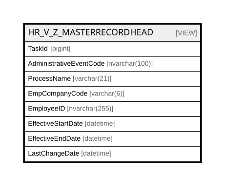

# HR_V_Z_MASTERRECORDHEAD

## Description

<details>
<summary><strong>Table Definition</strong></summary>

```sql
-- Talentia Software - All right reserved
-- Type: VIEW                     Name: HR_V_Z_MASTERRECORDHEAD
-- Date: 09-04-2026 07:27:59 (UTC)
-- 
-- ChangeLogId: 00000000-0000-0000-0000-000000000000
-- ChangeSetId: d5951c84-350a-4f97-81a6-60bc66db3c49
-- Original file name: C:\repos\Talentia-Software\hcm-core/DB/ProductDB/EDM\Schema\Views\HR_V_Z_MASTERRECORDHEAD.xml


CREATE VIEW [HR_V_Z_MASTERRECORDHEAD]
 ( TaskId, AdministrativeEventCode, ProcessName, EmpCompanyCode, EmployeeID, EffectiveStartDate, EffectiveEndDate, LastChangeDate ) 
 AS 
( SELECT 
		HR_TRANSPOSEDENTITY.TASK_ID AS TaskId, 
		HR_TRANSPOSEDENTITY.ADMINISTRATIVEEVENTCODE AS AdministrativeEventCode, 
		'Master Record Process' AS ProcessName, 
		'000000' AS EmpCompanyCode,
		(
			SELECT DISTINCT FIELDVALUE_STRING
			FROM HR_TRANSPOSEDENTITY TE
			WHERE TE.TASK_ID = HR_TRANSPOSEDENTITY.TASK_ID AND TE.ENTITY_NAME = 'PERSON' AND TE.FIELD_NAME = 'FORMATTEDNAME'
		) AS EmployeeID,
		MAX(HR_TRANSPOSEDENTITY.EFFECTIVEFROM) AS EffectiveStartDate, 
		MIN(HR_TRANSPOSEDENTITY.EFFECTIVETO) AS EffectiveEndDate, 
		MAX(HR_TRANSPOSEDENTITY.CHANGEDATE) AS LastChangeDate
	FROM
		HR_TRANSPOSEDENTITY
	GROUP BY 
		HR_TRANSPOSEDENTITY.TASK_ID, HR_TRANSPOSEDENTITY.ADMINISTRATIVEEVENTCODE )

```

</details>

## Columns

| Name | Type | Default | Nullable | Comment |
| ---- | ---- | ------- | -------- | ------- |
| TaskId | bigint |  | false |  |
| AdministrativeEventCode | nvarchar(100) |  | true |  |
| ProcessName | varchar(21) |  | false |  |
| EmpCompanyCode | varchar(6) |  | false |  |
| EmployeeID | nvarchar(255) |  | true |  |
| EffectiveStartDate | datetime |  | true |  |
| EffectiveEndDate | datetime |  | true |  |
| LastChangeDate | datetime |  | true |  |

## Referenced Tables

| Name | Columns | Comment | Type |
| ---- | ------- | ------- | ---- |
| [HR_TRANSPOSEDENTITY](HR_TRANSPOSEDENTITY.md) | 22 | Transposed Entity - When TransposeDatasource rule is active, the entities of the datasource of the process workflow are transpose in this entity<br /> | BASIC TABLE |

## Relations



---

> Generated by [tbls](https://github.com/k1LoW/tbls)
