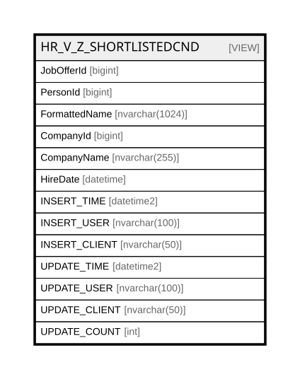

# HR_V_Z_SHORTLISTEDCND

## Description

<details>
<summary><strong>Table Definition</strong></summary>

```sql
-- Talentia Software - All right reserved
-- Type: VIEW                     Name: HR_V_Z_SHORTLISTEDCND
-- Date: 09-04-2026 07:27:59 (UTC)
-- 
-- ChangeLogId: 00000000-0000-0000-0000-000000000000
-- ChangeSetId: f157d549-91ed-4c72-9a0d-91060885d11b
-- Original file name: C:\repos\Talentia-Software\hcm-core/DB/ProductDB/EDM\Schema\Views\HR_V_Z_SHORTLISTEDCND.xml


CREATE VIEW [HR_V_Z_SHORTLISTEDCND]
 ( JobOfferId, PersonId, FormattedName, CompanyId, CompanyName, HireDate, INSERT_TIME, INSERT_USER, INSERT_CLIENT, UPDATE_TIME, UPDATE_USER, UPDATE_CLIENT, UPDATE_COUNT ) 
 AS 
( SELECT
	SLC.ID AS JobOfferId,
	SLC.PERSON_ID AS PersonId,
	COALESCE(SLC.FORMATTEDNAME, PER.FORMATTEDNAME) AS FormattedName,
	SLC.COMPANY_ID AS CompanyId,
	CMP.COMPANYNAME AS CompanyName,
	SLC.HIREDATE AS HireDate,
	SLC.INSERT_TIME AS INSERT_TIME,
	SLC.INSERT_USER AS INSERT_USER,
	SLC.INSERT_CLIENT AS INSERT_CLIENT,
	SLC.UPDATE_TIME AS UPDATE_TIME,
	SLC.UPDATE_USER AS UPDATE_USER,
	SLC.UPDATE_CLIENT AS UPDATE_CLIENT,
	SLC.UPDATE_COUNT AS UPDATE_COUNT
FROM 
	HR_SHORTLISTEDCND SLC
	LEFT OUTER JOIN HR_PERSON PER ON PER.ID = SLC.PERSON_ID
	LEFT OUTER JOIN HR_COMPANY CMP ON CMP.ID = SLC.COMPANY_ID
WHERE
	SLC.COMPANY_ID IS NOT NULL AND
	SLC.HIREDATE IS NOT NULL )

```

</details>

## Columns

| Name | Type | Default | Nullable | Comment |
| ---- | ---- | ------- | -------- | ------- |
| JobOfferId | bigint |  | false |  |
| PersonId | bigint |  | true |  |
| FormattedName | nvarchar(1024) |  | true |  |
| CompanyId | bigint |  | true |  |
| CompanyName | nvarchar(255) |  | true |  |
| HireDate | datetime |  | true |  |
| INSERT_TIME | datetime2 |  | false |  |
| INSERT_USER | nvarchar(100) |  | false |  |
| INSERT_CLIENT | nvarchar(50) |  | false |  |
| UPDATE_TIME | datetime2 |  | false |  |
| UPDATE_USER | nvarchar(100) |  | false |  |
| UPDATE_CLIENT | nvarchar(50) |  | false |  |
| UPDATE_COUNT | int |  | false |  |

## Referenced Tables

| Name | Columns | Comment | Type |
| ---- | ------- | ------- | ---- |
| [HR_SHORTLISTEDCND](HR_SHORTLISTEDCND.md) | 117 | Shortlisted Candidates - Shortlisted candidates are those candidates, internal or external, to whom a Job offer for a specific Vacancy has been proposed. For each candidate, basic contractual and deployment terms and conditions are also specified.<br /> | BASIC TABLE |
| [HR_PERSON](HR_PERSON.md) | 56 | Person - Contains information identifying the person.<br /> | BASIC TABLE |
| [HR_COMPANY](HR_COMPANY.md) | 17 | Company - This Entity represents the Companies in the Group.<br /> | BASIC TABLE |

## Relations



---

> Generated by [tbls](https://github.com/k1LoW/tbls)
