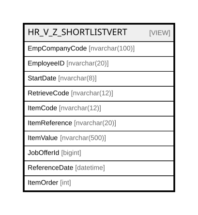

# HR_V_Z_SHORTLISTVERT

## Description

<details>
<summary><strong>Table Definition</strong></summary>

```sql
-- Talentia Software - All right reserved
-- Type: VIEW                     Name: HR_V_Z_SHORTLISTVERT
-- Date: 09-04-2026 07:27:59 (UTC)
-- 
-- ChangeLogId: 00000000-0000-0000-0000-000000000000
-- ChangeSetId: 7a041e6d-b763-4b2e-b076-dbf38997f8dc
-- Original file name: C:\repos\Talentia-Software\hcm-core/DB/ProductDB/EDM\Schema\Views\HR_V_Z_SHORTLISTVERT.xml


CREATE VIEW [HR_V_Z_SHORTLISTVERT]
 ( EmpCompanyCode, EmployeeID, StartDate, RetrieveCode, ItemCode, ItemReference, ItemValue, JobOfferId, ReferenceDate, ItemOrder ) 
 AS 
( SELECT 
EmpCompanyCode,
EmployeeID,  
StartDate,
RetrieveCode,
ItemCode,
ItemReference,
ItemValue,
JobOfferId,
ReferenceDate,
ItemOrder
FROM 
(
SELECT
	EmpCompanyCode,
	EmployeeID,
	JobOfferId,
	StartDate,
	ReferenceDate,
	RECEPTION_CODE AS RetrieveCode,
	ITEMCODE AS ItemCode,
	CASE ITEMCODE
		WHEN 'IDTPSUBJ' THEN 'DIPEND'
		ELSE ITEMREFERENCE
	END AS ItemReference,
	SORTORDER AS ItemOrder,
	CASE ITEMCODE
		WHEN 'DUMMY' THEN 
			CASE ISEXTERNALAPPLICANT
				WHEN '1' THEN '1' -- External applicant
				ELSE NULL
			END
		WHEN 'DUMMY1' THEN 
			CASE ISEXTERNALAPPLICANT
				WHEN '1' THEN
					CASE
					(
					SELECT
					JSON_VALUE(PARAMETERS, N'lax $.HCM_NEW_DUMMY')
					FROM
					TF_EXTERNAL_APPLICATIONS
					WHERE ID = 1140004
					)
					WHEN 'true' THEN '1'
					ELSE NULL
					END
				ELSE '1' -- Internal applicant
			END
		WHEN 'IDCODAL00S' THEN SHAREDIDENTIFIER_P
		WHEN 'FLCHECKOBB' THEN NULL -- DUMMY initialisation
		WHEN 'IDTPSUBJ' THEN 'DIPEND'
		WHEN 'FLACTIVE' THEN NULL -- DUMMY initialisation
		WHEN 'ANSURNAM' THEN FAMILYNAME
		WHEN 'ANNAME' THEN FIRSTNAME
		WHEN 'DTBIRTH' THEN BIRTHDATE
		WHEN 'IDSTATEBT' THEN BIRTHCOUNTRY_ID_C
		WHEN 'IDCITYBT' THEN BIRTHCITY_ID_C
		WHEN 'TPSEX' THEN GENDER_ID_C
		WHEN 'IDSTATECTY' THEN NATIONALITY_ID_C
		WHEN 'TPIDENTIFP' THEN NULL -- DUMMY initialisation
		WHEN 'IDLEGALNAT' THEN NULL -- DUMMY initialisation
		WHEN 'IDIDENTIFP' THEN PRIMARYLEGALIDENTIFIER
		WHEN 'IDMARITAL' THEN MARITALSTATUS_ID_C
		WHEN 'ANADDRESRS' THEN ADDRESSLINE_HOME
		WHEN 'ANCIVICNRS' THEN STREETNUMBER_HOME
		WHEN 'IDSTATERS' THEN ADDRESSCOUNTRY_ID_C_HOME
		WHEN 'IDCITYRS' THEN ADDRESSCITY_ID_C_HOME
		WHEN 'ANZIPCODRS' THEN ADDRESSZIPCODE_HOME
		WHEN 'ANTELEFRS' THEN PERSONALPHONENUMBER
		WHEN 'ANMOBILTEL' THEN PERSONALMOBILENUMBER
		WHEN 'ANEMAILRS' THEN PERSONALEMAILADDRESS
		WHEN 'ANFAX' THEN FAXNUMBER
		WHEN 'ANWEB' THEN WEBSITEURL
		WHEN 'TPADDRESS' THEN
			CASE ITEMREFERENCE
				WHEN 'DM' THEN 'DM'
				WHEN 'RA' THEN 'RA'
				ELSE NULL
			END
		WHEN 'ANADDRES' THEN 
			CASE ITEMREFERENCE
				WHEN 'DM' THEN ADDRESSLINE_ADDR
				WHEN 'RA' THEN ADDRESSLINE_MLTO
				ELSE NULL
			END
		WHEN 'ANCIVICN' THEN
			CASE ITEMREFERENCE
				WHEN 'DM' THEN STREETNUMBER_ADDR
				ELSE NULL
			END
		WHEN 'IDSTATE' THEN
			CASE ITEMREFERENCE
				WHEN 'DM' THEN ADDRESSCOUNTRY_ID_C_ADDR
				WHEN 'RA' THEN ADDRESSCOUNTRY_ID_C_MLTO
				ELSE NULL
			END
		WHEN 'IDCITY' THEN
			CASE ITEMREFERENCE
				WHEN 'DM' THEN ADDRESSCITY_ID_C_ADDR
				WHEN 'RA' THEN ADDRESSCITY_ID_C_MLTO
				ELSE NULL
			END
		WHEN 'ANZIPCOD' THEN
			CASE ITEMREFERENCE
				WHEN 'DM' THEN ADDRESSZIPCODE_ADDR
				WHEN 'RA' THEN ADDRESSZIPCODE_MLTO
				ELSE NULL
			END
		WHEN 'ANTELEF' THEN
			CASE ITEMREFERENCE
				WHEN 'DM' THEN WORKPHONENUMBER
				WHEN 'RA' THEN OTHERPHONENUMBER
				ELSE NULL
			END
		WHEN 'ANEMAIL' THEN
			CASE ITEMREFERENCE
				WHEN 'DM' THEN WORKEMAILADDRESS
				WHEN 'RA' THEN OTHEREMAILADDRESS
				ELSE NULL
			END
		WHEN 'ANMOBILTEL_2' THEN
			CASE ITEMREFERENCE
				WHEN 'RA' THEN WORKMOBILENUMBER
				ELSE NULL
			END
		WHEN 'IDCODAL00' THEN SHAREDIDENTIFIER_C
		WHEN 'FLRELATION' THEN NULL -- DUMMY initialisation
		WHEN 'IDRELATION' THEN NULL -- DUMMY initialisation
		WHEN 'IDNATREL' THEN WORKERTYPE_ID_C
		WHEN 'DTASSUMPT' THEN HIREDATE
		WHEN 'DTEXPTRIES' THEN PROBATIONENDDATE
		WHEN 'IDGRPEM' THEN 'NOC' -- Status for a to-be-hired candidate.
		WHEN 'IDCOMPANY' THEN COMPANY_ID_C
		WHEN 'TPPARTTIME' THEN WORKINGTIMEPATTERN_ID_C
		WHEN 'TPRELATION' THEN CONTRACTTYPE_ID_C
		WHEN 'DTEXPDT' THEN CONTRACTENDDATE
		WHEN 'DTINCOMEGR' THEN COMPANYSENIORITYDATE
		WHEN 'DTSTARTLV' THEN HIREDATE
		WHEN 'DTFIRSTEMP11' THEN HIREDATE
		WHEN 'DTREGISTER11' THEN HIREDATE
		WHEN 'IDDEPENDEN' THEN LOCATION_ID_C
		WHEN 'IDEMPSOMM' THEN NULL -- DUMMY initialisation
		WHEN 'IDLANGUAGE' THEN NULL -- DUMMY initialisation
		WHEN 'FLDEFERRED' THEN NULL -- DUMMY initialisation
		WHEN 'DTSENAGRM' THEN HIREDATE
		WHEN 'IDAGRMNT' THEN CONTRACT_ID_C
		WHEN 'IDQUAGRMNT' THEN QUALIFICATION_ID_C
		WHEN 'IDLVAGRMNT' THEN CONTRACTLEVEL_ID_C
		WHEN 'IDPROFESS' THEN JOB_ID_C
		WHEN 'DTFREE5' THEN ACCEPTANCEDATE
		WHEN 'VACOMPENS12' THEN ANNUALGROSSPAY
		WHEN 'IDCURRENC_12' THEN CURRENCY_ID_C
		WHEN 'IDTBLHH' THEN NULL -- DUMMY initialisation
		WHEN 'ANMONTHNUM' THEN NULL -- DUMMY initialisation
		WHEN 'FLAPPLCOEF' THEN NULL -- DUMMY initialisation
		WHEN 'IDPAY' THEN NULL -- SHORTLIST initialisation
		WHEN 'IDDEBTGRP' THEN NULL -- SHORTLIST initialisation
		WHEN 'PETKPAY' THEN NULL -- SHORTLIST initialisation
		WHEN 'FLMAIN' THEN NULL -- SHORTLIST initialisation
		WHEN 'FLJOBSHAR' THEN NULL -- SHORTLIST initialisation
		WHEN 'PEJOBSHAR' THEN NULL -- SHORTLIST initialisation
		ELSE DEFAULTVALUE
	END AS ItemValue
FROM
(
SELECT 
	ZC.ENTITY_NAME,
	ZC.FIELD_NAME,
	ZC.RECEPTION_CODE,
	ZC.SORTORDER,
	ZC.ITEMCODE,
	ZC.ITEMREFERENCE,
	ZC.DEFAULTVALUE,
	HCM.JobOfferId,
	HCM.EmpCompanyCode,
	HCM.ReferenceDate,
	HCM.EmployeeID,
	CASE WHEN ZC.ENTITYCLUSTERCODE = 'P' THEN HCM.BIRTHDATE ELSE HCM.HIREDATE END AS StartDate,
	HCM.ISEXTERNALAPPLICANT,
	HCM.FAMILYNAME,
	HCM.FIRSTNAME,
	HCM.BIRTHDATE,
	HCM.BIRTHCOUNTRY_ID_C,
	HCM.BIRTHCITY_ID_C,
	HCM.GENDER_ID_C,
	HCM.NATIONALITY_ID_C,
	HCM.PRIMARYLEGALIDENTIFIER,
	HCM.MARITALSTATUS_ID_C,
	HCM.ADDRESSLINE_HOME,
	HCM.ADDRESSCOUNTRY_ID_C_HOME,
	HCM.STREETNUMBER_HOME,
	HCM.ADDRESSCITY_ID_C_HOME,
	HCM.ADDRESSZIPCODE_HOME,
	HCM.PERSONALPHONENUMBER,
	HCM.PERSONALMOBILENUMBER,
	HCM.PERSONALEMAILADDRESS,
	HCM.FAXNUMBER,
	HCM.WEBSITEURL,
	HCM.ADDRESSLINE_ADDR,
	HCM.STREETNUMBER_ADDR,
	HCM.ADDRESSCOUNTRY_ID_C_ADDR,
	HCM.ADDRESSCITY_ID_C_ADDR,
	HCM.ADDRESSZIPCODE_ADDR,
	HCM.WORKPHONENUMBER,
	HCM.WORKEMAILADDRESS,
	HCM.WORKMOBILENUMBER,
	HCM.ADDRESSLINE_MLTO,
	HCM.STREETNUMBER_MLTO,
	HCM.ADDRESSCOUNTRY_ID_C_MLTO,
	HCM.ADDRESSCITY_ID_C_MLTO,
	HCM.ADDRESSZIPCODE_MLTO,
	HCM.OTHERPHONENUMBER,
	HCM.OTHEREMAILADDRESS,
	HCM.COMPANY_ID_C,
	HCM.WORKERTYPE_ID_C,
	HCM.HIREDATE,
	HCM.PROBATIONENDDATE,
	HCM.WORKINGTIMEPATTERN_ID_C,
	HCM.CONTRACTTYPE_ID_C,
	HCM.CONTRACTENDDATE,
	HCM.COMPANYSENIORITYDATE,
	HCM.LOCATION_ID_C,
	HCM.PRIMARYLANG_ID_C,
	HCM.CONTRACT_ID_C,
	HCM.QUALIFICATION_ID_C,
	HCM.CONTRACTLEVEL_ID_C,
	HCM.JOB_ID_C,
	HCM.ACCEPTANCEDATE,
	HCM.CONTRACTDURATIONINMONTHS,
	HCM.PROBATIONPERIODINMONTHS,
	HCM.NOTICEPERIODINDAYS,
	HCM.ANNUALGROSSPAY,
	HCM.CURRENCY_ID_C,
	HCM.SHAREDIDENTIFIER_P,
	HCM.SHAREDIDENTIFIER_C
FROM
HR_Z_FLOWDEFINITION ZC
CROSS JOIN
(
SELECT
	-- Foreign key: the candidate ID (job offer id).
	SLC.ID AS JobOfferId,
	-- Always have a company. If not specified, default to generic company.
	COALESCE(CMP.COMPANYCODE, '000000') AS EmpCompanyCode,
	-- Use the hire date as reference date, for queries.
	SLC.HIREDATE AS ReferenceDate,
	-- The Short list candidate ID is adopted as shared identifier to transmit to Zucchetti.
	CAST(SLC.ID AS nvarchar(20)) AS EmployeeID,
	CASE 
		WHEN (
			SELECT 
				COUNT(*) 
			FROM 
				HR_APPLICANT 
			WHERE 
				HR_APPLICANT.PERSON_ID = PER.ID AND COALESCE(HR_APPLICANT.ISINTERNAL, 0) = 0
			) = 0 
		THEN NULL 
		ELSE '1' 
	END AS ISEXTERNALAPPLICANT,
	COALESCE(SLC.FAMILYNAME, PER.FAMILYNAME) AS FAMILYNAME,
	COALESCE(SLC.FIRSTNAME, PER.FIRSTNAME) AS FIRSTNAME,
	CASE GND.CODE WHEN '1' THEN 'M' WHEN '2' THEN 'F' ELSE NULL END AS GENDER_ID_C,
	CONVERT(nvarchar(8), COALESCE(SLC.BIRTHDATE, PER.BIRTHDATE), 112) AS BIRTHDATE,
	COALESCE(SLC.PRIMARYLEGALID, PER.PRIMARYLEGALIDENTIFIER) AS PRIMARYLEGALIDENTIFIER,
	-- Get the birth city from the description, the country code and filtering by Zucchetti codification
	-- (hopefully this should suffice).
	(
		SELECT
			CTY.CODE
		FROM
			TF_CODES CTY
			INNER JOIN TF_BLENTITIES ENT ON ENT.ID = CTY.ENTITY_ID AND ENT.NAME = 'CITIES'
			INNER JOIN TF_CODIFICATIONS CDC ON CDC.ID = CTY.CODIFICATION_ID AND CDC.NAME = 'Zucchetti\Città'
			LEFT OUTER JOIN TF_CODES STT ON STT.ID = CTY.PARENT_ID
			LEFT OUTER JOIN TF_CODES CNT ON CNT.ID = STT.PARENT_ID
		WHERE
			CTY.DESCRIPTION = PER.BIRTHCITY AND
			(STT.DESCRIPTION = PER.BIRTHCOUNTRYSUB OR STT.DESCRIPTION IS NULL) AND
			(CNT.ID = PER.BIRTHCOUNTRY_ID OR CNT.ID IS NULL) AND
			CTY.IS_ENABLED = 1 AND
			COALESCE(SLC.BIRTHDATE, PER.BIRTHDATE) BETWEEN COALESCE(CTY.EFFECTIVE_FROM, '1900-01-01') AND COALESCE(CTY.EFFECTIVE_TO, '2999-12-31')
	) AS BIRTHCITY_ID_C,
	CNT.CODE AS BIRTHCOUNTRY_ID_C,
	NTN.CODE AS NATIONALITY_ID_C,
-- Residential address
	(SELECT RTRIM(ADR.ADDRESSLINE1 + COALESCE(ADR.ADDRESSLINE2, ' ') + COALESCE(ADR.ADDRESSLINE3, ' ') + COALESCE(ADR.ADDRESSLINE4, ' ') + COALESCE(ADR.ADDRESSLINE5, ' ')) 
	FROM HR_PERSONADDRESSES ADR
		INNER JOIN TF_CODES CDADT ON CDADT.ID = ADR.ADDRESSTYPECODE_ID AND CDADT.CODE = 'HOME'
		INNER JOIN TF_BLENTITIES ENTADT ON ENTADT.ID = CDADT.ENTITY_ID AND ENTADT.NAME = 'ADDRESSTYPE'
	WHERE ADR.PERSON_ID = PER.ID)
	AS ADDRESSLINE_HOME,
	(SELECT CAST(ADR.STREETNUMBER AS nvarchar(8)) 
	FROM HR_PERSONADDRESSES ADR
		INNER JOIN TF_CODES CDADT ON CDADT.ID = ADR.ADDRESSTYPECODE_ID AND CDADT.CODE = 'HOME'
		INNER JOIN TF_BLENTITIES ENTADT ON ENTADT.ID = CDADT.ENTITY_ID AND ENTADT.NAME = 'ADDRESSTYPE'
	WHERE ADR.PERSON_ID = PER.ID)
	AS STREETNUMBER_HOME,
	(SELECT ADR.ADDRESSZIPCODE 
	FROM HR_PERSONADDRESSES ADR
		INNER JOIN TF_CODES CDADT ON CDADT.ID = ADR.ADDRESSTYPECODE_ID AND CDADT.CODE = 'HOME'
		INNER JOIN TF_BLENTITIES ENTADT ON ENTADT.ID = CDADT.ENTITY_ID AND ENTADT.NAME = 'ADDRESSTYPE'
	WHERE ADR.PERSON_ID = PER.ID)
	AS ADDRESSZIPCODE_HOME,
	(SELECT CDCTY.CODE
	FROM HR_PERSONADDRESSES ADR
		INNER JOIN TF_CODES CDADT ON CDADT.ID = ADR.ADDRESSTYPECODE_ID AND CDADT.CODE = 'HOME'
		INNER JOIN TF_BLENTITIES ENTADT ON ENTADT.ID = CDADT.ENTITY_ID AND ENTADT.NAME = 'ADDRESSTYPE'
		LEFT OUTER JOIN TF_CODES CDCTY ON CDCTY.ID = ADR.ADDRESSCITY_ID
	WHERE ADR.PERSON_ID = PER.ID)
	AS ADDRESSCITY_ID_C_HOME,
	(SELECT CDCNT.CODE
	FROM HR_PERSONADDRESSES ADR
		INNER JOIN TF_CODES CDADT ON CDADT.ID = ADR.ADDRESSTYPECODE_ID AND CDADT.CODE = 'HOME'
		INNER JOIN TF_BLENTITIES ENTADT ON ENTADT.ID = CDADT.ENTITY_ID AND ENTADT.NAME = 'ADDRESSTYPE'
		LEFT OUTER JOIN TF_CODES CDCNT ON CDCNT.ID = ADR.ADDRESSCOUNTRY_ID
	WHERE ADR.PERSON_ID = PER.ID)
	AS ADDRESSCOUNTRY_ID_C_HOME,
	CTC.PERSONALPHONENUMBER AS PERSONALPHONENUMBER,
-- Temporary address
	(SELECT RTRIM(ADR.ADDRESSLINE1 + COALESCE(ADR.ADDRESSLINE2, ' ') + COALESCE(ADR.ADDRESSLINE3, ' ') + COALESCE(ADR.ADDRESSLINE4, ' ') + COALESCE(ADR.ADDRESSLINE5, ' ')) 
	FROM HR_PERSONADDRESSES ADR
		INNER JOIN TF_CODES CDADT ON CDADT.ID = ADR.ADDRESSTYPECODE_ID AND CDADT.CODE = 'ADDR'
		INNER JOIN TF_BLENTITIES ENTADT ON ENTADT.ID = CDADT.ENTITY_ID AND ENTADT.NAME = 'ADDRESSTYPE'
	WHERE ADR.PERSON_ID = PER.ID)
	AS ADDRESSLINE_ADDR,
	(SELECT CAST(ADR.STREETNUMBER AS nvarchar(8)) 
	FROM HR_PERSONADDRESSES ADR
		INNER JOIN TF_CODES CDADT ON CDADT.ID = ADR.ADDRESSTYPECODE_ID AND CDADT.CODE = 'ADDR'
		INNER JOIN TF_BLENTITIES ENTADT ON ENTADT.ID = CDADT.ENTITY_ID AND ENTADT.NAME = 'ADDRESSTYPE'
	WHERE ADR.PERSON_ID = PER.ID)
	AS STREETNUMBER_ADDR,
	(SELECT ADR.ADDRESSZIPCODE 
	FROM HR_PERSONADDRESSES ADR
		INNER JOIN TF_CODES CDADT ON CDADT.ID = ADR.ADDRESSTYPECODE_ID AND CDADT.CODE = 'ADDR'
		INNER JOIN TF_BLENTITIES ENTADT ON ENTADT.ID = CDADT.ENTITY_ID AND ENTADT.NAME = 'ADDRESSTYPE'
	WHERE ADR.PERSON_ID = PER.ID)
	AS ADDRESSZIPCODE_ADDR,
	(SELECT CDCTY.CODE
	FROM HR_PERSONADDRESSES ADR
		INNER JOIN TF_CODES CDADT ON CDADT.ID = ADR.ADDRESSTYPECODE_ID AND CDADT.CODE = 'ADDR'
		INNER JOIN TF_BLENTITIES ENTADT ON ENTADT.ID = CDADT.ENTITY_ID AND ENTADT.NAME = 'ADDRESSTYPE'
		LEFT OUTER JOIN TF_CODES CDCTY ON CDCTY.ID = ADR.ADDRESSCITY_ID
	WHERE ADR.PERSON_ID = PER.ID)
	AS ADDRESSCITY_ID_C_ADDR,
	(SELECT CDCNT.CODE
	FROM HR_PERSONADDRESSES ADR
		INNER JOIN TF_CODES CDADT ON CDADT.ID = ADR.ADDRESSTYPECODE_ID AND CDADT.CODE = 'ADDR'
		INNER JOIN TF_BLENTITIES ENTADT ON ENTADT.ID = CDADT.ENTITY_ID AND ENTADT.NAME = 'ADDRESSTYPE'
		LEFT OUTER JOIN TF_CODES CDCNT ON CDCNT.ID = ADR.ADDRESSCOUNTRY_ID
	WHERE ADR.PERSON_ID = PER.ID)
	AS ADDRESSCOUNTRY_ID_C_ADDR,
	CTC.WORKPHONENUMBER AS WORKPHONENUMBER,
-- Mailing address
	(SELECT RTRIM(ADR.ADDRESSLINE1 + COALESCE(ADR.ADDRESSLINE2, ' ') + COALESCE(ADR.ADDRESSLINE3, ' ') + COALESCE(ADR.ADDRESSLINE4, ' ') + COALESCE(ADR.ADDRESSLINE5, ' ')) 
	FROM HR_PERSONADDRESSES ADR
		INNER JOIN TF_CODES CDADT ON CDADT.ID = ADR.ADDRESSTYPECODE_ID AND CDADT.CODE = 'MLTO'
		INNER JOIN TF_BLENTITIES ENTADT ON ENTADT.ID = CDADT.ENTITY_ID AND ENTADT.NAME = 'ADDRESSTYPE'
	WHERE ADR.PERSON_ID = PER.ID)
	AS ADDRESSLINE_MLTO,
	(SELECT CAST(ADR.STREETNUMBER AS nvarchar(8)) 
	FROM HR_PERSONADDRESSES ADR
		INNER JOIN TF_CODES CDADT ON CDADT.ID = ADR.ADDRESSTYPECODE_ID AND CDADT.CODE = 'MLTO'
		INNER JOIN TF_BLENTITIES ENTADT ON ENTADT.ID = CDADT.ENTITY_ID AND ENTADT.NAME = 'ADDRESSTYPE'
	WHERE ADR.PERSON_ID = PER.ID)
	AS STREETNUMBER_MLTO,
	(SELECT ADR.ADDRESSZIPCODE 
	FROM HR_PERSONADDRESSES ADR
		INNER JOIN TF_CODES CDADT ON CDADT.ID = ADR.ADDRESSTYPECODE_ID AND CDADT.CODE = 'MLTO'
		INNER JOIN TF_BLENTITIES ENTADT ON ENTADT.ID = CDADT.ENTITY_ID AND ENTADT.NAME = 'ADDRESSTYPE'
	WHERE ADR.PERSON_ID = PER.ID)
	AS ADDRESSZIPCODE_MLTO,
	(SELECT CDCTY.CODE
	FROM HR_PERSONADDRESSES ADR
		INNER JOIN TF_CODES CDADT ON CDADT.ID = ADR.ADDRESSTYPECODE_ID AND CDADT.CODE = 'MLTO'
		INNER JOIN TF_BLENTITIES ENTADT ON ENTADT.ID = CDADT.ENTITY_ID AND ENTADT.NAME = 'ADDRESSTYPE'
		LEFT OUTER JOIN TF_CODES CDCTY ON CDCTY.ID = ADR.ADDRESSCITY_ID
	WHERE ADR.PERSON_ID = PER.ID)
	AS ADDRESSCITY_ID_C_MLTO,
	(SELECT CDCNT.CODE
	FROM HR_PERSONADDRESSES ADR
		INNER JOIN TF_CODES CDADT ON CDADT.ID = ADR.ADDRESSTYPECODE_ID AND CDADT.CODE = 'MLTO'
		INNER JOIN TF_BLENTITIES ENTADT ON ENTADT.ID = CDADT.ENTITY_ID AND ENTADT.NAME = 'ADDRESSTYPE'
		LEFT OUTER JOIN TF_CODES CDCNT ON CDCNT.ID = ADR.ADDRESSCOUNTRY_ID
	WHERE ADR.PERSON_ID = PER.ID)
	AS ADDRESSCOUNTRY_ID_C_MLTO,
	CTC.OTHERPHONENUMBER AS OTHERPHONENUMBER,
	CTC.PERSONALMOBILENUMBER AS PERSONALMOBILENUMBER,
	CTC.WORKMOBILENUMBER AS WORKMOBILENUMBER,
	CTC.FAXNUMBER AS FAXNUMBER,
	CTC.PERSONALEMAILADDRESS AS PERSONALEMAILADDRESS,
	CTC.WORKEMAILADDRESS AS WORKEMAILADDRESS,
	CTC.OTHEREMAILADDRESS AS OTHEREMAILADDRESS,
	CTC.WEBSITEURL AS WEBSITEURL,
	MRT.CODE AS MARITALSTATUS_ID_C,
	JOB.JOBCODE AS JOB_ID_C,
	COALESCE(CMP.COMPANYCODE, '000000') AS COMPANY_ID_C,
	-- Remove the leading company code from the location code (if any).
	CASE 
		WHEN SLC.LOCATION_ID IS NOT NULL 
		THEN 
			SUBSTRING(LCN.LOCATIONCODE, 
				CASE WHEN CHARINDEX(COALESCE(CMP.COMPANYCODE, '000000') + ' - ', LCN.LOCATIONCODE) = 0 THEN 1 ELSE LEN(COALESCE(CMP.COMPANYCODE, '000000')) + 4 END, 
				20)
		ELSE NULL 
	END AS LOCATION_ID_C,
	CASE LAN.CODE
		WHEN 'ger B' THEN 'DEU'
		WHEN 'eng' THEN 'ENG'
		WHEN 'fre B' THEN 'FRA'
		WHEN 'ita' THEN 'ITA'
		ELSE 'ITA'
	END AS PRIMARYLANG_ID_C,
	CONVERT(nvarchar(8), SLC.ACCEPTANCEDATE, 112) AS ACCEPTANCEDATE,
	CONVERT(nvarchar(8), SLC.HIREDATE, 112) AS HIREDATE,
	CONVERT(nvarchar(8), COALESCE(CPR.COMPANYSENIORITYDATE, SLC.HIREDATE), 112) AS COMPANYSENIORITYDATE,
	WTY.CODE AS WORKERTYPE_ID_C,
	-- Remove the leading contract code from the job class code (if any).
	CASE
		WHEN SLC.QUALIFICATION_ID IS NOT NULL
		THEN
			SUBSTRING(JCL.CODE,
				CASE WHEN CHARINDEX(' - ', JCL.CODE) = 0 THEN 1 ELSE CHARINDEX(' - ', JCL.CODE) + 3 END,
				12)
		ELSE NULL
	END AS QUALIFICATION_ID_C,
	-- Calculate the end contract date adding the contract duration to the hire date.
	CONVERT(nvarchar(8),
	CASE 
		WHEN SLC.CONTRACTDURATIONINMONTHS IS NOT NULL
		THEN DATEADD(MONTH, SLC.CONTRACTDURATIONINMONTHS, SLC.HIREDATE)
		ELSE NULL
	END, 112) AS CONTRACTENDDATE,
	-- Calculate the end probation date adding the probatin duration to the hire date.
	CONVERT(nvarchar(8),
	CASE 
		WHEN SLC.PROBATIONPERIODINMONTHS IS NOT NULL
		THEN DATEADD(MONTH, SLC.PROBATIONPERIODINMONTHS, SLC.HIREDATE)
		ELSE NULL
	END, 112) AS PROBATIONENDDATE,
	CAST(SLC.NOTICEPERIODINDAYS AS nvarchar(3)) AS NOTICEPERIODINDAYS,
	-- Remove the leading contract and job class codes from the level code (if any). WARNING: the job class code could be
	-- the generic one (coded as 000). If no specific job class code is found, remove that generic code.
	CASE
		WHEN SLC.CONTRACTLEVEL_ID IS NOT NULL
		THEN
			CASE
				WHEN CHARINDEX(' - ', CNL.CODE) > 0
				THEN
					SUBSTRING(CNL.CODE,
						CASE WHEN CHARINDEX(JCL.CODE, CNL.CODE) > 0 THEN LEN(JCL.CODE) + 1 ELSE CHARINDEX(' - ', CNL.CODE) + 6 END,
						15)
				ELSE
					CNL.CODE
			END
		ELSE
			NULL
	END  AS CONTRACTLEVEL_ID_C,
	-- The contract code is the leading part of the job class (if any).
	CASE
		WHEN SLC.QUALIFICATION_ID IS NOT NULL
		THEN
			CASE
				WHEN CHARINDEX(' - ', JCL.CODE) > 0
				THEN SUBSTRING(JCL.CODE, 1, CHARINDEX(' - ', JCL.CODE) - 1)
				ELSE NULL
			END
		ELSE NULL
	END AS CONTRACT_ID_C,
	CNY.CODE AS CONTRACTTYPE_ID_C,
	CAST(SLC.PROBATIONPERIODINMONTHS AS nvarchar(2)) AS PROBATIONPERIODINMONTHS,
	CAST(SLC.CONTRACTDURATIONINMONTHS AS nvarchar(3)) AS CONTRACTDURATIONINMONTHS,
	CAST(SLC.ANNUALGROSSPAY AS nvarchar(15)) AS ANNUALGROSSPAY,
	CCY.CODE AS CURRENCY_ID_C,
	WTP.CODE AS WORKINGTIMEPATTERN_ID_C,
	CAST(SLC.ID AS nvarchar(20)) AS SHAREDIDENTIFIER_C,
	PER.SHAREDIDENTIFIER AS SHAREDIDENTIFIER_P
FROM
	HR_SHORTLISTEDCND SLC
	LEFT OUTER JOIN HR_COMPANY CMP ON CMP.ID = SLC.COMPANY_ID
	LEFT OUTER JOIN HR_PERSON PER ON PER.ID = SLC.PERSON_ID
	LEFT OUTER JOIN TF_CODES GND ON GND.ID = COALESCE(SLC.GENDER_ID, PER.GENDER_ID)
	LEFT OUTER JOIN TF_CODES CNT ON CNT.ID = PER.BIRTHCOUNTRY_ID
	LEFT OUTER JOIN TF_CODES NTN ON NTN.ID = COALESCE(SLC.NATIONALITY_ID, PER.NATIONALITY_ID)
	LEFT OUTER JOIN HR_PERSONCONTACTS CTC ON CTC.PERSON_ID = PER.ID
	LEFT OUTER JOIN TF_CODES MRT ON MRT.ID = PER.MARITALSTATUS_ID
	LEFT OUTER JOIN HR_JOB JOB ON JOB.ID = SLC.JOB_ID
	LEFT OUTER JOIN HR_LOCATION LCN ON LCN.ID = SLC.LOCATION_ID
	LEFT OUTER JOIN TF_CODES LAN ON LAN.ID = PER.PRIMARYLANG_ID
	LEFT OUTER JOIN TF_CODES WTY ON WTY.ID = SLC.WORKERTYPE_ID
	LEFT OUTER JOIN TF_CODES JCL ON JCL.ID = SLC.QUALIFICATION_ID
	LEFT OUTER JOIN TF_CODES CNL ON CNL.ID = SLC.CONTRACTLEVEL_ID
	LEFT OUTER JOIN TF_CODES CNY ON CNY.ID = SLC.CONTRACTTYPE_ID
	LEFT OUTER JOIN TF_CODES CCY ON CCY.ID = SLC.CURRENCY_ID
	LEFT OUTER JOIN TF_CODES WTP ON WTP.ID = SLC.WORKINGTIMEPATTERN_ID
	LEFT OUTER JOIN HR_COMPANYRELATIONSHIP CPR ON CPR.PERSON_ID = PER.ID AND CPR.ISPRIMARY = 1
WHERE
	SLC.COMPANY_ID IS NOT NULL AND
	SLC.HIREDATE IS NOT NULL
) HCM
WHERE ZC.ZFLOWNAME IN ('ENT_COMMON_Z', 'RCR_CANDIDATE_Z')
) CR
) CND
WHERE ItemValue IS NOT NULL )

```

</details>

## Columns

| Name | Type | Default | Nullable | Comment |
| ---- | ---- | ------- | -------- | ------- |
| EmpCompanyCode | nvarchar(100) |  | true |  |
| EmployeeID | nvarchar(20) |  | true |  |
| StartDate | nvarchar(8) |  | true |  |
| RetrieveCode | nvarchar(12) |  | false |  |
| ItemCode | nvarchar(12) |  | false |  |
| ItemReference | nvarchar(20) |  | false |  |
| ItemValue | nvarchar(500) |  | true |  |
| JobOfferId | bigint |  | false |  |
| ReferenceDate | datetime |  | true |  |
| ItemOrder | int |  | false |  |

## Referenced Tables

| Name | Columns | Comment | Type |
| ---- | ------- | ------- | ---- |
| [TF_EXTERNAL_APPLICATIONS](TF_EXTERNAL_APPLICATIONS.md) | 17 | External Applications - TF_EXTERNAL_APPLICATIONS<br /> | BASIC TABLE |
| [HR_Z_FLOWDEFINITION](HR_Z_FLOWDEFINITION.md) | 20 | Zucchetti Flow Definition - Dictionary containing mappings between Zucchetti and HCM fields.<br /> | BASIC TABLE |
| [HR_APPLICANT](HR_APPLICANT.md) | 27 | Applicant - It’s an application for a vacancy by a candidate, regardless if internal or external.<br /> | BASIC TABLE |
| [the](the.md) | 0 |  |  |
| [TF_CODES](TF_CODES.md) | 87 |  | BASIC TABLE |
| [TF_BLENTITIES](TF_BLENTITIES.md) | 33 | TF_BLENTITIES_LOOKUP - TF_BLENTITIES_LOOKUP<br /> | BASIC TABLE |
| [TF_CODIFICATIONS](TF_CODIFICATIONS.md) | 26 | Codifications - List of Codifications.<br /> | BASIC TABLE |
| [HR_PERSONADDRESSES](HR_PERSONADDRESSES.md) | 32 | Address - Provides the information about the address or semantic address of an associated entity<br /> | BASIC TABLE |
| [HR_SHORTLISTEDCND](HR_SHORTLISTEDCND.md) | 117 | Shortlisted Candidates - Shortlisted candidates are those candidates, internal or external, to whom a Job offer for a specific Vacancy has been proposed. For each candidate, basic contractual and deployment terms and conditions are also specified.<br /> | BASIC TABLE |
| [HR_COMPANY](HR_COMPANY.md) | 17 | Company - This Entity represents the Companies in the Group.<br /> | BASIC TABLE |
| [HR_PERSON](HR_PERSON.md) | 56 | Person - Contains information identifying the person.<br /> | BASIC TABLE |
| [HR_PERSONCONTACTS](HR_PERSONCONTACTS.md) | 36 | Contact Information - Contact Information for the Person, including email addresses, phone numbers and social media accounts.<br /> | BASIC TABLE |
| [HR_JOB](HR_JOB.md) | 17 | Job - Contains a collection of information relating to a job. A job can be thought of as a template for a position. A position is an instance of a job. Jobs describe the nature of the work, whereas related positions represent the time, place, and organizational structure in which a person or persons actually perform the work. Positions usually have a specific budget associated with them.<br /> | BASIC TABLE |
| [HR_LOCATION](HR_LOCATION.md) | 17 | Location - The location of a Company.<br /> | BASIC TABLE |
| [HR_COMPANYRELATIONSHIP](HR_COMPANYRELATIONSHIP.md) | 47 | Company Relationship - Provides key information about an employment contract associated with a staffing assignment or staffing resource.<br /> | BASIC TABLE |

## Relations



---

> Generated by [tbls](https://github.com/k1LoW/tbls)
