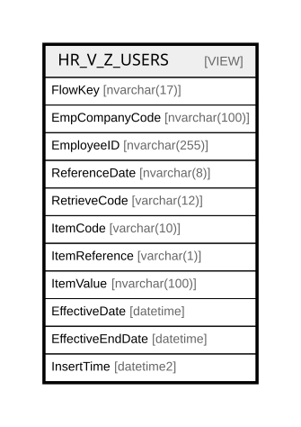

# HR_V_Z_USERS

## Description

<details>
<summary><strong>Table Definition</strong></summary>

```sql
-- Talentia Software - All right reserved
-- Type: VIEW                     Name: HR_V_Z_USERS
-- Date: 09-04-2026 07:27:59 (UTC)
-- 
-- ChangeLogId: 00000000-0000-0000-0000-000000000000
-- ChangeSetId: 426c3cba-82ec-42bb-b7b4-f85d3aac1f06
-- Original file name: C:\repos\Talentia-Software\hcm-core/DB/ProductDB/EDM\Schema\Views\HR_V_Z_USERS.xml


CREATE VIEW [HR_V_Z_USERS]
 ( FlowKey, EmpCompanyCode, EmployeeID, ReferenceDate, RetrieveCode, ItemCode, ItemReference, ItemValue, EffectiveDate, EffectiveEndDate, InsertTime ) 
 AS 
( SELECT
	CAST(DATEPART(YY, USR.INSERT_TIME) AS nvarchar(4)) +
	RIGHT('0' + CAST(DATEPART(MM, USR.INSERT_TIME) AS nvarchar(2)), 2) +
	RIGHT('0' + CAST(DATEPART(DD, USR.INSERT_TIME) AS nvarchar(2)), 2) +
	RIGHT('00' + CAST(DATEPART(HH, USR.INSERT_TIME) AS nvarchar(2)), 2) +
	RIGHT('00' + CAST(DATEPART(MI, USR.INSERT_TIME) AS nvarchar(2)), 2) +
	RIGHT('00' + CAST(DATEPART(SS, USR.INSERT_TIME) AS nvarchar(2)), 2) +
	RIGHT('000' + CAST(DATEPART(MS, USR.INSERT_TIME) AS nvarchar(3)), 3) AS FlowKey,
	CMP.COMPANYCODE AS EmpCompanyCode,
	CRS.SHAREDIDENTIFIER AS EmployeeID,
	CONVERT(nvarchar(8), CRS.EFFECTIVEFROM, 112) AS ReferenceDate,
	'HRANAGRAFICO' AS RetrieveCode,
	'IDUSERNAME' AS ItemCode,
	' ' AS ItemReference,
	USR.USERNAME AS ItemValue,
	COALESCE(USR.START_DATE, CRS.EFFECTIVEFROM) AS EffectiveDate,
	COALESCE(USR.END_DATE, CRS.EFFECTIVETO, '2999-12-31') AS EffectiveEndDate,
	USR.INSERT_TIME AS InsertTime
FROM
	TF_USERS USR
	INNER JOIN HR_COMPANYRELATIONSHIP CRS ON CRS.PERSON_ID = USR.PERSON_ID
	INNER JOIN HR_COMPANY CMP ON CMP.ID = CRS.COMPANY_ID
WHERE
	CRS.ISPRIMARY = 1 AND
	USR.ACTIVE = 1 AND
	CRS.SHAREDIDENTIFIER IS NOT NULL )

```

</details>

## Columns

| Name | Type | Default | Nullable | Comment |
| ---- | ---- | ------- | -------- | ------- |
| FlowKey | nvarchar(17) |  | true |  |
| EmpCompanyCode | nvarchar(100) |  | false |  |
| EmployeeID | nvarchar(255) |  | true |  |
| ReferenceDate | nvarchar(8) |  | true |  |
| RetrieveCode | varchar(12) |  | false |  |
| ItemCode | varchar(10) |  | false |  |
| ItemReference | varchar(1) |  | false |  |
| ItemValue | nvarchar(100) |  | false |  |
| EffectiveDate | datetime |  | true |  |
| EffectiveEndDate | datetime |  | true |  |
| InsertTime | datetime2 |  | false |  |

## Referenced Tables

| Name | Columns | Comment | Type |
| ---- | ------- | ------- | ---- |
| [TF_USERS](TF_USERS.md) | 66 | Users - The TF_USERS Entity<br /> | BASIC TABLE |
| [HR_COMPANYRELATIONSHIP](HR_COMPANYRELATIONSHIP.md) | 47 | Company Relationship - Provides key information about an employment contract associated with a staffing assignment or staffing resource.<br /> | BASIC TABLE |
| [HR_COMPANY](HR_COMPANY.md) | 17 | Company - This Entity represents the Companies in the Group.<br /> | BASIC TABLE |

## Relations



---

> Generated by [tbls](https://github.com/k1LoW/tbls)
