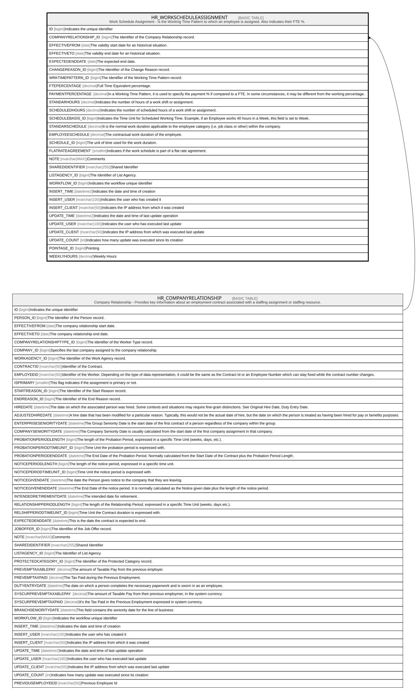

# HR_WORKSCHEDULEASSIGNMENT

## Description

Work Schedule Assignment - Is the Working Time Pattern to which an employee is assigned. Also indicates their FTE %.  

## Columns

| Name | Type | Default | Nullable | Parents | Comment |
| ---- | ---- | ------- | -------- | ------- | ------- |
| ID | bigint |  | false |  | Indicates the unique identifier |
| COMPANYRELATIONSHIP_ID | bigint |  | false | [HR_COMPANYRELATIONSHIP](HR_COMPANYRELATIONSHIP.md) | The Identifier of the Company Relationship record. |
| EFFECTIVEFROM | date |  | false |  | The validity start date for an historical situation. |
| EFFECTIVETO | date |  | true |  | The validity end date for an historical situation. |
| EXPECTEDENDDATE | date |  | true |  | The expected end date. |
| CHANGEREASON_ID | bigint |  | true |  | The Identifier of the Change Reason record. |
| WRKTIMEPATTERN_ID | bigint |  | true |  | The Identifier of the Working Time Pattern record. |
| FTEPERCENTAGE | decimal |  | false |  | Full Time Equivalent percentage. |
| PAYMENTPERCENTAGE | decimal |  | true |  | In a Working Time Pattern, it is used to specify the payment % if compared to a FTE. In some circumstances, it may be different from the working percentage. |
| STANDARHOURS | decimal |  | true |  | Indicates the number of hours of a work shift or assignment. |
| SCHEDULEDHOURS | decimal |  | true |  | Indicates the number of scheduled hours of a work shift or assignment. |
| SCHEDULEBASIS_ID | bigint |  | true |  | Indicates the Time Unit for Scheduled Working Time. Example, if an Employee works 40 hours in a Week, this field is set to Week. |
| STANDARSCHEDULE | decimal |  | true |  | It is the normal work duration applicable to the employee category (i.e. job class or other) within the company. |
| EMPLOYEESCHEDULE | decimal |  | true |  | The contractual work duration of the employee. |
| SCHEDULE_ID | bigint |  | true |  | The unit of time used for the work duration. |
| FLATRATEAGREEMENT | smallint |  | true |  | Indicates if the work schedule is part of a flat rate agreement. |
| NOTE | nvarchar(MAX) |  | true |  | Comments |
| SHAREDIDENTIFIER | nvarchar(255) |  | true |  | Shared Identifier |
| LISTAGENCY_ID | bigint |  | true |  | The Identifier of List Agency. |
| WORKFLOW_ID | bigint |  | true |  | Indicates the workflow unique identifier |
| INSERT_TIME | datetime2 | (sysutcdatetime()) | false |  | Indicates the date and time of creation |
| INSERT_USER | nvarchar(100) | (N'MAIN') | false |  | Indicates the user who has created it |
| INSERT_CLIENT | nvarchar(50) | (N'localhost') | false |  | Indicates the IP address from which it was created |
| UPDATE_TIME | datetime2 | (sysutcdatetime()) | false |  | Indicates the date and time of last update operation |
| UPDATE_USER | nvarchar(100) | (N'MAIN') | false |  | Indicates the user who has executed last update |
| UPDATE_CLIENT | nvarchar(50) | (N'localhost') | false |  | Indicates the IP address from which was executed last update |
| UPDATE_COUNT | int | ((0)) | false |  | Indicates how many update was executed since its creation |
| POINTAGE_ID | bigint |  | true |  | Pointing |
| WEEKLYHOURS | decimal |  | true |  | Weekly Hours |

## Constraints

| Name | Type | Definition |
| ---- | ---- | ---------- |
| PK_WORKSCHEDULEASSIGNMENT | PRIMARY KEY | CLUSTERED, unique, part of a PRIMARY KEY constraint, [ ID ] |
| UQ_WORKSCHEDULEASSIGNMENT | UNIQUE | NONCLUSTERED, unique, part of a UNIQUE constraint, [ ID, COMPANYRELATIONSHIP_ID, EFFECTIVEFROM ] |
| FK_WORKSCHED_COMPREL | FOREIGN KEY | FOREIGN KEY(COMPANYRELATIONSHIP_ID) REFERENCES HR_COMPANYRELATIONSHIP(ID) ON UPDATE NO_ACTION ON DELETE CASCADE |

## Indexes

| Name | Definition |
| ---- | ---------- |
| PK_WORKSCHEDULEASSIGNMENT | CLUSTERED, unique, part of a PRIMARY KEY constraint, [ ID ] |
| UQ_WORKSCHEDULEASSIGNMENT | NONCLUSTERED, unique, part of a UNIQUE constraint, [ ID, COMPANYRELATIONSHIP_ID, EFFECTIVEFROM ] |
| IDX_WORKSCHEDULEASSIGNMENT_P | NONCLUSTERED, [ COMPANYRELATIONSHIP_ID, EFFECTIVEFROM, EFFECTIVETO, WRKTIMEPATTERN_ID ] |
| IDX_WORKSCHEDULEASSIGNMENT | NONCLUSTERED, unique, [ COMPANYRELATIONSHIP_ID, EFFECTIVEFROM, WRKTIMEPATTERN_ID ] |
| IDX_WSASSIGNMENT_CHANGE | NONCLUSTERED, [ CHANGEREASON_ID ] |
| IDX_WSASSIGNMENT_BASIS | NONCLUSTERED, [ SCHEDULEBASIS_ID ] |
| IDX_WSASSIGNMENT_WTPATTERN | NONCLUSTERED, [ WRKTIMEPATTERN_ID ] |

## Relations

---

> Generated by [tbls](https://github.com/k1LoW/tbls)
