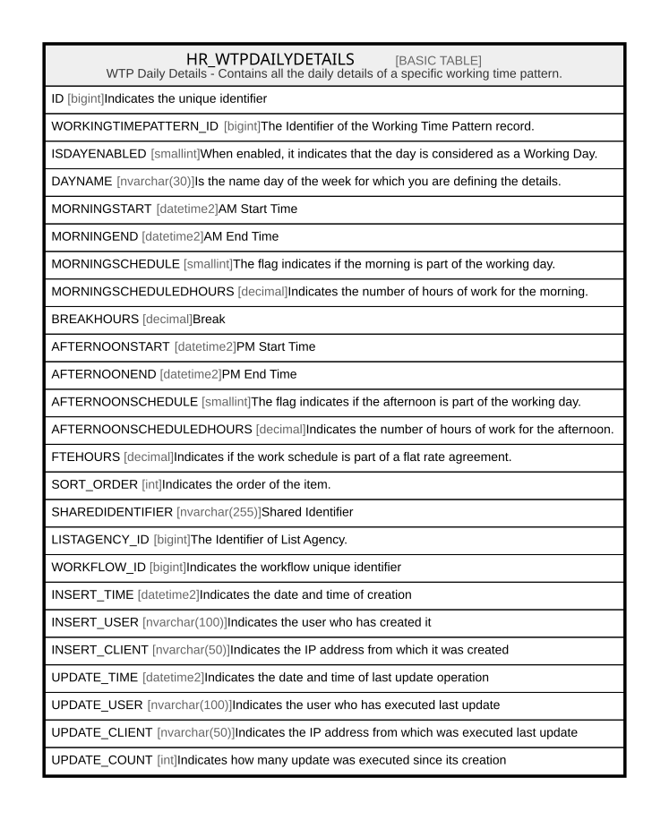

# HR_WTPDAILYDETAILS

## Description

WTP Daily Details - Contains all the daily details of a specific working time pattern.  

## Columns

| Name | Type | Default | Nullable | Comment |
| ---- | ---- | ------- | -------- | ------- |
| ID | bigint |  | false | Indicates the unique identifier |
| WORKINGTIMEPATTERN_ID | bigint |  | true | The Identifier of the Working Time Pattern record. |
| ISDAYENABLED | smallint |  | true | When enabled, it indicates that the day is considered as a Working Day. |
| DAYNAME | nvarchar(30) |  | true | Is the name day of the week for which you are defining the details. |
| MORNINGSTART | datetime2 |  | true | AM Start Time |
| MORNINGEND | datetime2 |  | true | AM End Time |
| MORNINGSCHEDULE | smallint |  | true | The flag indicates if the morning is part of the working day. |
| MORNINGSCHEDULEDHOURS | decimal |  | true | Indicates the number of hours of work for the morning. |
| BREAKHOURS | decimal |  | true | Break |
| AFTERNOONSTART | datetime2 |  | true | PM Start Time |
| AFTERNOONEND | datetime2 |  | true | PM End Time |
| AFTERNOONSCHEDULE | smallint |  | true | The flag indicates if the afternoon is part of the working day. |
| AFTERNOONSCHEDULEDHOURS | decimal |  | true | Indicates the number of hours of work for the afternoon. |
| FTEHOURS | decimal |  | true | Indicates if the work schedule is part of a flat rate agreement. |
| SORT_ORDER | int |  | true | Indicates the order of the item. |
| SHAREDIDENTIFIER | nvarchar(255) |  | true | Shared Identifier |
| LISTAGENCY_ID | bigint |  | true | The Identifier of List Agency. |
| WORKFLOW_ID | bigint |  | true | Indicates the workflow unique identifier |
| INSERT_TIME | datetime2 | (sysutcdatetime()) | false | Indicates the date and time of creation |
| INSERT_USER | nvarchar(100) | (N'MAIN') | false | Indicates the user who has created it |
| INSERT_CLIENT | nvarchar(50) | (N'localhost') | false | Indicates the IP address from which it was created |
| UPDATE_TIME | datetime2 | (sysutcdatetime()) | false | Indicates the date and time of last update operation |
| UPDATE_USER | nvarchar(100) | (N'MAIN') | false | Indicates the user who has executed last update |
| UPDATE_CLIENT | nvarchar(50) | (N'localhost') | false | Indicates the IP address from which was executed last update |
| UPDATE_COUNT | int | ((0)) | false | Indicates how many update was executed since its creation |

## Constraints

| Name | Type | Definition |
| ---- | ---- | ---------- |
| PK_WTPDAILYDETAILS | PRIMARY KEY | CLUSTERED, unique, part of a PRIMARY KEY constraint, [ ID ] |

## Indexes

| Name | Definition |
| ---- | ---------- |
| PK_WTPDAILYDETAILS | CLUSTERED, unique, part of a PRIMARY KEY constraint, [ ID ] |
| IDX_WTPDAILYDETAILS_WTP | NONCLUSTERED, [ WORKINGTIMEPATTERN_ID ] |

## Relations

---

> Generated by [tbls](https://github.com/k1LoW/tbls)
