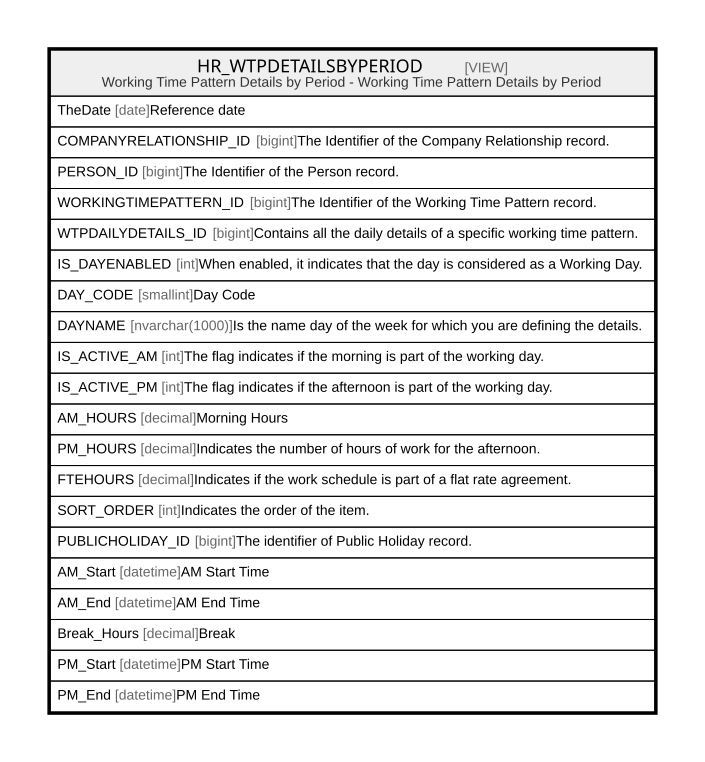

# HR_WTPDETAILSBYPERIOD

## Description

Working Time Pattern Details by Period - Working Time Pattern Details by Period  


<details>
<summary><strong>Table Definition</strong></summary>

```sql
-- Talentia Software - All right reserved
-- Type: VIEW                     Name: HR_WTPDETAILSBYPERIOD
-- Date: 09-04-2026 07:27:59 (UTC)
-- 
-- ChangeLogId: 00000000-0000-0000-0000-000000000000
-- ChangeSetId: a111236d-ee7f-43cc-8b70-bc496b5d282d
-- Original file name: C:\repos\Talentia-Software\hcm-core/DB/ProductDB/EDM\Schema\Views\HR_WTPDETAILSBYPERIOD.xml


CREATE VIEW [HR_WTPDETAILSBYPERIOD]
 ( TheDate, COMPANYRELATIONSHIP_ID, PERSON_ID, WORKINGTIMEPATTERN_ID, WTPDAILYDETAILS_ID, IS_DAYENABLED, DAY_CODE, DAYNAME, IS_ACTIVE_AM, IS_ACTIVE_PM, AM_HOURS, PM_HOURS, FTEHOURS, SORT_ORDER, PUBLICHOLIDAY_ID, AM_Start, AM_End, Break_Hours, PM_Start, PM_End ) 
 AS 
( SELECT
    GregorianCalendar.TheDate,
    HR_WORKSCHEDULEASSIGNMENT.COMPANYRELATIONSHIP_ID,
    HR_COMPANYRELATIONSHIP.PERSON_ID,
    HR_WTPDAILYDETAILS.WORKINGTIMEPATTERN_ID,
    HR_WTPDAILYDETAILS.ID as WTPDAILYDETAILS_ID,
    (CASE WHEN HR_EMPCALENDAREXCEPTION.ID IS NOT NULL THEN (CASE WHEN PublicHolidayExc.ID IS NOT NULL AND COALESCE(wtp.CT_BOOL8,0) = 0 and PublicHolidayExc.DAYPART_ID = 1175003 THEN 0 ELSE HR_WTPDAILYDETAILS.ISDAYENABLED END)
                                                      ELSE (CASE WHEN PublicHoliday.ID IS NOT NULL AND COALESCE(wtp.CT_BOOL8,0) = 0 and PublicHoliday.DAYPART_ID = 1175003 THEN 0 ELSE HR_WTPDAILYDETAILS.ISDAYENABLED END) END) AS IS_DAYENABLED,
    GregorianCalendar.THEDAYFROMSUNDAY AS DAY_CODE,
    (CASE WHEN HR_EMPCALENDAREXCEPTION.ID is not null THEN (CASE WHEN PublicHolidayExc.ID is not null and coalesce(wtp.CT_BOOL8,0) = 0 THEN PublicHolidayReasonExc.DESCRIPTION ELSE HR_WTPDAILYDETAILS.DAYNAME END)
                                                      ELSE (CASE WHEN PublicHoliday.ID is not null and coalesce(wtp.CT_BOOL8,0) = 0 THEN PublicHolidayReason.DESCRIPTION ELSE HR_WTPDAILYDETAILS.DAYNAME END) END) as DAYNAME,
    (CASE WHEN HR_EMPCALENDAREXCEPTION.ID is not null THEN (CASE WHEN PublicHolidayExc.ID is not null and coalesce(wtp.CT_BOOL8,0) = 0 and PublicHolidayExc.DAYPART_ID in (1175003,1175004) THEN 0 ELSE HR_WTPDAILYDETAILS.MORNINGSCHEDULE END)
                                                      ELSE (CASE WHEN PublicHoliday.ID is not null and coalesce(wtp.CT_BOOL8,0) = 0 and PublicHoliday.DAYPART_ID in (1175003,1175004) THEN 0 ELSE HR_WTPDAILYDETAILS.MORNINGSCHEDULE END) END) as IS_ACTIVE_AM,
    (CASE WHEN HR_EMPCALENDAREXCEPTION.ID is not null THEN (CASE WHEN PublicHolidayExc.ID is not null and coalesce(wtp.CT_BOOL8,0) = 0 and PublicHolidayExc.DAYPART_ID in (1175003,1175005) THEN 0 ELSE HR_WTPDAILYDETAILS.AFTERNOONSCHEDULE END)
                                                      ELSE (CASE WHEN PublicHoliday.ID is not null and coalesce(wtp.CT_BOOL8,0) = 0 and PublicHoliday.DAYPART_ID in (1175003,1175005) THEN 0 ELSE HR_WTPDAILYDETAILS.AFTERNOONSCHEDULE END) END) as IS_ACTIVE_PM,
    (CASE WHEN HR_EMPCALENDAREXCEPTION.ID is not null THEN (CASE WHEN PublicHolidayExc.ID is not null and coalesce(wtp.CT_BOOL8,0) = 0 and PublicHolidayExc.DAYPART_ID in (1175003,1175004) THEN 0 ELSE (case when HR_WTPDAILYDETAILS.MORNINGSCHEDULE = 1 then HR_WTPDAILYDETAILS.MORNINGSCHEDULEDHOURS else 0 end ) END)
                                                      ELSE (CASE WHEN PublicHoliday.ID is not null and coalesce(wtp.CT_BOOL8,0) = 0 and PublicHoliday.DAYPART_ID in (1175003,1175004) THEN 0 ELSE (case when HR_WTPDAILYDETAILS.MORNINGSCHEDULE = 1 then HR_WTPDAILYDETAILS.MORNINGSCHEDULEDHOURS else 0 end ) END) END) as AM_HOURS,
    (CASE WHEN HR_EMPCALENDAREXCEPTION.ID is not null THEN (CASE WHEN PublicHolidayExc.ID is not null and coalesce(wtp.CT_BOOL8,0) = 0 and PublicHolidayExc.DAYPART_ID in (1175003,1175005) THEN 0 ELSE (case when HR_WTPDAILYDETAILS.AFTERNOONSCHEDULE = 1 then HR_WTPDAILYDETAILS.AFTERNOONSCHEDULEDHOURS else 0 end ) END)
                                                      ELSE (CASE WHEN PublicHoliday.ID is not null and coalesce(wtp.CT_BOOL8,0) = 0 and PublicHoliday.DAYPART_ID in (1175003,1175005) THEN 0 ELSE (case when HR_WTPDAILYDETAILS.AFTERNOONSCHEDULE = 1 then HR_WTPDAILYDETAILS.AFTERNOONSCHEDULEDHOURS else 0 end ) END) END) as PM_HOURS,
    (CASE WHEN HR_EMPCALENDAREXCEPTION.ID is not null THEN (CASE WHEN PublicHolidayExc.ID is not null and coalesce(wtp.CT_BOOL8,0) = 0 then 0 else HR_WTPDAILYDETAILS.FTEHOURS end)
                                                      ELSE (CASE WHEN PublicHoliday.ID is not null and coalesce(wtp.CT_BOOL8,0) = 0 then 0 else HR_WTPDAILYDETAILS.FTEHOURS end) END) AS FTEHOURS,
    HR_WTPDAILYDETAILS.SORT_ORDER,
    (CASE WHEN HR_EMPCALENDAREXCEPTION.ID is not null THEN PublicHolidayExc.ID
                                                      ELSE PublicHoliday.ID END) AS PUBLICHOLIDAY_ID,
    CAST(GregorianCalendar.TheDate AS DATETIME) + CAST(CAST(HR_WTPDAILYDETAILS.MORNINGSTART AS TIME) AS DATETIME)   AS AM_Start   ,
    CAST(GregorianCalendar.TheDate AS DATETIME) + CAST(CAST(HR_WTPDAILYDETAILS.MORNINGEND AS TIME) AS DATETIME)     AS AM_End     ,
    HR_WTPDAILYDETAILS.BREAKHOURS                                                                                   AS Break_Hours,
    CAST(GregorianCalendar.TheDate AS DATETIME) + CAST(CAST(HR_WTPDAILYDETAILS.AFTERNOONSTART AS TIME) AS DATETIME) AS PM_Start   ,
    CAST(GregorianCalendar.TheDate AS DATETIME) + CAST(CAST(HR_WTPDAILYDETAILS.AFTERNOONEND AS TIME) AS DATETIME)   AS PM_End
FROM HR_DAYSTIMELINE AS GregorianCalendar
CROSS APPLY (SELECT CAST(COALESCE(PROPERTYVALUE, 0) AS smallint) AS UseWorkLocation FROM HR_APP_PROPERTIES WHERE PROPERTYCODE = 'ABSUSEWLA') AS AppConfig
  LEFT JOIN HR_WORKSCHEDULEASSIGNMENT on (GregorianCalendar.TheDate BETWEEN HR_WORKSCHEDULEASSIGNMENT.EFFECTIVEFROM AND HR_WORKSCHEDULEASSIGNMENT.EFFECTIVETO)
       JOIN HR_COMPANYRELATIONSHIP on (HR_COMPANYRELATIONSHIP.ID = HR_WORKSCHEDULEASSIGNMENT.COMPANYRELATIONSHIP_ID)
CROSS APPLY dbo.HR_ft_AbsWTPOrder(GregorianCalendar.TheDate, hr_WORKSCHEDULEASSIGNMENT.ID) AS WTPOrder
  LEFT JOIN TF_CODES WTP ON (WTP.ID = HR_WORKSCHEDULEASSIGNMENT.WRKTIMEPATTERN_ID)
  LEFT JOIN HR_WTPDAILYDETAILS on (HR_WTPDAILYDETAILS.WORKINGTIMEPATTERN_ID = wtp.ID and WTPOrder.WTPOrder = HR_WTPDAILYDETAILS.SORT_ORDER)
  LEFT JOIN HR_LOCATIONASSIGNMENT on (HR_LOCATIONASSIGNMENT.COMPANYRELATIONSHIP_ID = hr_WORKSCHEDULEASSIGNMENT.COMPANYRELATIONSHIP_ID and GregorianCalendar.TheDate between HR_LOCATIONASSIGNMENT.EFFECTIVEFROM and HR_LOCATIONASSIGNMENT.EFFECTIVETO)
  LEFT JOIN HR_WORKLOCATIONASSIGNMENT on (HR_WORKLOCATIONASSIGNMENT.COMPANYRELATIONSHIP_ID = hr_WORKSCHEDULEASSIGNMENT.COMPANYRELATIONSHIP_ID  and GregorianCalendar.TheDate between HR_WORKLOCATIONASSIGNMENT.EFFECTIVEFROM and HR_WORKLOCATIONASSIGNMENT.EFFECTIVETO and HR_WORKLOCATIONASSIGNMENT.ISPRIMARY = 1)
  LEFT JOIN HR_EMPCALENDAREXCEPTION on (HR_EMPCALENDAREXCEPTION.COMPANYRELATIONSHIP_ID = HR_WORKSCHEDULEASSIGNMENT.COMPANYRELATIONSHIP_ID and GregorianCalendar.TheDate between HR_EMPCALENDAREXCEPTION.EFFECTIVEFROM and HR_EMPCALENDAREXCEPTION.EFFECTIVETO)
  LEFT JOIN HR_PUBLICHOLIDAY PublicHolidayExc on (HR_EMPCALENDAREXCEPTION.CALENDAR_ID = PublicHolidayExc.CALENDAR_ID and PublicHolidayExc.REFDATE = GregorianCalendar.TheDate)
  LEFT JOIN TF_CODES PublicHolidayReasonExc on (PublicHolidayExc.HOLIDAYREASON_ID = PublicHolidayReasonExc.ID)
  LEFT JOIN HR_CALENDARBYLOCATION on (HR_CALENDARBYLOCATION.LOCATION_ID = CASE WHEN AppConfig.UseWorkLocation = 1 THEN COALESCE(HR_WORKLOCATIONASSIGNMENT.LOCATION_ID, HR_LOCATIONASSIGNMENT.LOCATION_ID) ELSE HR_LOCATIONASSIGNMENT.LOCATION_ID END)               
  LEFT JOIN HR_PUBLICHOLIDAY PublicHoliday on (HR_CALENDARBYLOCATION.CALENDAR_ID = PublicHoliday.CALENDAR_ID and PublicHoliday.REFDATE = GregorianCalendar.TheDate)
  LEFT JOIN TF_CODES PublicHolidayReason on (PublicHoliday.HOLIDAYREASON_ID = PublicHolidayReason.ID) 
WHERE 
(
CASE WHEN HR_EMPCALENDAREXCEPTION.ID IS NOT NULL THEN (
        CASE WHEN PublicHolidayExc.ID IS NOT NULL AND COALESCE(wtp.CT_BOOL8,0) = 0 and PublicHolidayExc.DAYPART_ID = 1175003 THEN 0 ELSE HR_WTPDAILYDETAILS.ISDAYENABLED END
        )
     ELSE (
        CASE WHEN PublicHoliday.ID IS NOT NULL AND COALESCE(wtp.CT_BOOL8,0) = 0 and PublicHoliday.DAYPART_ID = 1175003 THEN 0 ELSE HR_WTPDAILYDETAILS.ISDAYENABLED END) END) = 1
				 )

```

</details>

## Columns

| Name | Type | Default | Nullable | Comment |
| ---- | ---- | ------- | -------- | ------- |
| TheDate | date |  | false | Reference date |
| COMPANYRELATIONSHIP_ID | bigint |  | true | The Identifier of the Company Relationship record. |
| PERSON_ID | bigint |  | false | The Identifier of the Person record. |
| WORKINGTIMEPATTERN_ID | bigint |  | true | The Identifier of the Working Time Pattern record. |
| WTPDAILYDETAILS_ID | bigint |  | true | Contains all the daily details of a specific working time pattern. |
| IS_DAYENABLED | int |  | true | When enabled, it indicates that the day is considered as a Working Day. |
| DAY_CODE | smallint |  | true | Day Code |
| DAYNAME | nvarchar(1000) |  | true | Is the name day of the week for which you are defining the details. |
| IS_ACTIVE_AM | int |  | true | The flag indicates if the morning is part of the working day. |
| IS_ACTIVE_PM | int |  | true | The flag indicates if the afternoon is part of the working day. |
| AM_HOURS | decimal |  | true | Morning Hours |
| PM_HOURS | decimal |  | true | Indicates the number of hours of work for the afternoon. |
| FTEHOURS | decimal |  | true | Indicates if the work schedule is part of a flat rate agreement. |
| SORT_ORDER | int |  | true | Indicates the order of the item. |
| PUBLICHOLIDAY_ID | bigint |  | true | The identifier of Public Holiday record. |
| AM_Start | datetime |  | true | AM Start Time |
| AM_End | datetime |  | true | AM End Time |
| Break_Hours | decimal |  | true | Break |
| PM_Start | datetime |  | true | PM Start Time |
| PM_End | datetime |  | true | PM End Time |

## Referenced Tables

| Name | Columns | Comment | Type |
| ---- | ------- | ------- | ---- |
| [HR_DAYSTIMELINE](HR_DAYSTIMELINE.md) | 15 | DAYSTIMELINE - DAYSTIMELINE<br /> | BASIC TABLE |
| [HR_APP_PROPERTIES](HR_APP_PROPERTIES.md) | 15 | Application Properties - Application Properties<br /> | BASIC TABLE |
| [HR_WORKSCHEDULEASSIGNMENT](HR_WORKSCHEDULEASSIGNMENT.md) | 29 | Work Schedule Assignment - Is the Working Time Pattern to which an employee is assigned. Also indicates their FTE %.<br /> | BASIC TABLE |
| [HR_COMPANYRELATIONSHIP](HR_COMPANYRELATIONSHIP.md) | 47 | Company Relationship - Provides key information about an employment contract associated with a staffing assignment or staffing resource.<br /> | BASIC TABLE |
| [TF_CODES](TF_CODES.md) | 87 |  | BASIC TABLE |
| [HR_WTPDAILYDETAILS](HR_WTPDAILYDETAILS.md) | 25 | WTP Daily Details - Contains all the daily details of a specific working time pattern.<br /> | BASIC TABLE |
| [HR_LOCATIONASSIGNMENT](HR_LOCATIONASSIGNMENT.md) | 17 | Location Assignment - Indicates which Company's Location the employee has a Contract with. It is not necessarily equal to the Working Location.<br /> | BASIC TABLE |
| [HR_WORKLOCATIONASSIGNMENT](HR_WORKLOCATIONASSIGNMENT.md) | 22 | Work Location Assignment - Indicates the Working Location, which does not necessarily correspond to the Contract Location.<br /> | BASIC TABLE |
| [HR_EMPCALENDAREXCEPTION](HR_EMPCALENDAREXCEPTION.md) | 15 | Employee Calendar Exception - This entity is used to define a calendar for an employee and a given period, that is different from the default one defined for them by their location<br /> | BASIC TABLE |
| [HR_PUBLICHOLIDAY](HR_PUBLICHOLIDAY.md) | 16 | Public Holiday - Includes all public holidays for a calendar.<br /> | BASIC TABLE |
| [HR_CALENDARBYLOCATION](HR_CALENDARBYLOCATION.md) | 13 | Calendar by Location - This entity stores the link between a calendar and a location.<br /> | BASIC TABLE |

## Relations



---

> Generated by [tbls](https://github.com/k1LoW/tbls)
