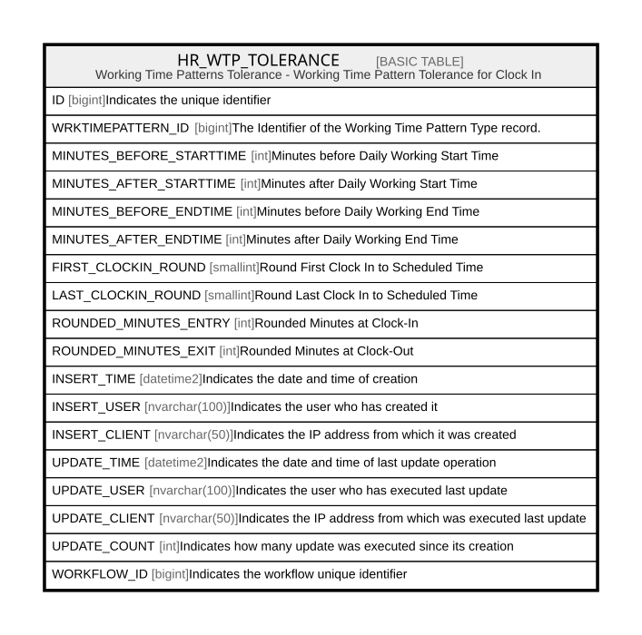

# HR_WTP_TOLERANCE

## Description

Working Time Patterns Tolerance - Working Time Pattern Tolerance for Clock In  

## Columns

| Name | Type | Default | Nullable | Comment |
| ---- | ---- | ------- | -------- | ------- |
| ID | bigint |  | false | Indicates the unique identifier |
| WRKTIMEPATTERN_ID | bigint |  | false | The Identifier of the Working Time Pattern Type record. |
| MINUTES_BEFORE_STARTTIME | int |  | true | Minutes before Daily Working Start Time |
| MINUTES_AFTER_STARTTIME | int |  | true | Minutes after Daily Working Start Time |
| MINUTES_BEFORE_ENDTIME | int |  | true | Minutes before Daily Working End Time |
| MINUTES_AFTER_ENDTIME | int |  | true | Minutes after Daily Working End Time |
| FIRST_CLOCKIN_ROUND | smallint |  | true | Round First Clock In to Scheduled Time |
| LAST_CLOCKIN_ROUND | smallint |  | true | Round Last Clock In to Scheduled Time |
| ROUNDED_MINUTES_ENTRY | int |  | true | Rounded Minutes at Clock-In |
| ROUNDED_MINUTES_EXIT | int |  | true | Rounded Minutes at Clock-Out |
| INSERT_TIME | datetime2 | (sysutcdatetime()) | false | Indicates the date and time of creation |
| INSERT_USER | nvarchar(100) | (N'MAIN') | false | Indicates the user who has created it |
| INSERT_CLIENT | nvarchar(50) | (N'localhost') | false | Indicates the IP address from which it was created |
| UPDATE_TIME | datetime2 | (sysutcdatetime()) | false | Indicates the date and time of last update operation |
| UPDATE_USER | nvarchar(100) | (N'MAIN') | false | Indicates the user who has executed last update |
| UPDATE_CLIENT | nvarchar(50) | (N'localhost') | false | Indicates the IP address from which was executed last update |
| UPDATE_COUNT | int | ((0)) | false | Indicates how many update was executed since its creation |
| WORKFLOW_ID | bigint |  | true | Indicates the workflow unique identifier |

## Constraints

| Name | Type | Definition |
| ---- | ---- | ---------- |
| PK_WTP_TOLERANCE | PRIMARY KEY | CLUSTERED, unique, part of a PRIMARY KEY constraint, [ ID ] |

## Indexes

| Name | Definition |
| ---- | ---------- |
| PK_WTP_TOLERANCE | CLUSTERED, unique, part of a PRIMARY KEY constraint, [ ID ] |

## Relations

---

> Generated by [tbls](https://github.com/k1LoW/tbls)
