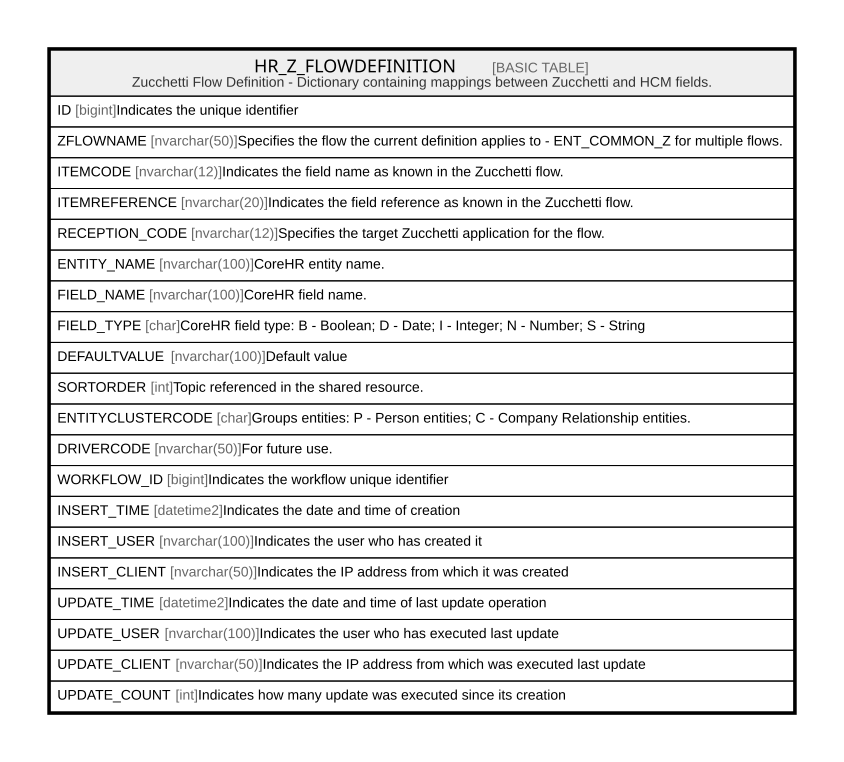

# HR_Z_FLOWDEFINITION

## Description

Zucchetti Flow Definition - Dictionary containing mappings between Zucchetti and HCM fields.  

## Columns

| Name | Type | Default | Nullable | Comment |
| ---- | ---- | ------- | -------- | ------- |
| ID | bigint |  | false | Indicates the unique identifier |
| ZFLOWNAME | nvarchar(50) |  | false | Specifies the flow the current definition applies to - ENT_COMMON_Z for multiple flows. |
| ITEMCODE | nvarchar(12) |  | false | Indicates the field name as known in the Zucchetti flow. |
| ITEMREFERENCE | nvarchar(20) |  | false | Indicates the field reference as known in the Zucchetti flow. |
| RECEPTION_CODE | nvarchar(12) |  | false | Specifies the target Zucchetti application for the flow. |
| ENTITY_NAME | nvarchar(100) |  | true | CoreHR entity name. |
| FIELD_NAME | nvarchar(100) |  | true | CoreHR field name. |
| FIELD_TYPE | char | ('S') | false | CoreHR field type: B - Boolean; D - Date; I - Integer; N - Number; S - String |
| DEFAULTVALUE | nvarchar(100) |  | true | Default value |
| SORTORDER | int |  | false | Topic referenced in the shared resource. |
| ENTITYCLUSTERCODE | char | ('P') | false | Groups entities: P - Person entities; C - Company Relationship entities. |
| DRIVERCODE | nvarchar(50) |  | true | For future use. |
| WORKFLOW_ID | bigint |  | true | Indicates the workflow unique identifier |
| INSERT_TIME | datetime2 | (sysutcdatetime()) | false | Indicates the date and time of creation |
| INSERT_USER | nvarchar(100) | (N'MAIN') | false | Indicates the user who has created it |
| INSERT_CLIENT | nvarchar(50) | (N'localhost') | false | Indicates the IP address from which it was created |
| UPDATE_TIME | datetime2 | (sysutcdatetime()) | false | Indicates the date and time of last update operation |
| UPDATE_USER | nvarchar(100) | (N'MAIN') | false | Indicates the user who has executed last update |
| UPDATE_CLIENT | nvarchar(50) | (N'localhost') | false | Indicates the IP address from which was executed last update |
| UPDATE_COUNT | int | ((0)) | false | Indicates how many update was executed since its creation |

## Constraints

| Name | Type | Definition |
| ---- | ---- | ---------- |
| PK_HR_Z_FLOWDEFINITION | PRIMARY KEY | CLUSTERED, unique, part of a PRIMARY KEY constraint, [ ID ] |
| UQ_ZFLOWDEFITEM | UNIQUE | NONCLUSTERED, unique, part of a UNIQUE constraint, [ ZFLOWNAME, ITEMCODE, ITEMREFERENCE ] |
| CK_ZFLOWDEF_CLUSTERCODE | CHECK | CHECK([ENTITYCLUSTERCODE]='C' OR [ENTITYCLUSTERCODE]='P') |
| CK_ZFLOWDEF_FIELDTYPE | CHECK | CHECK([FIELD_TYPE]='I' OR [FIELD_TYPE]='S' OR [FIELD_TYPE]='X' OR [FIELD_TYPE]='D' OR [FIELD_TYPE]='B' OR [FIELD_TYPE]='N') |

## Indexes

| Name | Definition |
| ---- | ---------- |
| PK_HR_Z_FLOWDEFINITION | CLUSTERED, unique, part of a PRIMARY KEY constraint, [ ID ] |
| UQ_ZFLOWDEFITEM | NONCLUSTERED, unique, part of a UNIQUE constraint, [ ZFLOWNAME, ITEMCODE, ITEMREFERENCE ] |

## Relations

---

> Generated by [tbls](https://github.com/k1LoW/tbls)
