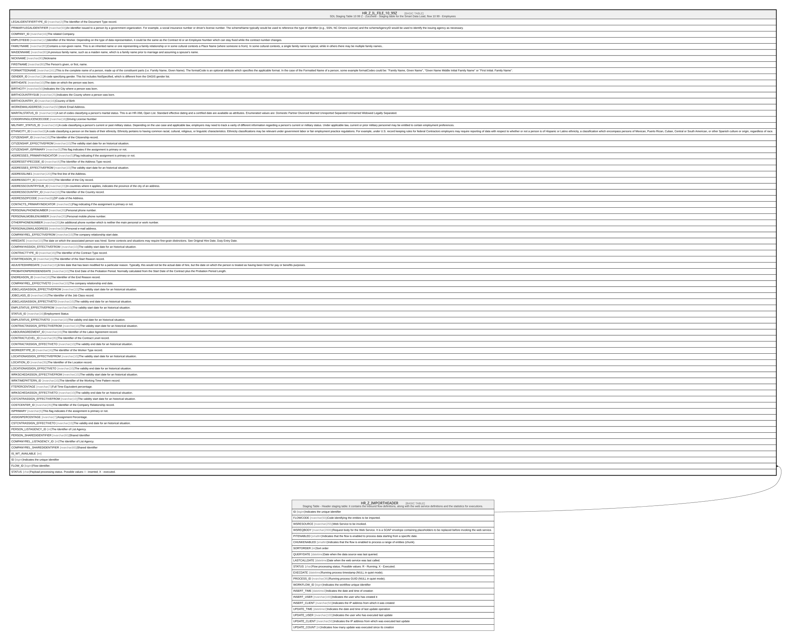

# HR_Z_IL_FILE_10_99Z

## Description

SDL Staging Table 10 99 Z - Zucchetti - Staging table for the Smart Data Load, flow 10 99 - Employees  

## Columns

| Name | Type | Default | Nullable | Parents | Comment |
| ---- | ---- | ------- | -------- | ------- | ------- |
| LEGALIDENTIFIERTYPE_ID | nvarchar(2) |  | true |  | The Identifier of the Document Type record. |
| PRIMARYLEGALIDENTIFIER | nvarchar(50) |  | true |  | An identifier issued to a person by a government organization. For example, a social insurance number or driver's license number. The schemeName typically would be used to reference the type of identifier (e.g., SSN, NC Drivers License) and the schemeAgencyID would be used to identify the issuing agency as necessary. |
| COMPANY_ID | nvarchar(16) |  | true |  | The related Company. |
| EMPLOYEEID | nvarchar(12) |  | true |  | Identifier of the Worker. Depending on the type of data representation, it could be the same as the Contract Id or an Employee Number which can stay fixed while the contract number changes. |
| FAMILYNAME | nvarchar(80) |  | true |  | Contains a non-given name. This is an inherited name or one representing a family relationship or in some cultural contexts a Place Name (where someone is from). In some cultural contexts, a single family name is typical, while in others there may be multiple family names.. |
| MAIDENNAME | nvarchar(80) |  | true |  | A previous family name, such as a maiden name, which is a family name prior to marriage and assuming a spouse's name. |
| NICKNAME | nvarchar(80) |  | true |  | Nickname |
| FIRSTNAME | nvarchar(80) |  | true |  | The Person's given, or first, name. |
| FORMATTEDNAME | nvarchar(161) |  | true |  | This is the complete name of a person, made up of the constituent parts (i.e. Family Name, Given Name). The formatCode is an optional attribute which specifies the applicable format. In the case of the Formatted Name of a person, some example formatCodes could be: ''Family Name, Given Name'', ''Given Name Middle Initial Family Name'' or ''First Initial. Family Name''. |
| GENDER_ID | nvarchar(1) |  | true |  | A code specifying gender. This list includes NotSpecified, which is different from the OAGIS gender list. |
| BIRTHDATE | nvarchar(10) |  | true |  | The date on which the person was born. |
| BIRTHCITY | nvarchar(50) |  | true |  | Indicates the City where a person was born. |
| BIRTHCOUNTRYSUB | nvarchar(25) |  | true |  | Indicates the County where a person was born. |
| BIRTHCOUNTRY_ID | nvarchar(16) |  | true |  | Country of Birth |
| WORKEMAILADDRESS | nvarchar(50) |  | true |  | Work Email Address. |
| MARITALSTATUS_ID | nvarchar(16) |  | true |  | A set of codes classifying a person's marital status. This is an HR-XML Open List. Standard effective dating and a certified date are available as attributes. Enumerated values are: Domestic Partner Divorced Married Unreported Separated Unmarried Widowed Legally Separated. |
| CODDRIVINGLICENCECODE | nvarchar(16) |  | true |  | Driving License Number |
| MILITARY_STATUS_ID | nvarchar(16) |  | true |  | A code classifiying a person's current or past military status. Depending on the use case and applicable law, employers may need to track a varity of different information regarding a person's current or military status. Under applicable law, current or prior military personnel may be entitled to certain employment preferences. |
| ETHNICITY_ID | nvarchar(6) |  | true |  | A code classifying a person on the basis of their ethnicity. Ethnicity pertains to having common racial, cultural, religious, or linguistic characteristics. Ethnicity classifications may be relevant under government labor or fair employment practice regulations. For example, under U.S. record keeping rules for federal Contractors employers may require reporting of data with respect to whether or not a person is of Hispanic or Latino ethnicity, a classification which encompass persons of Mexican, Puerto Rican, Cuban, Central or South American, or other Spanish culture or origin, regardless of race. |
| CITIZENSHIP_ID | nvarchar(16) |  | true |  | The Identifier of the Citizenship record. |
| CITIZENSHIP_EFFECTIVEFROM | nvarchar(10) |  | true |  | The validity start date for an historical situation. |
| CITIZENSHIP_ISPRIMARY | nvarchar(5) |  | true |  | This flag indicates if the assignment is primary or not. |
| ADDRESSES_PRIMARYINDICATOR | nvarchar(5) |  | true |  | Flag indicating if the assignment is primary or not. |
| ADDRESSTYPECODE_ID | nvarchar(4) |  | true |  | The Identifier of the Address Type record. |
| ADDRESSES_EFFECTIVEFROM | nvarchar(10) |  | true |  | The validity start date for an historical situation. |
| ADDRESSLINE1 | nvarchar(120) |  | true |  | The first line of the Address.  |
| ADDRESSCITY_ID | nvarchar(500) |  | true |  | The Identifier of the City record. |
| ADDRESSCOUNTRYSUB_ID | nvarchar(23) |  | true |  | In countries where it applies, indicates the province of the city of an address. |
| ADDRESSCOUNTRY_ID | nvarchar(16) |  | true |  | The Identifier of the Country record. |
| ADDRESSZIPCODE | nvarchar(8) |  | true |  | ZIP code of the Address. |
| CONTACTS_PRIMARYINDICATOR | nvarchar(5) |  | true |  | Flag indicating if the assignment is primary or not. |
| PERSONALPHONENUMBER | nvarchar(20) |  | true |  | Personal phone number. |
| PERSONALMOBILENUMBER | nvarchar(20) |  | true |  | Personal mobile phone number. |
| OTHERPHONENUMBER | nvarchar(20) |  | true |  | An additional phone number which is neither the main personal or work number. |
| PERSONALEMAILADDRESS | nvarchar(50) |  | true |  | Personal e-mail address. |
| COMPANYREL_EFFECTIVEFROM | nvarchar(10) |  | true |  | The company relationship start date. |
| HIREDATE | nvarchar(10) |  | true |  | The date on which the associated person was hired. Some contexts and situations may require fine-grain distinctions. See Original Hire Date, Duty Entry Date. |
| COMPANYASSIGN_EFFECTIVEFROM | nvarchar(10) |  | true |  | The validity start date for an historical situation. |
| CONTRACTTYPE_ID | nvarchar(16) |  | true |  | The Identifier of the Contract Type record. |
| STARTREASON_ID | nvarchar(16) |  | true |  | The Identifier of the Start Reason record. |
| ADJUSTEDHIREDATE | nvarchar(10) |  | true |  | A hire date that has been modified for a particular reason. Typically, this would not be the actual date of hire, but the date on which the person is treated as having been hired for pay or benefits purposes. |
| PROBATIONPERIODENDDATE | nvarchar(10) |  | true |  | The End Date of the Probation Period. Normally calculated from the Start Date of the Contract plus the Probation Period Length. |
| ENDREASON_ID | nvarchar(16) |  | true |  | The Identifier of the End Reason record. |
| COMPANYREL_EFFECTIVETO | nvarchar(10) |  | true |  | The company relationship end date. |
| JOBCLASSASSIGN_EFFECTIVEFROM | nvarchar(10) |  | true |  | The validity start date for an historical situation. |
| JOBCLASS_ID | nvarchar(16) |  | true |  | The Identifier of the Job Class record. |
| JOBCLASSASSIGN_EFFECTIVETO | nvarchar(10) |  | true |  | The validity end date for an historical situation. |
| EMPLSTATUS_EFFECTIVEFROM | nvarchar(10) |  | true |  | The validity start date for an historical situation. |
| STATUS_ID | nvarchar(16) |  | true |  | Employment Status |
| EMPLSTATUS_EFFECTIVETO | nvarchar(10) |  | true |  | The validity end date for an historical situation. |
| CONTRACTASSIGN_EFFECTIVEFROM | nvarchar(10) |  | true |  | The validity start date for an historical situation. |
| LABOURAGREEMENT_ID | nvarchar(16) |  | true |  | The Identifier of the Labor Agreement record. |
| CONTRACTLEVEL_ID | nvarchar(35) |  | true |  | The Identifier of the Contract Level record. |
| CONTRACTASSIGN_EFFECTIVETO | nvarchar(10) |  | true |  | The validity end date for an historical situation. |
| WORKERTYPE_ID | nvarchar(16) |  | true |  | The identifier of the Worker Type record. |
| LOCATIONASSIGN_EFFECTIVEFROM | nvarchar(10) |  | true |  | The validity start date for an historical situation. |
| LOCATION_ID | nvarchar(35) |  | true |  | The Identifier of the Location record. |
| LOCATIONASSIGN_EFFECTIVETO | nvarchar(10) |  | true |  | The validity end date for an historical situation. |
| WRKSCHEDASSGN_EFFECTIVEFROM | nvarchar(10) |  | true |  | The validity start date for an historical situation. |
| WRKTIMEPATTERN_ID | nvarchar(16) |  | true |  | The Identifier of the Working Time Pattern record. |
| FTEPERCENTAGE | nvarchar(7) |  | true |  | Full Time Equivalent percentage. |
| WRKSCHEDASSGN_EFFECTIVETO | nvarchar(10) |  | true |  | The validity end date for an historical situation. |
| CSTCNTRASSIGN_EFFECTIVEFROM | nvarchar(10) |  | true |  | The validity start date for an historical situation. |
| COSTCENTER_ID | nvarchar(35) |  | true |  | The Identifier of the Company Relationship record. |
| ISPRIMARY | nvarchar(5) |  | true |  | This flag indicates if the assignment is primary or not. |
| ASSIGNPERCENTAGE | nvarchar(7) |  | true |  | Assignment Percentage. |
| CSTCNTRASSIGN_EFFECTIVETO | nvarchar(10) |  | true |  | The validity end date for an historical situation. |
| PERSON_LISTAGENCY_ID | int |  | false |  | The Identifier of List Agency. |
| PERSON_SHAREDIDENTIFIER | nvarchar(60) |  | true |  | Shared Identifier |
| COMPANYREL_LISTAGENCY_ID | int |  | false |  | The Identifier of List Agency. |
| COMPANYREL_SHAREDIDENTIFIER | nvarchar(60) |  | true |  | Shared Identifier |
| IS_WT_AVAILABLE | int |  | false |  |  |
| ID | bigint |  | false |  | Indicates the unique identifier |
| FLOW_ID | bigint |  | true | [HR_Z_IMPORTHEADER](HR_Z_IMPORTHEADER.md) | Flow identifier. |
| STATUS | char |  | true |  | Payload processing status. Possible values: I - inserted; X - executed. |

## Constraints

| Name | Type | Definition |
| ---- | ---- | ---------- |
| PK_HR_Z_IL_FILE_10_99Z | PRIMARY KEY | CLUSTERED, unique, part of a PRIMARY KEY constraint, [ ID ] |
| FK_Z_10_99Z_HR_Z_HEADER | FOREIGN KEY | FOREIGN KEY(FLOW_ID) REFERENCES HR_Z_IMPORTHEADER(ID) ON UPDATE NO_ACTION ON DELETE CASCADE |

## Indexes

| Name | Definition |
| ---- | ---------- |
| PK_HR_Z_IL_FILE_10_99Z | CLUSTERED, unique, part of a PRIMARY KEY constraint, [ ID ] |
| IDX_Z_10_99 | NONCLUSTERED, [ IS_WT_AVAILABLE, ID ] |

## Relations

---

> Generated by [tbls](https://github.com/k1LoW/tbls)
