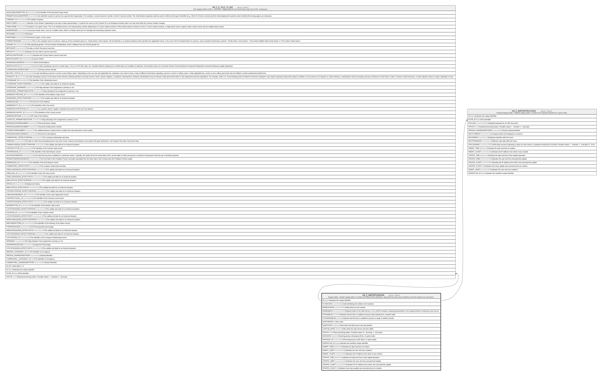

# HR_Z_IMPORTHEADER

## Description

Staging Table - Header staging table: it contains the inbound flow definitions, along with the web service definitions and the statistics for executions.

## Columns

| Name | Type | Default | Nullable | Children | Comment |
| ---- | ---- | ------- | -------- | -------- | ------- |
| ID | bigint |  | false | [HR_Z_IL_FILE_10_99Z](HR_Z_IL_FILE_10_99Z.md) [HR_Z_IMPORTPAYLOADS](HR_Z_IMPORTPAYLOADS.md) | Indicates the unique identifier |
| FLOWCODE | nvarchar(50) |  | false |  | Code identifying the entities to be imported. |
| WSRESOURCE | nvarchar(255) |  | true |  | Web Service to be invoked. |
| WSREQBODY | nvarchar(2000) |  | true |  | Request body for the Web Service. It is a SOAP envelope containing placeholders to be replaced before invoking the web service. |
| PITENABLED | smallint |  | true |  | Indicates that the flow is enabled to process data starting from a specific date. |
| CHUNKENABLED | smallint |  | true |  | Indicates that the flow is enabled to process a range of entities (chunk). |
| SORTORDER | int |  | true |  | Sort order |
| QUERYDATE | datetime |  | true |  | Date when the data source was last queried. |
| LASTCALLDATE | datetime |  | true |  | Date when the web service was last called. |
| STATUS | char | ('X') | true |  | Flow processing status. Possible values: R - Running; X - Executed. |
| EXECDATE | datetime |  | true |  | Running process timestamp (NULL in quiet mode). |
| PROCESS_ID | nvarchar(36) |  | true |  | Running process GUID (NULL in quiet mode). |
| WORKFLOW_ID | bigint |  | true |  | Indicates the workflow unique identifier |
| INSERT_TIME | datetime2 | (sysutcdatetime()) | false |  | Indicates the date and time of creation |
| INSERT_USER | nvarchar(100) | (N'MAIN') | false |  | Indicates the user who has created it |
| INSERT_CLIENT | nvarchar(50) | (N'localhost') | false |  | Indicates the IP address from which it was created |
| UPDATE_TIME | datetime2 | (sysutcdatetime()) | false |  | Indicates the date and time of last update operation |
| UPDATE_USER | nvarchar(100) | (N'MAIN') | false |  | Indicates the user who has executed last update |
| UPDATE_CLIENT | nvarchar(50) | (N'localhost') | false |  | Indicates the IP address from which was executed last update |
| UPDATE_COUNT | int | ((0)) | false |  | Indicates how many update was executed since its creation |

## Constraints

| Name | Type | Definition |
| ---- | ---- | ---------- |
| PK_HR_Z_IMPORTHEADER | PRIMARY KEY | CLUSTERED, unique, part of a PRIMARY KEY constraint, [ ID ] |
| UQ_HR_Z_IMPORTHEADER_CODE | UNIQUE | NONCLUSTERED, unique, part of a UNIQUE constraint, [ FLOWCODE ] |

## Indexes

| Name | Definition |
| ---- | ---------- |
| PK_HR_Z_IMPORTHEADER | CLUSTERED, unique, part of a PRIMARY KEY constraint, [ ID ] |
| UQ_HR_Z_IMPORTHEADER_CODE | NONCLUSTERED, unique, part of a UNIQUE constraint, [ FLOWCODE ] |

## Relations

---

> Generated by [tbls](https://github.com/k1LoW/tbls)
