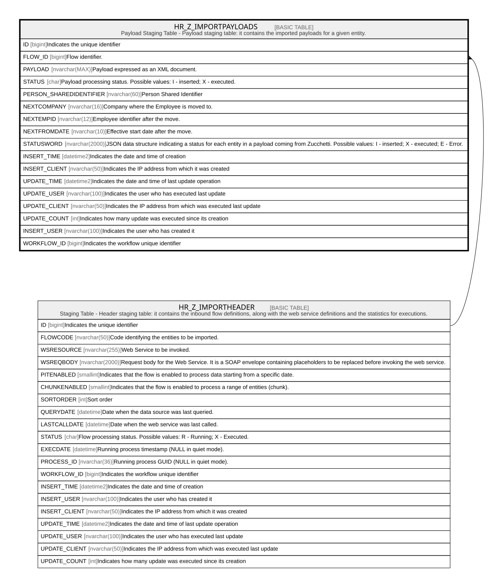

# HR_Z_IMPORTPAYLOADS

## Description

Payload Staging Table - Payload staging table: it contains the imported payloads for a given entity.

## Columns

| Name | Type | Default | Nullable | Parents | Comment |
| ---- | ---- | ------- | -------- | ------- | ------- |
| ID | bigint |  | false |  | Indicates the unique identifier |
| FLOW_ID | bigint |  | true | [HR_Z_IMPORTHEADER](HR_Z_IMPORTHEADER.md) | Flow identifier. |
| PAYLOAD | nvarchar(MAX) |  | true |  | Payload expressed as an XML document. |
| STATUS | char | ('I') | true |  | Payload processing status. Possible values: I - inserted; X - executed. |
| PERSON_SHAREDIDENTIFIER | nvarchar(60) |  | true |  | Person Shared Identifier |
| NEXTCOMPANY | nvarchar(16) |  | true |  | Company where the Employee is moved to. |
| NEXTEMPID | nvarchar(12) |  | true |  | Employee identifier after the move. |
| NEXTFROMDATE | nvarchar(10) |  | true |  | Effective start date after the move. |
| STATUSWORD | nvarchar(2000) | (N'{}') | true |  | JSON data structure indicating a status for each entity in a payload coming from Zucchetti. Possible values: I - inserted; X - executed; E - Error. |
| INSERT_TIME | datetime2 | (sysutcdatetime()) | false |  | Indicates the date and time of creation |
| INSERT_CLIENT | nvarchar(50) | (N'localhost') | false |  | Indicates the IP address from which it was created |
| UPDATE_TIME | datetime2 | (sysutcdatetime()) | false |  | Indicates the date and time of last update operation |
| UPDATE_USER | nvarchar(100) | (N'MAIN') | false |  | Indicates the user who has executed last update |
| UPDATE_CLIENT | nvarchar(50) | (N'localhost') | false |  | Indicates the IP address from which was executed last update |
| UPDATE_COUNT | int | ((0)) | false |  | Indicates how many update was executed since its creation |
| INSERT_USER | nvarchar(100) | (N'MAIN') | true |  | Indicates the user who has created it |
| WORKFLOW_ID | bigint |  | true |  | Indicates the workflow unique identifier |

## Constraints

| Name | Type | Definition |
| ---- | ---- | ---------- |
| PK_HR_Z_IMPORTPAYLOADS | PRIMARY KEY | CLUSTERED, unique, part of a PRIMARY KEY constraint, [ ID ] |
| FK_HR_Z_PAYLOADS_HR_Z_HEADER | FOREIGN KEY | FOREIGN KEY(FLOW_ID) REFERENCES HR_Z_IMPORTHEADER(ID) ON UPDATE NO_ACTION ON DELETE CASCADE |

## Indexes

| Name | Definition |
| ---- | ---------- |
| PK_HR_Z_IMPORTPAYLOADS | CLUSTERED, unique, part of a PRIMARY KEY constraint, [ ID ] |
| IDX_HR_Z_IMPORTPAYLOADS | NONCLUSTERED, [ PERSON_SHAREDIDENTIFIER, NEXTCOMPANY, NEXTEMPID ] |

## Relations

---

> Generated by [tbls](https://github.com/k1LoW/tbls)
