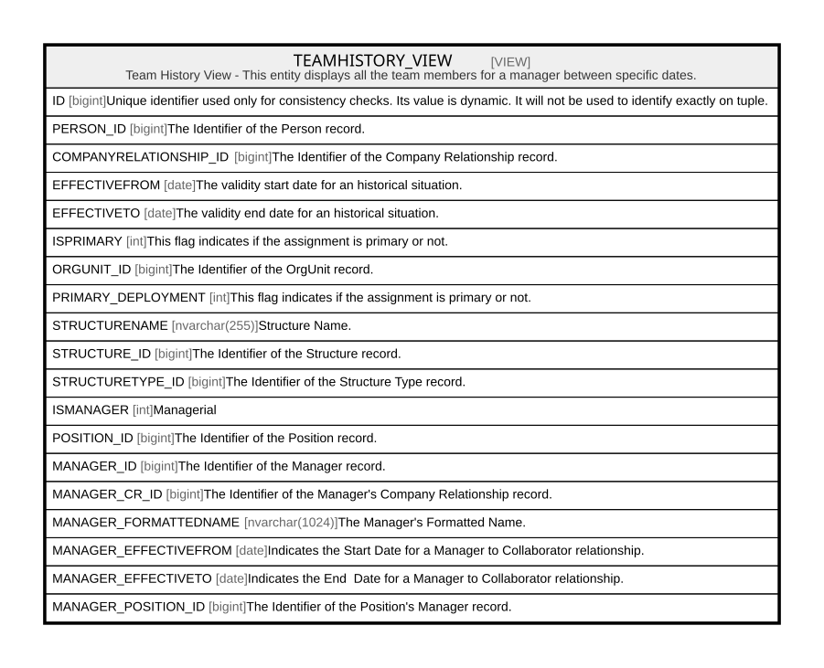

# TEAMHISTORY_VIEW

## Description

Team History View - This entity displays all the team members for a manager between specific dates.  


<details>
<summary><strong>Table Definition</strong></summary>

```sql
-- Talentia Software - All right reserved
-- Type: VIEW                     Name: TEAMHISTORY_VIEW
-- Date: 09-04-2026 07:27:59 (UTC)
-- 
-- ChangeLogId: 00000000-0000-0000-0000-000000000000
-- ChangeSetId: e540dbec-2d13-45ee-8eeb-7f69c2712c7c
-- Original file name: C:\repos\Talentia-Software\hcm-core/DB/ProductDB/EDM\Schema\Views\0050_TEAMHISTORY_VIEW.xml


CREATE VIEW [TEAMHISTORY_VIEW]
 AS 
( 
SELECT
    ROW_NUMBER() OVER (ORDER BY (SELECT NULL)) AS ID,
    *
FROM (
                  SELECT * FROM V_ORGANIZATIONREPORTS

                  UNION

                  SELECT * FROM V_OTHERSTRUCTREPORTS

                  UNION

                  SELECT * FROM V_POSITIONREPORTS

                  UNION

                  SELECT * FROM V_PERSONTOPERSON
                 ) THV
				  )

```

</details>

## Columns

| Name | Type | Default | Nullable | Comment |
| ---- | ---- | ------- | -------- | ------- |
| ID | bigint |  | true | Unique identifier used only for consistency checks. Its value is dynamic. It will not be used to identify exactly on tuple. |
| PERSON_ID | bigint |  | false | The Identifier of the Person record. |
| COMPANYRELATIONSHIP_ID | bigint |  | true | The Identifier of the Company Relationship record. |
| EFFECTIVEFROM | date |  | true | The validity start date for an historical situation. |
| EFFECTIVETO | date |  | true | The validity end date for an historical situation. |
| ISPRIMARY | int |  | true | This flag indicates if the assignment is primary or not. |
| ORGUNIT_ID | bigint |  | true | The Identifier of the OrgUnit record. |
| PRIMARY_DEPLOYMENT | int |  | true | This flag indicates if the assignment is primary or not. |
| STRUCTURENAME | nvarchar(255) |  | true | Structure Name. |
| STRUCTURE_ID | bigint |  | false | The Identifier of the Structure record. |
| STRUCTURETYPE_ID | bigint |  | true | The Identifier of the Structure Type record. |
| ISMANAGER | int |  | true | Managerial |
| POSITION_ID | bigint |  | true | The Identifier of the Position record. |
| MANAGER_ID | bigint |  | true | The Identifier of the Manager record. |
| MANAGER_CR_ID | bigint |  | true | The Identifier of the Manager's Company Relationship record. |
| MANAGER_FORMATTEDNAME | nvarchar(1024) |  | true | The Manager's Formatted Name. |
| MANAGER_EFFECTIVEFROM | date |  | true | Indicates the Start Date for a Manager to Collaborator relationship. |
| MANAGER_EFFECTIVETO | date |  | true | Indicates the End  Date for a Manager to Collaborator relationship. |
| MANAGER_POSITION_ID | bigint |  | true | The Identifier of the Position's Manager record. |

## Referenced Tables

| Name | Columns | Comment | Type |
| ---- | ------- | ------- | ---- |
| [V_ORGANIZATIONREPORTS](V_ORGANIZATIONREPORTS.md) | 18 |  | VIEW |
| [V_OTHERSTRUCTREPORTS](V_OTHERSTRUCTREPORTS.md) | 18 |  | VIEW |
| [V_POSITIONREPORTS](V_POSITIONREPORTS.md) | 18 |  | VIEW |
| [V_PERSONTOPERSON](V_PERSONTOPERSON.md) | 18 |  | VIEW |

## Relations



---

> Generated by [tbls](https://github.com/k1LoW/tbls)
