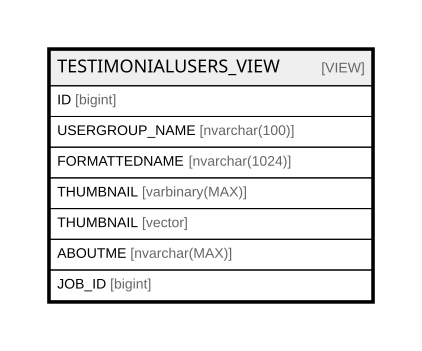

# TESTIMONIALUSERS_VIEW

## Description

<details>
<summary><strong>Table Definition</strong></summary>

```sql
-- Talentia Software - All right reserved
-- Type: VIEW                     Name: TESTIMONIALUSERS_VIEW
-- Date: 09-04-2026 07:27:59 (UTC)
-- 
-- ChangeLogId: 00000000-0000-0000-0000-000000000000
-- ChangeSetId: bdaa3847-f157-477c-a747-5d08f30687a1
-- Original file name: C:\repos\Talentia-Software\hcm-core/DB/ProductDB/EDM\Schema\Views\0060_TESTIMONIALUSERS_VIEW.xml


CREATE VIEW [TESTIMONIALUSERS_VIEW]
 ( ID, USERGROUP_NAME, FORMATTEDNAME, THUMBNAIL, ABOUTME, JOB_ID ) 
 AS 
( SELECT HR_PERSON.ID, TF_USERGROUPS.NAME, HR_PERSON.FORMATTEDNAME, HR_PERSON.THUMBNAIL, HR_PERSON.ABOUTME, HR_JOBASSIGNMENT.JOB_ID
FROM TF_USERGROUPS
INNER JOIN TF_USERGROUP_USERS ON TF_USERGROUPS.ID = TF_USERGROUP_USERS.USERGROUP_ID
INNER JOIN TF_USERS ON (TF_USERGROUP_USERS.USER_ID = TF_USERS.ID)
INNER JOIN HR_PERSON ON (TF_USERS.PERSON_ID = HR_PERSON.ID)
LEFT JOIN HR_COMPANYRELATIONSHIP ON (HR_PERSON.ID = HR_COMPANYRELATIONSHIP.PERSON_ID AND HR_COMPANYRELATIONSHIP.ISPRIMARY = 1 AND GETDATE() BETWEEN HR_COMPANYRELATIONSHIP.EFFECTIVEFROM AND HR_COMPANYRELATIONSHIP.EFFECTIVETO)
LEFT JOIN HR_JOBASSIGNMENT ON (HR_COMPANYRELATIONSHIP.ID = HR_JOBASSIGNMENT.COMPANYRELATIONSHIP_ID AND HR_JOBASSIGNMENT.ISPRIMARY = 1 AND GETDATE() BETWEEN HR_JOBASSIGNMENT.EFFECTIVEFROM AND HR_JOBASSIGNMENT.EFFECTIVETO) )

```

</details>

## Columns

| Name | Type | Default | Nullable | Comment |
| ---- | ---- | ------- | -------- | ------- |
| ID | bigint |  | false |  |
| USERGROUP_NAME | nvarchar(100) |  | false |  |
| FORMATTEDNAME | nvarchar(1024) |  | true |  |
| THUMBNAIL | varbinary(MAX) |  | true |  |
| THUMBNAIL | vector |  | true |  |
| ABOUTME | nvarchar(MAX) |  | true |  |
| JOB_ID | bigint |  | true |  |

## Referenced Tables

| Name | Columns | Comment | Type |
| ---- | ------- | ------- | ---- |
| [TF_USERGROUPS](TF_USERGROUPS.md) | 28 | User Groups - User Groups<br /> | BASIC TABLE |
| [TF_USERGROUP_USERS](TF_USERGROUP_USERS.md) | 10 | User Group Users - User Group Users<br /> | BASIC TABLE |
| [TF_USERS](TF_USERS.md) | 66 | Users - The TF_USERS Entity<br /> | BASIC TABLE |
| [HR_PERSON](HR_PERSON.md) | 56 | Person - Contains information identifying the person.<br /> | BASIC TABLE |
| [HR_COMPANYRELATIONSHIP](HR_COMPANYRELATIONSHIP.md) | 47 | Company Relationship - Provides key information about an employment contract associated with a staffing assignment or staffing resource.<br /> | BASIC TABLE |
| [HR_JOBASSIGNMENT](HR_JOBASSIGNMENT.md) | 21 | Job Assignment - Indicates the Job associated to a Person in the context of a specific Company Relationship.<br /> | BASIC TABLE |

## Relations



---

> Generated by [tbls](https://github.com/k1LoW/tbls)
