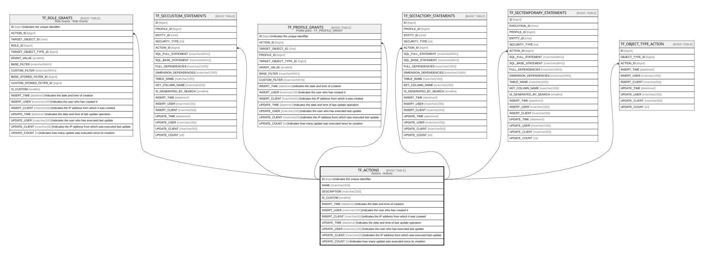

# TF_ACTIONS

## Description

Actions - Actions  

## Columns

| Name | Type | Default | Nullable | Children | Comment |
| ---- | ---- | ------- | -------- | -------- | ------- |
| ID | bigint |  | false | [TF_ROLE_GRANTS](TF_ROLE_GRANTS.md) [TF_SECCUSTOM_STATEMENTS](TF_SECCUSTOM_STATEMENTS.md) [TF_PROFILE_GRANTS](TF_PROFILE_GRANTS.md) [TF_SECFACTORY_STATEMENTS](TF_SECFACTORY_STATEMENTS.md) [TF_SECTEMPORARY_STATEMENTS](TF_SECTEMPORARY_STATEMENTS.md) [TF_OBJECT_TYPE_ACTION](TF_OBJECT_TYPE_ACTION.md) | Indicates the unique identifier |
| NAME | nvarchar(250) |  | false |  |  |
| DESCRIPTION | nvarchar(250) |  | true |  |  |
| IS_CUSTOM | smallint | ((1)) | true |  |  |
| INSERT_TIME | datetime2 | (sysutcdatetime()) | false |  | Indicates the date and time of creation |
| INSERT_USER | nvarchar(100) | (N'MAIN') | false |  | Indicates the user who has created it |
| INSERT_CLIENT | nvarchar(50) | (N'localhost') | false |  | Indicates the IP address from which it was created |
| UPDATE_TIME | datetime2 | (sysutcdatetime()) | false |  | Indicates the date and time of last update operation |
| UPDATE_USER | nvarchar(100) | (N'MAIN') | false |  | Indicates the user who has executed last update |
| UPDATE_CLIENT | nvarchar(50) | (N'localhost') | false |  | Indicates the IP address from which was executed last update |
| UPDATE_COUNT | int | ((0)) | false |  | Indicates how many update was executed since its creation |

## Constraints

| Name | Type | Definition |
| ---- | ---- | ---------- |
| PK_ACTIONS | PRIMARY KEY | CLUSTERED, unique, part of a PRIMARY KEY constraint, [ ID ] |

## Indexes

| Name | Definition |
| ---- | ---------- |
| PK_ACTIONS | CLUSTERED, unique, part of a PRIMARY KEY constraint, [ ID ] |

## Relations

---

> Generated by [tbls](https://github.com/k1LoW/tbls)
