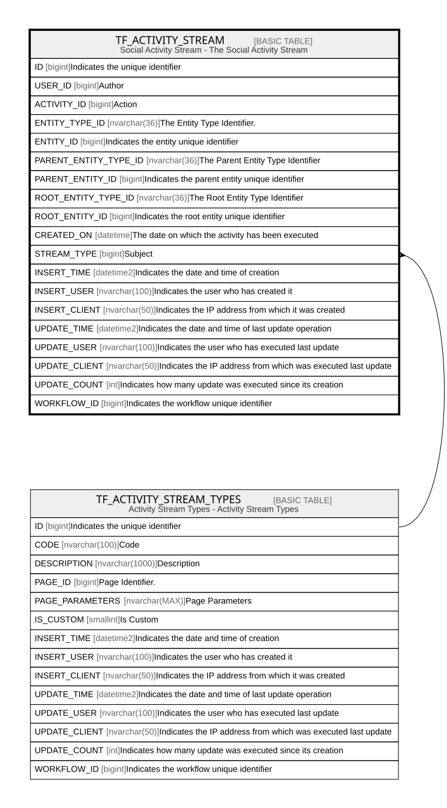

# TF_ACTIVITY_STREAM

## Description

Social Activity Stream - The Social Activity Stream  

## Columns

| Name | Type | Default | Nullable | Parents | Comment |
| ---- | ---- | ------- | -------- | ------- | ------- |
| ID | bigint |  | false |  | Indicates the unique identifier |
| USER_ID | bigint |  | false |  | Author |
| ACTIVITY_ID | bigint |  | false |  | Action |
| ENTITY_TYPE_ID | nvarchar(36) |  | false |  | The Entity Type Identifier. |
| ENTITY_ID | bigint |  | false |  | Indicates the entity unique identifier |
| PARENT_ENTITY_TYPE_ID | nvarchar(36) |  | true |  | The Parent Entity Type Identifier |
| PARENT_ENTITY_ID | bigint |  | true |  | Indicates the parent entity unique identifier |
| ROOT_ENTITY_TYPE_ID | nvarchar(36) |  | true |  | The Root Entity Type Identifier |
| ROOT_ENTITY_ID | bigint |  | true |  | Indicates the root entity unique identifier |
| CREATED_ON | datetime | (sysutcdatetime()) | false |  | The date on which the activity has been executed |
| STREAM_TYPE | bigint | ((0)) | false | [TF_ACTIVITY_STREAM_TYPES](TF_ACTIVITY_STREAM_TYPES.md) | Subject |
| INSERT_TIME | datetime2 | (sysutcdatetime()) | false |  | Indicates the date and time of creation |
| INSERT_USER | nvarchar(100) | (N'MAIN') | false |  | Indicates the user who has created it |
| INSERT_CLIENT | nvarchar(50) | (N'localhost') | false |  | Indicates the IP address from which it was created |
| UPDATE_TIME | datetime2 | (sysutcdatetime()) | false |  | Indicates the date and time of last update operation |
| UPDATE_USER | nvarchar(100) | (N'MAIN') | false |  | Indicates the user who has executed last update |
| UPDATE_CLIENT | nvarchar(50) | (N'localhost') | false |  | Indicates the IP address from which was executed last update |
| UPDATE_COUNT | int | ((0)) | false |  | Indicates how many update was executed since its creation |
| WORKFLOW_ID | bigint |  | true |  | Indicates the workflow unique identifier |

## Constraints

| Name | Type | Definition |
| ---- | ---- | ---------- |
| PK_ACTIVITYSTREAM | PRIMARY KEY | CLUSTERED, unique, part of a PRIMARY KEY constraint, [ ID ] |
| FK_ACTIVITYSTREAM_TYPES | FOREIGN KEY | FOREIGN KEY(STREAM_TYPE) REFERENCES TF_ACTIVITY_STREAM_TYPES(ID) ON UPDATE NO_ACTION ON DELETE NO_ACTION |

## Indexes

| Name | Definition |
| ---- | ---------- |
| PK_ACTIVITYSTREAM | CLUSTERED, unique, part of a PRIMARY KEY constraint, [ ID ] |
| IDX_ACTIVITY_STREAM_CREATEDON | NONCLUSTERED, [ CREATED_ON ] |

## Relations

---

> Generated by [tbls](https://github.com/k1LoW/tbls)
