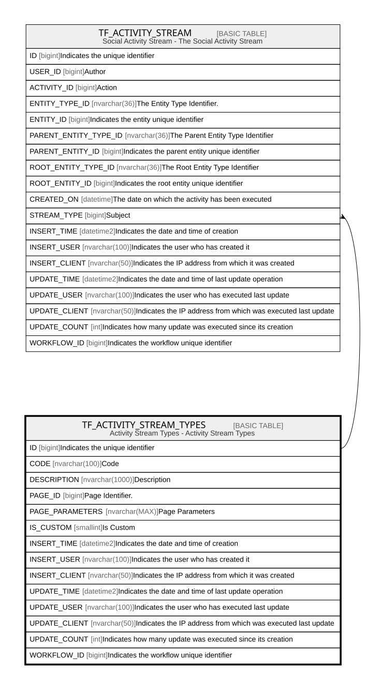

# TF_ACTIVITY_STREAM_TYPES

## Description

Activity Stream Types - Activity Stream Types  

## Columns

| Name | Type | Default | Nullable | Children | Comment |
| ---- | ---- | ------- | -------- | -------- | ------- |
| ID | bigint |  | false | [TF_ACTIVITY_STREAM](TF_ACTIVITY_STREAM.md) | Indicates the unique identifier |
| CODE | nvarchar(100) |  | false |  | Code |
| DESCRIPTION | nvarchar(1000) |  | true |  | Description |
| PAGE_ID | bigint |  | true |  | Page Identifier. |
| PAGE_PARAMETERS | nvarchar(MAX) |  | true |  | Page Parameters |
| IS_CUSTOM | smallint |  | false |  | Is Custom |
| INSERT_TIME | datetime2 | (sysutcdatetime()) | false |  | Indicates the date and time of creation |
| INSERT_USER | nvarchar(100) | (N'MAIN') | false |  | Indicates the user who has created it |
| INSERT_CLIENT | nvarchar(50) | (N'localhost') | false |  | Indicates the IP address from which it was created |
| UPDATE_TIME | datetime2 | (sysutcdatetime()) | false |  | Indicates the date and time of last update operation |
| UPDATE_USER | nvarchar(100) | (N'MAIN') | false |  | Indicates the user who has executed last update |
| UPDATE_CLIENT | nvarchar(50) | (N'localhost') | false |  | Indicates the IP address from which was executed last update |
| UPDATE_COUNT | int | ((0)) | false |  | Indicates how many update was executed since its creation |
| WORKFLOW_ID | bigint |  | true |  | Indicates the workflow unique identifier |

## Constraints

| Name | Type | Definition |
| ---- | ---- | ---------- |
| PK_ACTIVITYSTREAMTYPES | PRIMARY KEY | CLUSTERED, unique, part of a PRIMARY KEY constraint, [ ID ] |

## Indexes

| Name | Definition |
| ---- | ---------- |
| PK_ACTIVITYSTREAMTYPES | CLUSTERED, unique, part of a PRIMARY KEY constraint, [ ID ] |

## Relations

---

> Generated by [tbls](https://github.com/k1LoW/tbls)
