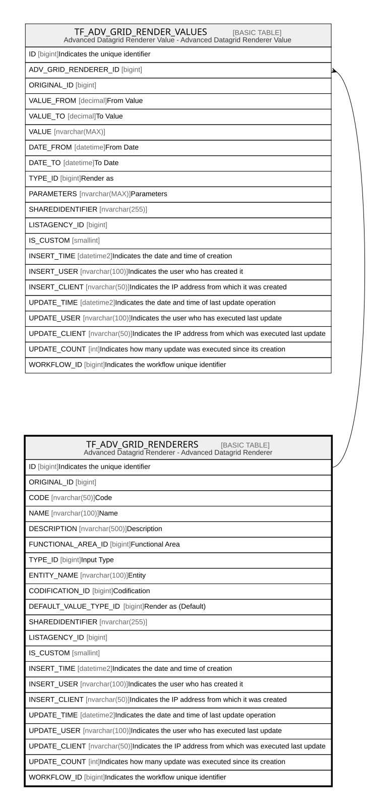

# TF_ADV_GRID_RENDERERS

## Description

Advanced Datagrid Renderer - Advanced Datagrid Renderer  

## Columns

| Name | Type | Default | Nullable | Children | Comment |
| ---- | ---- | ------- | -------- | -------- | ------- |
| ID | bigint |  | false | [TF_ADV_GRID_RENDER_VALUES](TF_ADV_GRID_RENDER_VALUES.md) | Indicates the unique identifier |
| ORIGINAL_ID | bigint |  | true |  |  |
| CODE | nvarchar(50) |  | false |  | Code |
| NAME | nvarchar(100) |  | false |  | Name |
| DESCRIPTION | nvarchar(500) |  | true |  | Description |
| FUNCTIONAL_AREA_ID | bigint |  | true |  | Functional Area |
| TYPE_ID | bigint |  | false |  | Input Type |
| ENTITY_NAME | nvarchar(100) |  | true |  | Entity |
| CODIFICATION_ID | bigint |  | true |  | Codification |
| DEFAULT_VALUE_TYPE_ID | bigint | ((0)) | true |  | Render as (Default) |
| SHAREDIDENTIFIER | nvarchar(255) |  | true |  |  |
| LISTAGENCY_ID | bigint |  | true |  |  |
| IS_CUSTOM | smallint |  | false |  |  |
| INSERT_TIME | datetime2 | (sysutcdatetime()) | false |  | Indicates the date and time of creation |
| INSERT_USER | nvarchar(100) | (N'MAIN') | false |  | Indicates the user who has created it |
| INSERT_CLIENT | nvarchar(50) | (N'localhost') | false |  | Indicates the IP address from which it was created |
| UPDATE_TIME | datetime2 | (sysutcdatetime()) | false |  | Indicates the date and time of last update operation |
| UPDATE_USER | nvarchar(100) | (N'MAIN') | false |  | Indicates the user who has executed last update |
| UPDATE_CLIENT | nvarchar(50) | (N'localhost') | false |  | Indicates the IP address from which was executed last update |
| UPDATE_COUNT | int | ((0)) | false |  | Indicates how many update was executed since its creation |
| WORKFLOW_ID | bigint |  | true |  | Indicates the workflow unique identifier |

## Constraints

| Name | Type | Definition |
| ---- | ---- | ---------- |
| PK_ADV_GRID_RENDERERS | PRIMARY KEY | CLUSTERED, unique, part of a PRIMARY KEY constraint, [ ID ] |
| UQ_ADV_GRID_RENDERERS | UNIQUE | NONCLUSTERED, unique, part of a UNIQUE constraint, [ CODE, IS_CUSTOM ] |

## Indexes

| Name | Definition |
| ---- | ---------- |
| PK_ADV_GRID_RENDERERS | CLUSTERED, unique, part of a PRIMARY KEY constraint, [ ID ] |
| UQ_ADV_GRID_RENDERERS | NONCLUSTERED, unique, part of a UNIQUE constraint, [ CODE, IS_CUSTOM ] |
| IDX_RENDERERS_CUSTOM_FACTORY | NONCLUSTERED, [ IS_CUSTOM, ORIGINAL_ID ] |

## Relations

---

> Generated by [tbls](https://github.com/k1LoW/tbls)
