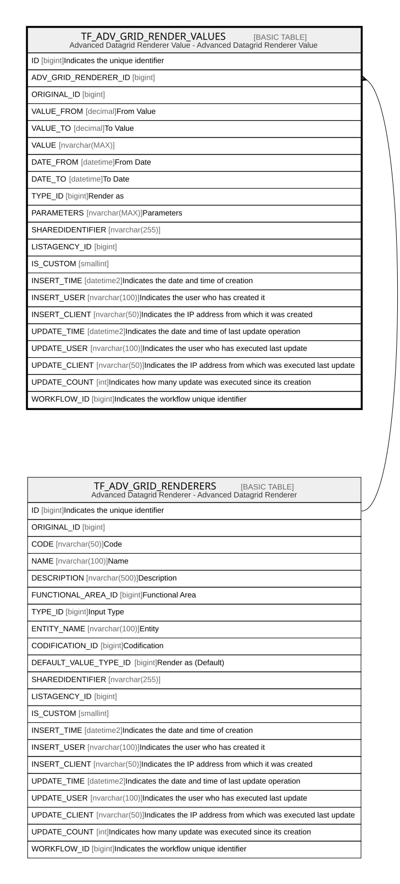

# TF_ADV_GRID_RENDER_VALUES

## Description

Advanced Datagrid Renderer Value - Advanced Datagrid Renderer Value  

## Columns

| Name | Type | Default | Nullable | Parents | Comment |
| ---- | ---- | ------- | -------- | ------- | ------- |
| ID | bigint |  | false |  | Indicates the unique identifier |
| ADV_GRID_RENDERER_ID | bigint |  | false | [TF_ADV_GRID_RENDERERS](TF_ADV_GRID_RENDERERS.md) |  |
| ORIGINAL_ID | bigint |  | true |  |  |
| VALUE_FROM | decimal |  | true |  | From Value |
| VALUE_TO | decimal |  | true |  | To Value |
| VALUE | nvarchar(MAX) |  | true |  |  |
| DATE_FROM | datetime |  | true |  | From Date |
| DATE_TO | datetime |  | true |  | To Date |
| TYPE_ID | bigint |  | true |  | Render as |
| PARAMETERS | nvarchar(MAX) |  | true |  | Parameters |
| SHAREDIDENTIFIER | nvarchar(255) |  | true |  |  |
| LISTAGENCY_ID | bigint |  | true |  |  |
| IS_CUSTOM | smallint |  | false |  |  |
| INSERT_TIME | datetime2 | (sysutcdatetime()) | false |  | Indicates the date and time of creation |
| INSERT_USER | nvarchar(100) | (N'MAIN') | false |  | Indicates the user who has created it |
| INSERT_CLIENT | nvarchar(50) | (N'localhost') | false |  | Indicates the IP address from which it was created |
| UPDATE_TIME | datetime2 | (sysutcdatetime()) | false |  | Indicates the date and time of last update operation |
| UPDATE_USER | nvarchar(100) | (N'MAIN') | false |  | Indicates the user who has executed last update |
| UPDATE_CLIENT | nvarchar(50) | (N'localhost') | false |  | Indicates the IP address from which was executed last update |
| UPDATE_COUNT | int | ((0)) | false |  | Indicates how many update was executed since its creation |
| WORKFLOW_ID | bigint |  | true |  | Indicates the workflow unique identifier |

## Constraints

| Name | Type | Definition |
| ---- | ---- | ---------- |
| PK_ADV_GRID_RENDER_VALUES | PRIMARY KEY | CLUSTERED, unique, part of a PRIMARY KEY constraint, [ ID ] |
| FK_ADV_GRID_RENDER_VALUES | FOREIGN KEY | FOREIGN KEY(ADV_GRID_RENDERER_ID) REFERENCES TF_ADV_GRID_RENDERERS(ID) ON UPDATE NO_ACTION ON DELETE NO_ACTION |

## Indexes

| Name | Definition |
| ---- | ---------- |
| PK_ADV_GRID_RENDER_VALUES | CLUSTERED, unique, part of a PRIMARY KEY constraint, [ ID ] |
| IDX_REND_VAL_CUSTOM_FACTORY | NONCLUSTERED, [ IS_CUSTOM, ORIGINAL_ID ] |

## Relations

---

> Generated by [tbls](https://github.com/k1LoW/tbls)
