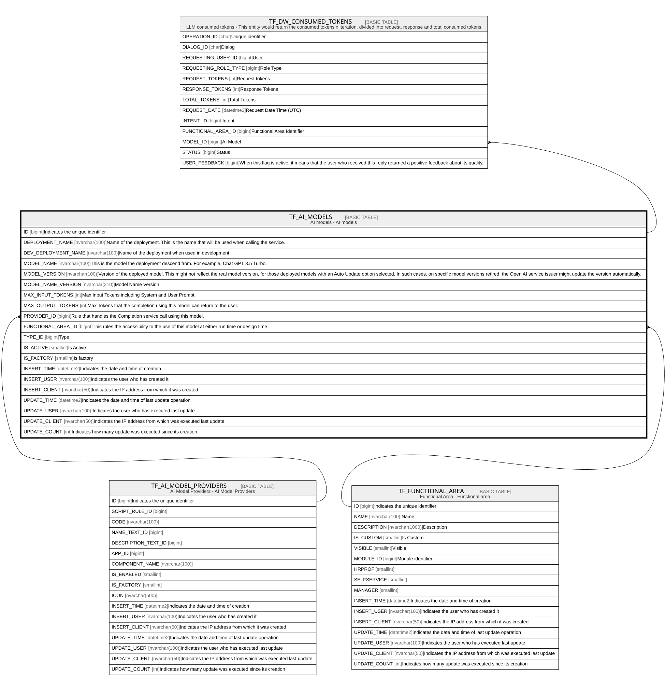

# TF_AI_MODELS

## Description

AI models - AI models  

## Columns

| Name | Type | Default | Nullable | Children | Parents | Comment |
| ---- | ---- | ------- | -------- | -------- | ------- | ------- |
| ID | bigint |  | false | [TF_DW_CONSUMED_TOKENS](TF_DW_CONSUMED_TOKENS.md) |  | Indicates the unique identifier |
| DEPLOYMENT_NAME | nvarchar(100) |  | false |  |  | Name of the deployment. This is the name that will be used when calling the service. |
| DEV_DEPLOYMENT_NAME | nvarchar(100) |  | false |  |  | Name of the deployment when used in development.  |
| MODEL_NAME | nvarchar(100) |  | false |  |  | This is the model the deployment descend from. For example, Chat GPT 3.5 Turbo. |
| MODEL_VERSION | nvarchar(100) |  | false |  |  | Version of the deployed model. This might not reflect the real model version, for those deployed models with an Auto Update option selected. In such cases, on specific model versions retired, the Open AI service issuer might update the version automatically. |
| MODEL_NAME_VERSION | nvarchar(210) |  | true |  |  | Model Name Version |
| MAX_INPUT_TOKENS | int |  | false |  |  | Max Input Tokens including System and User Prompt. |
| MAX_OUTPUT_TOKENS | int |  | false |  |  | Max Tokens that the completion using this model can return to the user. |
| PROVIDER_ID | bigint |  | false |  | [TF_AI_MODEL_PROVIDERS](TF_AI_MODEL_PROVIDERS.md) | Rule that handles the Completion service call using this model. |
| FUNCTIONAL_AREA_ID | bigint |  | true |  | [TF_FUNCTIONAL_AREA](TF_FUNCTIONAL_AREA.md) | This rules the accessibility to the use of this model at either run time or design time. |
| TYPE_ID | bigint |  | false |  |  | Type |
| IS_ACTIVE | smallint | ((1)) | false |  |  | Is Active |
| IS_FACTORY | smallint |  | false |  |  | Is factory |
| INSERT_TIME | datetime2 | (sysutcdatetime()) | false |  |  | Indicates the date and time of creation |
| INSERT_USER | nvarchar(100) | (N'MAIN') | false |  |  | Indicates the user who has created it |
| INSERT_CLIENT | nvarchar(50) | (N'localhost') | false |  |  | Indicates the IP address from which it was created |
| UPDATE_TIME | datetime2 | (sysutcdatetime()) | false |  |  | Indicates the date and time of last update operation |
| UPDATE_USER | nvarchar(100) | (N'MAIN') | false |  |  | Indicates the user who has executed last update |
| UPDATE_CLIENT | nvarchar(50) | (N'localhost') | false |  |  | Indicates the IP address from which was executed last update |
| UPDATE_COUNT | int | ((0)) | false |  |  | Indicates how many update was executed since its creation |

## Constraints

| Name | Type | Definition |
| ---- | ---- | ---------- |
| PK_AI_MODELS | PRIMARY KEY | CLUSTERED, unique, part of a PRIMARY KEY constraint, [ ID ] |
| UQ_AI_MODELS | UNIQUE | NONCLUSTERED, unique, part of a UNIQUE constraint, [ DEPLOYMENT_NAME ] |
| UQ_AI_MODELS_DEV | UNIQUE | NONCLUSTERED, unique, part of a UNIQUE constraint, [ DEV_DEPLOYMENT_NAME ] |
| FK_AI_MODEL_FUNC_AREA | FOREIGN KEY | FOREIGN KEY(FUNCTIONAL_AREA_ID) REFERENCES TF_FUNCTIONAL_AREA(ID) ON UPDATE NO_ACTION ON DELETE NO_ACTION |
| FK_AI_MODEL_PROVIDER | FOREIGN KEY | FOREIGN KEY(PROVIDER_ID) REFERENCES TF_AI_MODEL_PROVIDERS(ID) ON UPDATE NO_ACTION ON DELETE NO_ACTION |

## Indexes

| Name | Definition |
| ---- | ---------- |
| PK_AI_MODELS | CLUSTERED, unique, part of a PRIMARY KEY constraint, [ ID ] |
| UQ_AI_MODELS | NONCLUSTERED, unique, part of a UNIQUE constraint, [ DEPLOYMENT_NAME ] |
| UQ_AI_MODELS_DEV | NONCLUSTERED, unique, part of a UNIQUE constraint, [ DEV_DEPLOYMENT_NAME ] |

## Relations

---

> Generated by [tbls](https://github.com/k1LoW/tbls)
