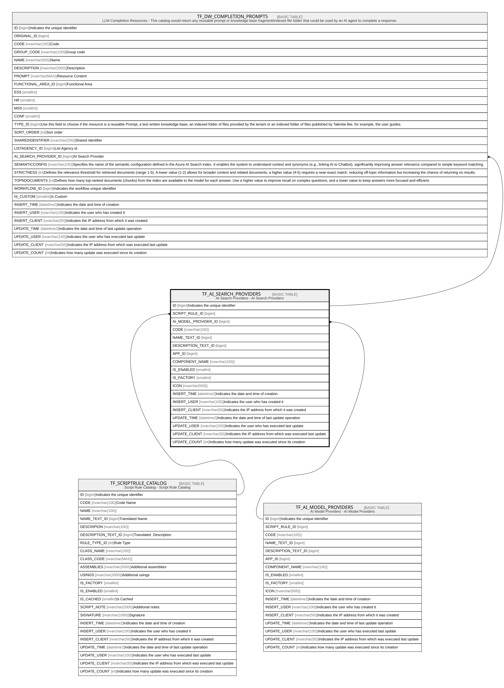

# TF_AI_SEARCH_PROVIDERS

## Description

AI Search Providers - AI Search Providers  

## Columns

| Name | Type | Default | Nullable | Children | Parents | Comment |
| ---- | ---- | ------- | -------- | -------- | ------- | ------- |
| ID | bigint |  | false | [TF_DW_COMPLETION_PROMPTS](TF_DW_COMPLETION_PROMPTS.md) |  | Indicates the unique identifier |
| SCRIPT_RULE_ID | bigint |  | true |  | [TF_SCRIPTRULE_CATALOG](TF_SCRIPTRULE_CATALOG.md) |  |
| AI_MODEL_PROVIDER_ID | bigint |  | true |  | [TF_AI_MODEL_PROVIDERS](TF_AI_MODEL_PROVIDERS.md) |  |
| CODE | nvarchar(100) |  | false |  |  |  |
| NAME_TEXT_ID | bigint |  | true |  |  |  |
| DESCRIPTION_TEXT_ID | bigint |  | true |  |  |  |
| APP_ID | bigint |  | false |  |  |  |
| COMPONENT_NAME | nvarchar(100) |  | false |  |  |  |
| IS_ENABLED | smallint |  | false |  |  |  |
| IS_FACTORY | smallint | ((0)) | false |  |  |  |
| ICON | nvarchar(500) |  | true |  |  |  |
| INSERT_TIME | datetime2 | (sysutcdatetime()) | false |  |  | Indicates the date and time of creation |
| INSERT_USER | nvarchar(100) | (N'MAIN') | false |  |  | Indicates the user who has created it |
| INSERT_CLIENT | nvarchar(50) | (N'localhost') | false |  |  | Indicates the IP address from which it was created |
| UPDATE_TIME | datetime2 | (sysutcdatetime()) | false |  |  | Indicates the date and time of last update operation |
| UPDATE_USER | nvarchar(100) | (N'MAIN') | false |  |  | Indicates the user who has executed last update |
| UPDATE_CLIENT | nvarchar(50) | (N'localhost') | false |  |  | Indicates the IP address from which was executed last update |
| UPDATE_COUNT | int | ((0)) | false |  |  | Indicates how many update was executed since its creation |

## Constraints

| Name | Type | Definition |
| ---- | ---- | ---------- |
| PK_AISEARCH_PROVIDERS | PRIMARY KEY | CLUSTERED, unique, part of a PRIMARY KEY constraint, [ ID ] |
| UQ_AISEARCH_PROVIDERS_CODE | UNIQUE | NONCLUSTERED, unique, part of a UNIQUE constraint, [ CODE ] |
| FK_AI_MODEL_PROVIDERS | FOREIGN KEY | FOREIGN KEY(AI_MODEL_PROVIDER_ID) REFERENCES TF_AI_MODEL_PROVIDERS(ID) ON UPDATE NO_ACTION ON DELETE NO_ACTION |
| FK_AISEARCH_PROVIDERS_SCR_CAT | FOREIGN KEY | FOREIGN KEY(SCRIPT_RULE_ID) REFERENCES TF_SCRIPTRULE_CATALOG(ID) ON UPDATE NO_ACTION ON DELETE NO_ACTION |

## Indexes

| Name | Definition |
| ---- | ---------- |
| PK_AISEARCH_PROVIDERS | CLUSTERED, unique, part of a PRIMARY KEY constraint, [ ID ] |
| UQ_AISEARCH_PROVIDERS_CODE | NONCLUSTERED, unique, part of a UNIQUE constraint, [ CODE ] |

## Relations

---

> Generated by [tbls](https://github.com/k1LoW/tbls)
