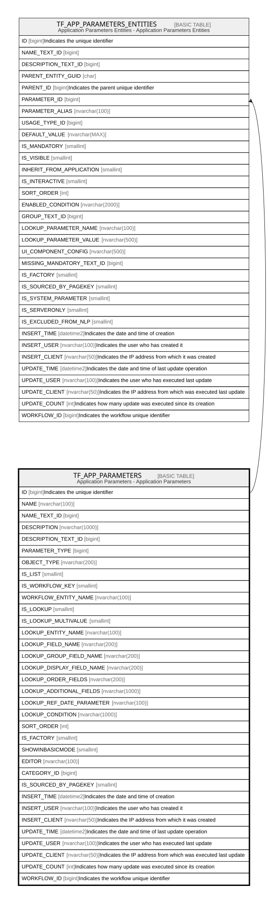

# TF_APP_PARAMETERS

## Description

Application Parameters - Application Parameters  

## Columns

| Name | Type | Default | Nullable | Children | Comment |
| ---- | ---- | ------- | -------- | -------- | ------- |
| ID | bigint |  | false | [TF_APP_PARAMETERS_ENTITIES](TF_APP_PARAMETERS_ENTITIES.md) | Indicates the unique identifier |
| NAME | nvarchar(100) |  | false |  |  |
| NAME_TEXT_ID | bigint |  | true |  |  |
| DESCRIPTION | nvarchar(1000) |  | true |  |  |
| DESCRIPTION_TEXT_ID | bigint |  | true |  |  |
| PARAMETER_TYPE | bigint | ((0)) | false |  |  |
| OBJECT_TYPE | nvarchar(200) |  | true |  |  |
| IS_LIST | smallint | ((0)) | false |  |  |
| IS_WORKFLOW_KEY | smallint | ((0)) | false |  |  |
| WORKFLOW_ENTITY_NAME | nvarchar(100) |  | true |  |  |
| IS_LOOKUP | smallint | ((0)) | false |  |  |
| IS_LOOKUP_MULTIVALUE | smallint | ((0)) | true |  |  |
| LOOKUP_ENTITY_NAME | nvarchar(100) |  | true |  |  |
| LOOKUP_FIELD_NAME | nvarchar(200) |  | true |  |  |
| LOOKUP_GROUP_FIELD_NAME | nvarchar(200) |  | true |  |  |
| LOOKUP_DISPLAY_FIELD_NAME | nvarchar(200) |  | true |  |  |
| LOOKUP_ORDER_FIELDS | nvarchar(200) |  | true |  |  |
| LOOKUP_ADDITIONAL_FIELDS | nvarchar(1000) |  | true |  |  |
| LOOKUP_REF_DATE_PARAMETER | nvarchar(100) |  | true |  |  |
| LOOKUP_CONDITION | nvarchar(1000) |  | true |  |  |
| SORT_ORDER | int | ((0)) | false |  |  |
| IS_FACTORY | smallint | ((0)) | false |  |  |
| SHOWINBASICMODE | smallint | ((1)) | false |  |  |
| EDITOR | nvarchar(100) |  | true |  |  |
| CATEGORY_ID | bigint |  | true |  |  |
| IS_SOURCED_BY_PAGEKEY | smallint | ((0)) | true |  |  |
| INSERT_TIME | datetime2 | (sysutcdatetime()) | false |  | Indicates the date and time of creation |
| INSERT_USER | nvarchar(100) | (N'MAIN') | false |  | Indicates the user who has created it |
| INSERT_CLIENT | nvarchar(50) | (N'localhost') | false |  | Indicates the IP address from which it was created |
| UPDATE_TIME | datetime2 | (sysutcdatetime()) | false |  | Indicates the date and time of last update operation |
| UPDATE_USER | nvarchar(100) | (N'MAIN') | false |  | Indicates the user who has executed last update |
| UPDATE_CLIENT | nvarchar(50) | (N'localhost') | false |  | Indicates the IP address from which was executed last update |
| UPDATE_COUNT | int | ((0)) | false |  | Indicates how many update was executed since its creation |
| WORKFLOW_ID | bigint |  | true |  | Indicates the workflow unique identifier |

## Constraints

| Name | Type | Definition |
| ---- | ---- | ---------- |
| PK_APP_PARAMETERS | PRIMARY KEY | CLUSTERED, unique, part of a PRIMARY KEY constraint, [ ID ] |
| UQ_APP_PARAMETERS | UNIQUE | NONCLUSTERED, unique, part of a UNIQUE constraint, [ NAME ] |

## Indexes

| Name | Definition |
| ---- | ---------- |
| PK_APP_PARAMETERS | CLUSTERED, unique, part of a PRIMARY KEY constraint, [ ID ] |
| UQ_APP_PARAMETERS | NONCLUSTERED, unique, part of a UNIQUE constraint, [ NAME ] |

## Relations

---

> Generated by [tbls](https://github.com/k1LoW/tbls)
