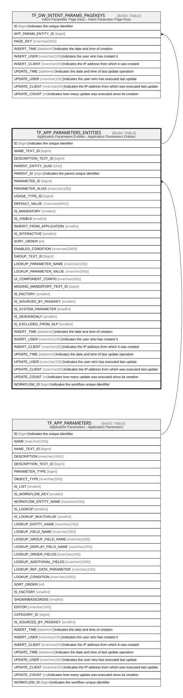

# TF_APP_PARAMETERS_ENTITIES

## Description

Application Parameters Entities - Application Parameters Entities  

## Columns

| Name | Type | Default | Nullable | Children | Parents | Comment |
| ---- | ---- | ------- | -------- | -------- | ------- | ------- |
| ID | bigint |  | false | [TF_DW_INTENT_PARAMS_PAGEKEYS](TF_DW_INTENT_PARAMS_PAGEKEYS.md) |  | Indicates the unique identifier |
| NAME_TEXT_ID | bigint |  | true |  |  |  |
| DESCRIPTION_TEXT_ID | bigint |  | true |  |  |  |
| PARENT_ENTITY_GUID | char |  | false |  |  |  |
| PARENT_ID | bigint |  | false |  |  | Indicates the parent unique identifier |
| PARAMETER_ID | bigint |  | false |  | [TF_APP_PARAMETERS](TF_APP_PARAMETERS.md) |  |
| PARAMETER_ALIAS | nvarchar(100) |  | true |  |  |  |
| USAGE_TYPE_ID | bigint |  | true |  |  |  |
| DEFAULT_VALUE | nvarchar(MAX) |  | true |  |  |  |
| IS_MANDATORY | smallint | ((0)) | false |  |  |  |
| IS_VISIBLE | smallint | ((1)) | false |  |  |  |
| INHERIT_FROM_APPLICATION | smallint | ((0)) | false |  |  |  |
| IS_INTERACTIVE | smallint | ((0)) | false |  |  |  |
| SORT_ORDER | int | ((0)) | false |  |  |  |
| ENABLED_CONDITION | nvarchar(2000) |  | true |  |  |  |
| GROUP_TEXT_ID | bigint |  | true |  |  |  |
| LOOKUP_PARAMETER_NAME | nvarchar(100) |  | true |  |  |  |
| LOOKUP_PARAMETER_VALUE | nvarchar(500) |  | true |  |  |  |
| UI_COMPONENT_CONFIG | nvarchar(500) |  | true |  |  |  |
| MISSING_MANDATORY_TEXT_ID | bigint |  | true |  |  |  |
| IS_FACTORY | smallint | ((0)) | false |  |  |  |
| IS_SOURCED_BY_PAGEKEY | smallint |  | true |  |  |  |
| IS_SYSTEM_PARAMETER | smallint |  | true |  |  |  |
| IS_SERVERONLY | smallint | ((0)) | false |  |  |  |
| IS_EXCLUDED_FROM_NLP | smallint | ((0)) | true |  |  |  |
| INSERT_TIME | datetime2 | (sysutcdatetime()) | false |  |  | Indicates the date and time of creation |
| INSERT_USER | nvarchar(100) | (N'MAIN') | false |  |  | Indicates the user who has created it |
| INSERT_CLIENT | nvarchar(50) | (N'localhost') | false |  |  | Indicates the IP address from which it was created |
| UPDATE_TIME | datetime2 | (sysutcdatetime()) | false |  |  | Indicates the date and time of last update operation |
| UPDATE_USER | nvarchar(100) | (N'MAIN') | false |  |  | Indicates the user who has executed last update |
| UPDATE_CLIENT | nvarchar(50) | (N'localhost') | false |  |  | Indicates the IP address from which was executed last update |
| UPDATE_COUNT | int | ((0)) | false |  |  | Indicates how many update was executed since its creation |
| WORKFLOW_ID | bigint |  | true |  |  | Indicates the workflow unique identifier |

## Constraints

| Name | Type | Definition |
| ---- | ---- | ---------- |
| PK_APP_PARAMETERS_ENTITIES | PRIMARY KEY | CLUSTERED, unique, part of a PRIMARY KEY constraint, [ ID ] |
| UQ_APP_PARAMETERS_ENTITIES | UNIQUE | NONCLUSTERED, unique, part of a UNIQUE constraint, [ PARENT_ENTITY_GUID, PARENT_ID, PARAMETER_ID ] |
| FK_PARAMSENTITIES_PARAMETERS | FOREIGN KEY | FOREIGN KEY(PARAMETER_ID) REFERENCES TF_APP_PARAMETERS(ID) ON UPDATE NO_ACTION ON DELETE NO_ACTION |

## Indexes

| Name | Definition |
| ---- | ---------- |
| PK_APP_PARAMETERS_ENTITIES | CLUSTERED, unique, part of a PRIMARY KEY constraint, [ ID ] |
| UQ_APP_PARAMETERS_ENTITIES | NONCLUSTERED, unique, part of a UNIQUE constraint, [ PARENT_ENTITY_GUID, PARENT_ID, PARAMETER_ID ] |
| IDX_APPPARAMENTITIES_PARENT | NONCLUSTERED, [ PARENT_ID ] |

## Relations

---

> Generated by [tbls](https://github.com/k1LoW/tbls)
