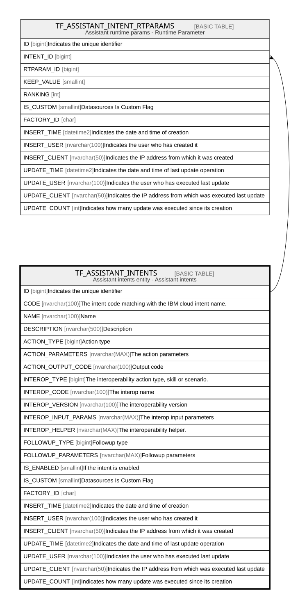

# TF_ASSISTANT_INTENTS

## Description

Assistant intents entity - Assistant intents  

## Columns

| Name | Type | Default | Nullable | Children | Comment |
| ---- | ---- | ------- | -------- | -------- | ------- |
| ID | bigint |  | false | [TF_ASSISTANT_INTENT_RTPARAMS](TF_ASSISTANT_INTENT_RTPARAMS.md) | Indicates the unique identifier |
| CODE | nvarchar(100) |  | false |  | The intent code matching with the IBM cloud intent name. |
| NAME | nvarchar(100) |  | true |  | Name |
| DESCRIPTION | nvarchar(500) |  | true |  | Description |
| ACTION_TYPE | bigint |  | true |  | Action type |
| ACTION_PARAMETERS | nvarchar(MAX) |  | true |  | The action parameters |
| ACTION_OUTPUT_CODE | nvarchar(100) |  | true |  | Output code |
| INTEROP_TYPE | bigint |  | true |  | The interoperability action type, skill or scenario. |
| INTEROP_CODE | nvarchar(100) |  | true |  | The interop name |
| INTEROP_VERSION | nvarchar(100) |  | true |  | The interoperability version |
| INTEROP_INPUT_PARAMS | nvarchar(MAX) |  | true |  | The interop input parameters |
| INTEROP_HELPER | nvarchar(MAX) |  | true |  | The interoperability helper. |
| FOLLOWUP_TYPE | bigint |  | true |  | Followup type |
| FOLLOWUP_PARAMETERS | nvarchar(MAX) |  | true |  | Followup parameters |
| IS_ENABLED | smallint | ((1)) | false |  | If the intent is enabled |
| IS_CUSTOM | smallint | ((0)) | false |  | Datasources Is Custom Flag |
| FACTORY_ID | char |  | true |  |  |
| INSERT_TIME | datetime2 | (sysutcdatetime()) | true |  | Indicates the date and time of creation |
| INSERT_USER | nvarchar(100) | (N'MAIN') | true |  | Indicates the user who has created it |
| INSERT_CLIENT | nvarchar(50) | (N'localhost') | true |  | Indicates the IP address from which it was created |
| UPDATE_TIME | datetime2 | (sysutcdatetime()) | true |  | Indicates the date and time of last update operation |
| UPDATE_USER | nvarchar(100) | (N'MAIN') | true |  | Indicates the user who has executed last update |
| UPDATE_CLIENT | nvarchar(50) | (N'localhost') | true |  | Indicates the IP address from which was executed last update |
| UPDATE_COUNT | int | ((0)) | true |  | Indicates how many update was executed since its creation |

## Constraints

| Name | Type | Definition |
| ---- | ---- | ---------- |
| PK_ASSISTANTINTENTS | PRIMARY KEY | CLUSTERED, unique, part of a PRIMARY KEY constraint, [ ID ] |
| UQ_ASSISTANTINTENTS_CODE | UNIQUE | NONCLUSTERED, unique, part of a UNIQUE constraint, [ CODE, IS_CUSTOM ] |

## Indexes

| Name | Definition |
| ---- | ---------- |
| PK_ASSISTANTINTENTS | CLUSTERED, unique, part of a PRIMARY KEY constraint, [ ID ] |
| UQ_ASSISTANTINTENTS_CODE | NONCLUSTERED, unique, part of a UNIQUE constraint, [ CODE, IS_CUSTOM ] |
| IDX_INTENTS_CUSTOM_FACTORY | NONCLUSTERED, [ FACTORY_ID, IS_CUSTOM ] |

## Relations

---

> Generated by [tbls](https://github.com/k1LoW/tbls)
