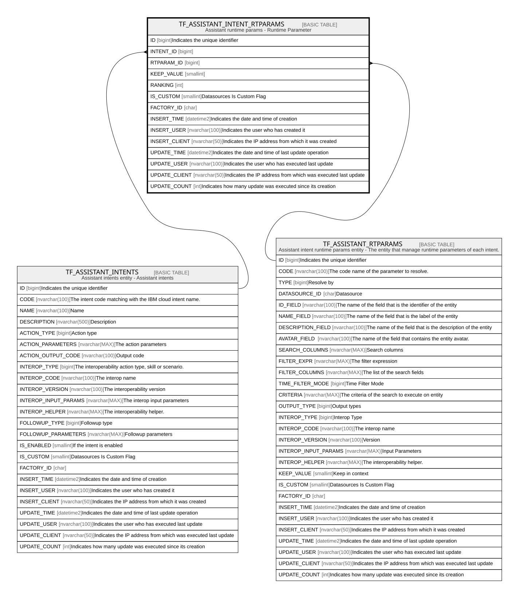

# TF_ASSISTANT_INTENT_RTPARAMS

## Description

Assistant runtime params - Runtime Parameter  

## Columns

| Name | Type | Default | Nullable | Parents | Comment |
| ---- | ---- | ------- | -------- | ------- | ------- |
| ID | bigint |  | false |  | Indicates the unique identifier |
| INTENT_ID | bigint |  | false | [TF_ASSISTANT_INTENTS](TF_ASSISTANT_INTENTS.md) |  |
| RTPARAM_ID | bigint |  | false | [TF_ASSISTANT_RTPARAMS](TF_ASSISTANT_RTPARAMS.md) |  |
| KEEP_VALUE | smallint | ((0)) | false |  |  |
| RANKING | int | ((0)) | false |  |  |
| IS_CUSTOM | smallint | ((0)) | false |  | Datasources Is Custom Flag |
| FACTORY_ID | char |  | true |  |  |
| INSERT_TIME | datetime2 | (sysutcdatetime()) | true |  | Indicates the date and time of creation |
| INSERT_USER | nvarchar(100) | (N'MAIN') | true |  | Indicates the user who has created it |
| INSERT_CLIENT | nvarchar(50) | (N'localhost') | true |  | Indicates the IP address from which it was created |
| UPDATE_TIME | datetime2 | (sysutcdatetime()) | true |  | Indicates the date and time of last update operation |
| UPDATE_USER | nvarchar(100) | (N'MAIN') | true |  | Indicates the user who has executed last update |
| UPDATE_CLIENT | nvarchar(50) | (N'localhost') | true |  | Indicates the IP address from which was executed last update |
| UPDATE_COUNT | int | ((0)) | true |  | Indicates how many update was executed since its creation |

## Constraints

| Name | Type | Definition |
| ---- | ---- | ---------- |
| PK_ASSISTANTINTENTSRTPARAMS | PRIMARY KEY | CLUSTERED, unique, part of a PRIMARY KEY constraint, [ ID ] |
| UQ_ASSISTANTINTENTSRTPARAMS_ID | UNIQUE | NONCLUSTERED, unique, part of a UNIQUE constraint, [ INTENT_ID, RTPARAM_ID, IS_CUSTOM ] |
| FK_ASSISTANTINTENTS | FOREIGN KEY | FOREIGN KEY(INTENT_ID) REFERENCES TF_ASSISTANT_INTENTS(ID) ON UPDATE NO_ACTION ON DELETE NO_ACTION |
| FK_ASSISTANTRTPARAMS | FOREIGN KEY | FOREIGN KEY(RTPARAM_ID) REFERENCES TF_ASSISTANT_RTPARAMS(ID) ON UPDATE NO_ACTION ON DELETE NO_ACTION |

## Indexes

| Name | Definition |
| ---- | ---------- |
| PK_ASSISTANTINTENTSRTPARAMS | CLUSTERED, unique, part of a PRIMARY KEY constraint, [ ID ] |
| UQ_ASSISTANTINTENTSRTPARAMS_ID | NONCLUSTERED, unique, part of a UNIQUE constraint, [ INTENT_ID, RTPARAM_ID, IS_CUSTOM ] |
| IDX_INTENT_PARM_CUSTOM_FACTORY | NONCLUSTERED, [ FACTORY_ID, IS_CUSTOM ] |

## Relations

---

> Generated by [tbls](https://github.com/k1LoW/tbls)
