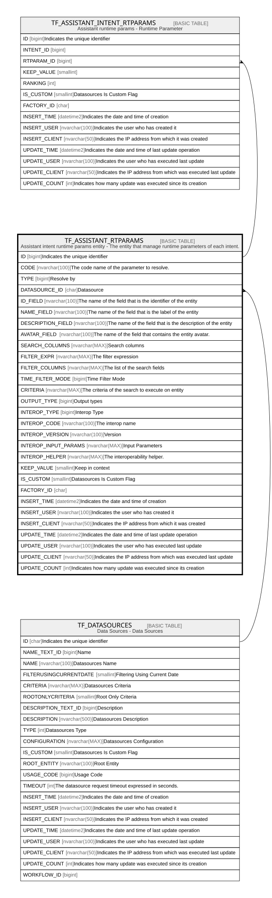

# TF_ASSISTANT_RTPARAMS

## Description

Assistant intent runtime params entity - The entity that manage runtime parameters of each intent.  

## Columns

| Name | Type | Default | Nullable | Children | Parents | Comment |
| ---- | ---- | ------- | -------- | -------- | ------- | ------- |
| ID | bigint |  | false | [TF_ASSISTANT_INTENT_RTPARAMS](TF_ASSISTANT_INTENT_RTPARAMS.md) |  | Indicates the unique identifier |
| CODE | nvarchar(100) |  | false |  |  | The code name of the parameter to resolve. |
| TYPE | bigint |  | false |  |  | Resolve by |
| DATASOURCE_ID | char |  | true |  | [TF_DATASOURCES](TF_DATASOURCES.md) | Datasource |
| ID_FIELD | nvarchar(100) |  | true |  |  | The name of the field that is the identifier of the entity |
| NAME_FIELD | nvarchar(100) |  | true |  |  | The name of the field that is the label of the entity |
| DESCRIPTION_FIELD | nvarchar(100) |  | true |  |  | The name of the field that is the description of the entity |
| AVATAR_FIELD | nvarchar(100) |  | true |  |  | The name of the field that contains the entity avatar. |
| SEARCH_COLUMNS | nvarchar(MAX) |  | true |  |  | Search columns |
| FILTER_EXPR | nvarchar(MAX) |  | true |  |  | The filter expression |
| FILTER_COLUMNS | nvarchar(MAX) |  | true |  |  | The list of the search fields |
| TIME_FILTER_MODE | bigint |  | true |  |  | Time Filter Mode |
| CRITERIA | nvarchar(MAX) |  | true |  |  | The criteria of the search to execute on entity |
| OUTPUT_TYPE | bigint |  | true |  |  | Output types |
| INTEROP_TYPE | bigint |  | true |  |  | Interop Type |
| INTEROP_CODE | nvarchar(100) |  | true |  |  | The interop name |
| INTEROP_VERSION | nvarchar(100) |  | true |  |  | Version |
| INTEROP_INPUT_PARAMS | nvarchar(MAX) |  | true |  |  | Input Parameters |
| INTEROP_HELPER | nvarchar(MAX) |  | true |  |  | The interoperability helper. |
| KEEP_VALUE | smallint | ((0)) | false |  |  | Keep in context |
| IS_CUSTOM | smallint | ((0)) | false |  |  | Datasources Is Custom Flag |
| FACTORY_ID | char |  | true |  |  |  |
| INSERT_TIME | datetime2 | (sysutcdatetime()) | true |  |  | Indicates the date and time of creation |
| INSERT_USER | nvarchar(100) | (N'MAIN') | true |  |  | Indicates the user who has created it |
| INSERT_CLIENT | nvarchar(50) | (N'localhost') | true |  |  | Indicates the IP address from which it was created |
| UPDATE_TIME | datetime2 | (sysutcdatetime()) | true |  |  | Indicates the date and time of last update operation |
| UPDATE_USER | nvarchar(100) | (N'MAIN') | true |  |  | Indicates the user who has executed last update |
| UPDATE_CLIENT | nvarchar(50) | (N'localhost') | true |  |  | Indicates the IP address from which was executed last update |
| UPDATE_COUNT | int | ((0)) | true |  |  | Indicates how many update was executed since its creation |

## Constraints

| Name | Type | Definition |
| ---- | ---- | ---------- |
| PK_ASSISTANTSRTPARAMS | PRIMARY KEY | CLUSTERED, unique, part of a PRIMARY KEY constraint, [ ID ] |
| UQ_ASSISTANTSRTPARAMS_CODE | UNIQUE | NONCLUSTERED, unique, part of a UNIQUE constraint, [ CODE, IS_CUSTOM ] |
| FK_INTENTS_DS | FOREIGN KEY | FOREIGN KEY(DATASOURCE_ID) REFERENCES TF_DATASOURCES(ID) ON UPDATE NO_ACTION ON DELETE NO_ACTION |

## Indexes

| Name | Definition |
| ---- | ---------- |
| PK_ASSISTANTSRTPARAMS | CLUSTERED, unique, part of a PRIMARY KEY constraint, [ ID ] |
| UQ_ASSISTANTSRTPARAMS_CODE | NONCLUSTERED, unique, part of a UNIQUE constraint, [ CODE, IS_CUSTOM ] |
| IDX_ASSIST_PARM_CUSTOM_FACTORY | NONCLUSTERED, [ FACTORY_ID, IS_CUSTOM ] |

## Relations

---

> Generated by [tbls](https://github.com/k1LoW/tbls)
