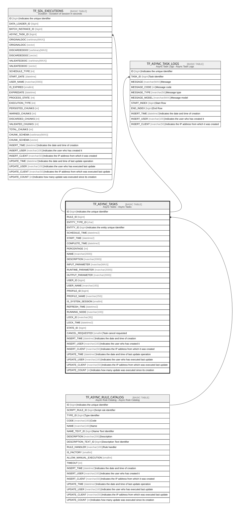

# TF_ASYNC_TASKS

## Description

Async Tasks - Async Tasks  

## Columns

| Name | Type | Default | Nullable | Children | Parents | Comment |
| ---- | ---- | ------- | -------- | -------- | ------- | ------- |
| ID | bigint |  | false | [TF_SDL_EXECUTIONS](TF_SDL_EXECUTIONS.md) [TF_ASYNC_TASK_LOGS](TF_ASYNC_TASK_LOGS.md) |  | Indicates the unique identifier |
| RULE_ID | bigint |  | false |  | [TF_ASYNC_RULE_CATALOG](TF_ASYNC_RULE_CATALOG.md) |  |
| ENTITY_TYPE_ID | char |  | true |  |  |  |
| ENTITY_ID | bigint |  | true |  |  | Indicates the entity unique identifier |
| SCHEDULE_TIME | datetime2 |  | false |  |  |  |
| START_TIME | datetime2 |  | true |  |  |  |
| COMPLETE_TIME | datetime2 |  | true |  |  |  |
| PERCENTAGE | int |  | false |  |  |  |
| NAME | nvarchar(2000) |  | true |  |  |  |
| DESCRIPTION | nvarchar(2000) |  | false |  |  |  |
| INPUT_PARAMETER | nvarchar(MAX) |  | true |  |  |  |
| RUNTIME_PARAMETER | nvarchar(2000) |  | true |  |  |  |
| OUTPUT_PARAMETER | nvarchar(2000) |  | true |  |  |  |
| USER_ID | bigint |  | false |  |  |  |
| USER_NAME | nvarchar(100) |  | true |  |  |  |
| PROFILE_ID | bigint |  | false |  |  |  |
| PROFILE_NAME | nvarchar(250) |  | true |  |  |  |
| IS_SYSTEM_SESSION | smallint |  | false |  |  |  |
| REFRESH_TIME | datetime2 |  | true |  |  |  |
| RUNNING_NODE | nvarchar(100) |  | true |  |  |  |
| LOCK_ID | nvarchar(36) |  | true |  |  |  |
| LOCK_TIME | datetime2 |  | true |  |  |  |
| STATE_ID | bigint |  | false |  |  |  |
| CANCEL_REQUESTED | smallint | ((0)) | false |  |  | Task cancel requested |
| INSERT_TIME | datetime2 | (sysutcdatetime()) | false |  |  | Indicates the date and time of creation |
| INSERT_USER | nvarchar(100) | (N'MAIN') | false |  |  | Indicates the user who has created it |
| INSERT_CLIENT | nvarchar(50) | (N'localhost') | false |  |  | Indicates the IP address from which it was created |
| UPDATE_TIME | datetime2 | (sysutcdatetime()) | false |  |  | Indicates the date and time of last update operation |
| UPDATE_USER | nvarchar(100) | (N'MAIN') | false |  |  | Indicates the user who has executed last update |
| UPDATE_CLIENT | nvarchar(50) | (N'localhost') | false |  |  | Indicates the IP address from which was executed last update |
| UPDATE_COUNT | int | ((0)) | false |  |  | Indicates how many update was executed since its creation |

## Constraints

| Name | Type | Definition |
| ---- | ---- | ---------- |
| PK_ASYNC_TASKS | PRIMARY KEY | CLUSTERED, unique, part of a PRIMARY KEY constraint, [ ID ] |
| FK_ASYNC_TASKS_RULES | FOREIGN KEY | FOREIGN KEY(RULE_ID) REFERENCES TF_ASYNC_RULE_CATALOG(ID) ON UPDATE NO_ACTION ON DELETE NO_ACTION |

## Indexes

| Name | Definition |
| ---- | ---------- |
| PK_ASYNC_TASKS | CLUSTERED, unique, part of a PRIMARY KEY constraint, [ ID ] |
| IDX_ASYNC_TASKS | NONCLUSTERED, [ ENTITY_TYPE_ID, ENTITY_ID, USER_ID, COMPLETE_TIME ] |

## Relations

---

> Generated by [tbls](https://github.com/k1LoW/tbls)
