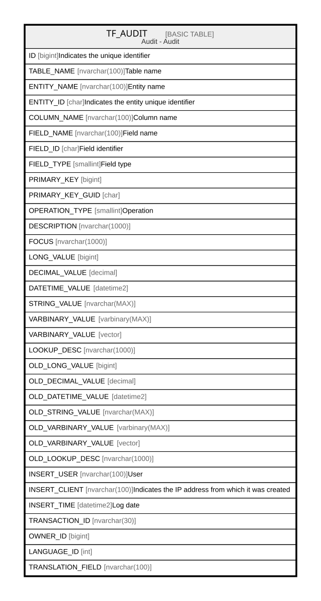

# TF_AUDIT

## Description

Audit - Audit  

## Columns

| Name | Type | Default | Nullable | Comment |
| ---- | ---- | ------- | -------- | ------- |
| ID | bigint |  | false | Indicates the unique identifier |
| TABLE_NAME | nvarchar(100) |  | false | Table name |
| ENTITY_NAME | nvarchar(100) |  | false | Entity name |
| ENTITY_ID | char |  | false | Indicates the entity unique identifier |
| COLUMN_NAME | nvarchar(100) |  | false | Column name |
| FIELD_NAME | nvarchar(100) |  | false | Field name |
| FIELD_ID | char |  | false | Field identifier |
| FIELD_TYPE | smallint |  | false | Field type |
| PRIMARY_KEY | bigint |  | false |  |
| PRIMARY_KEY_GUID | char |  | true |  |
| OPERATION_TYPE | smallint |  | false | Operation |
| DESCRIPTION | nvarchar(1000) |  | true |  |
| FOCUS | nvarchar(1000) |  | true |  |
| LONG_VALUE | bigint |  | true |  |
| DECIMAL_VALUE | decimal |  | true |  |
| DATETIME_VALUE | datetime2 |  | true |  |
| STRING_VALUE | nvarchar(MAX) |  | true |  |
| VARBINARY_VALUE | varbinary(MAX) |  | true |  |
| VARBINARY_VALUE | vector |  | true |  |
| LOOKUP_DESC | nvarchar(1000) |  | true |  |
| OLD_LONG_VALUE | bigint |  | true |  |
| OLD_DECIMAL_VALUE | decimal |  | true |  |
| OLD_DATETIME_VALUE | datetime2 |  | true |  |
| OLD_STRING_VALUE | nvarchar(MAX) |  | true |  |
| OLD_VARBINARY_VALUE | varbinary(MAX) |  | true |  |
| OLD_VARBINARY_VALUE | vector |  | true |  |
| OLD_LOOKUP_DESC | nvarchar(1000) |  | true |  |
| INSERT_USER | nvarchar(100) |  | true | User |
| INSERT_CLIENT | nvarchar(100) |  | true | Indicates the IP address from which it was created |
| INSERT_TIME | datetime2 |  | true | Log date |
| TRANSACTION_ID | nvarchar(30) |  | true |  |
| OWNER_ID | bigint |  | true |  |
| LANGUAGE_ID | int |  | true |  |
| TRANSLATION_FIELD | nvarchar(100) |  | true |  |

## Constraints

| Name | Type | Definition |
| ---- | ---- | ---------- |
| PK_AUDIT | PRIMARY KEY | CLUSTERED, unique, part of a PRIMARY KEY constraint, [ ID ] |

## Indexes

| Name | Definition |
| ---- | ---------- |
| PK_AUDIT | CLUSTERED, unique, part of a PRIMARY KEY constraint, [ ID ] |
| IDX_AUDIT_TABLENAME | NONCLUSTERED, [ TABLE_NAME ] |

## Relations

---

> Generated by [tbls](https://github.com/k1LoW/tbls)
