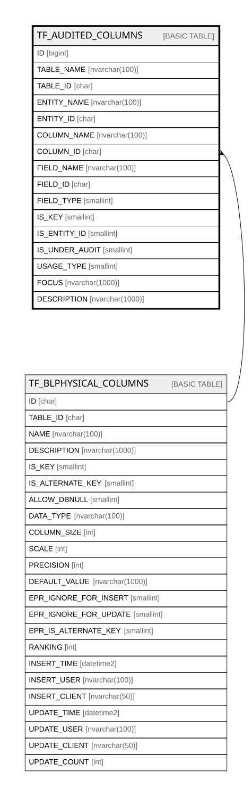

# TF_AUDITED_COLUMNS

## Columns

| Name | Type | Default | Nullable | Parents | Comment |
| ---- | ---- | ------- | -------- | ------- | ------- |
| ID | bigint |  | false |  |  |
| TABLE_NAME | nvarchar(100) |  | false |  |  |
| TABLE_ID | char |  | false |  |  |
| ENTITY_NAME | nvarchar(100) |  | false |  |  |
| ENTITY_ID | char |  | false |  |  |
| COLUMN_NAME | nvarchar(100) |  | false |  |  |
| COLUMN_ID | char |  | false | [TF_BLPHYSICAL_COLUMNS](TF_BLPHYSICAL_COLUMNS.md) |  |
| FIELD_NAME | nvarchar(100) |  | false |  |  |
| FIELD_ID | char |  | false |  |  |
| FIELD_TYPE | smallint |  | false |  |  |
| IS_KEY | smallint |  | false |  |  |
| IS_ENTITY_ID | smallint |  | false |  |  |
| IS_UNDER_AUDIT | smallint |  | false |  |  |
| USAGE_TYPE | smallint |  | true |  |  |
| FOCUS | nvarchar(1000) |  | true |  |  |
| DESCRIPTION | nvarchar(1000) |  | true |  |  |

## Constraints

| Name | Type | Definition |
| ---- | ---- | ---------- |
| PK_AUDITED_COLUMNS | PRIMARY KEY | CLUSTERED, unique, part of a PRIMARY KEY constraint, [ ID ] |
| FK_AUDIT_COL_BLPHYSICALCOLUMNS | FOREIGN KEY | FOREIGN KEY(COLUMN_ID) REFERENCES TF_BLPHYSICAL_COLUMNS(ID) ON UPDATE NO_ACTION ON DELETE CASCADE |

## Indexes

| Name | Definition |
| ---- | ---------- |
| PK_AUDITED_COLUMNS | CLUSTERED, unique, part of a PRIMARY KEY constraint, [ ID ] |
| IDX_AUDITED_COLUMNS | NONCLUSTERED, [ ENTITY_ID, TABLE_NAME, IS_UNDER_AUDIT ] |

## Relations

---

> Generated by [tbls](https://github.com/k1LoW/tbls)
