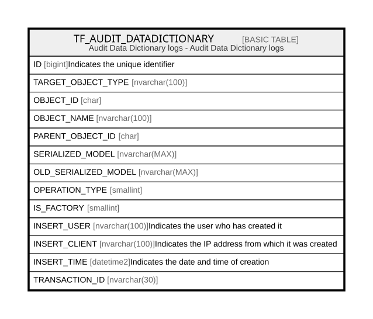

# TF_AUDIT_DATADICTIONARY

## Description

Audit Data Dictionary logs - Audit Data Dictionary logs  

## Columns

| Name | Type | Default | Nullable | Comment |
| ---- | ---- | ------- | -------- | ------- |
| ID | bigint |  | false | Indicates the unique identifier |
| TARGET_OBJECT_TYPE | nvarchar(100) |  | false |  |
| OBJECT_ID | char |  | false |  |
| OBJECT_NAME | nvarchar(100) |  | false |  |
| PARENT_OBJECT_ID | char |  | true |  |
| SERIALIZED_MODEL | nvarchar(MAX) |  | true |  |
| OLD_SERIALIZED_MODEL | nvarchar(MAX) |  | true |  |
| OPERATION_TYPE | smallint |  | false |  |
| IS_FACTORY | smallint |  | false |  |
| INSERT_USER | nvarchar(100) |  | true | Indicates the user who has created it |
| INSERT_CLIENT | nvarchar(100) |  | true | Indicates the IP address from which it was created |
| INSERT_TIME | datetime2 |  | true | Indicates the date and time of creation |
| TRANSACTION_ID | nvarchar(30) |  | true |  |

## Constraints

| Name | Type | Definition |
| ---- | ---- | ---------- |
| PK_AUDIT_DATADICTIONARY | PRIMARY KEY | CLUSTERED, unique, part of a PRIMARY KEY constraint, [ ID ] |

## Indexes

| Name | Definition |
| ---- | ---------- |
| PK_AUDIT_DATADICTIONARY | CLUSTERED, unique, part of a PRIMARY KEY constraint, [ ID ] |
| IDX_AUDIT_DATADICTIONARY | NONCLUSTERED, [ TARGET_OBJECT_TYPE, OBJECT_ID ] |

## Relations

---

> Generated by [tbls](https://github.com/k1LoW/tbls)
