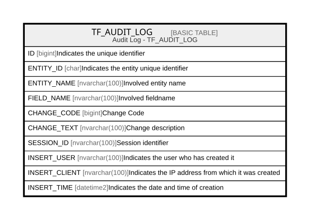

# TF_AUDIT_LOG

## Description

Audit Log - TF_AUDIT_LOG  

## Columns

| Name | Type | Default | Nullable | Comment |
| ---- | ---- | ------- | -------- | ------- |
| ID | bigint |  | false | Indicates the unique identifier |
| ENTITY_ID | char |  | true | Indicates the entity unique identifier |
| ENTITY_NAME | nvarchar(100) |  | true | Involved entity name |
| FIELD_NAME | nvarchar(100) |  | true | Involved fieldname |
| CHANGE_CODE | bigint |  | false | Change Code |
| CHANGE_TEXT | nvarchar(100) |  | true | Change description |
| SESSION_ID | nvarchar(100) |  | true | Session identifier |
| INSERT_USER | nvarchar(100) |  | false | Indicates the user who has created it |
| INSERT_CLIENT | nvarchar(100) |  | false | Indicates the IP address from which it was created |
| INSERT_TIME | datetime2 |  | false | Indicates the date and time of creation |

## Constraints

| Name | Type | Definition |
| ---- | ---- | ---------- |
| PK_AUDIT_LOG | PRIMARY KEY | CLUSTERED, unique, part of a PRIMARY KEY constraint, [ ID ] |

## Indexes

| Name | Definition |
| ---- | ---------- |
| PK_AUDIT_LOG | CLUSTERED, unique, part of a PRIMARY KEY constraint, [ ID ] |
| IDX_AUDITLOGS_LOGDATE | NONCLUSTERED, [ INSERT_TIME ] |

## Relations

---

> Generated by [tbls](https://github.com/k1LoW/tbls)
