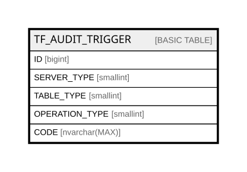

# TF_AUDIT_TRIGGER

## Columns

| Name | Type | Default | Nullable | Comment |
| ---- | ---- | ------- | -------- | ------- |
| ID | bigint |  | false |  |
| SERVER_TYPE | smallint |  | false |  |
| TABLE_TYPE | smallint |  | false |  |
| OPERATION_TYPE | smallint |  | false |  |
| CODE | nvarchar(MAX) |  | false |  |

## Constraints

| Name | Type | Definition |
| ---- | ---- | ---------- |
| PK_AUDIT_TRIGGER | PRIMARY KEY | CLUSTERED, unique, part of a PRIMARY KEY constraint, [ ID ] |

## Indexes

| Name | Definition |
| ---- | ---------- |
| PK_AUDIT_TRIGGER | CLUSTERED, unique, part of a PRIMARY KEY constraint, [ ID ] |

## Relations

---

> Generated by [tbls](https://github.com/k1LoW/tbls)
