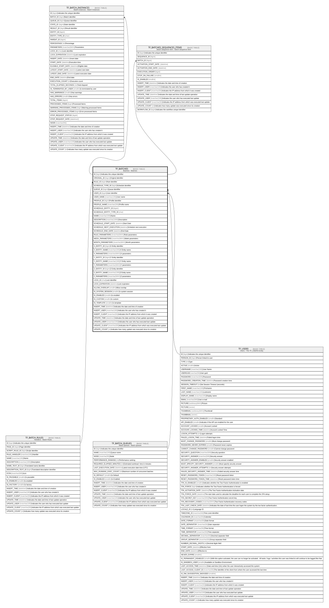

# TF_BATCHES

## Description

Batches - Batches  

## Columns

| Name | Type | Default | Nullable | Children | Parents | Comment |
| ---- | ---- | ------- | -------- | -------- | ------- | ------- |
| ID | bigint |  | false | [TF_BATCH_INSTANCES](TF_BATCH_INSTANCES.md) [TF_BATCHES_SEQUENCES_ITEMS](TF_BATCHES_SEQUENCES_ITEMS.md) |  | Indicates the unique identifier |
| ORIGINAL_ID | bigint |  | true |  |  | Original identifier |
| RULE_ID | bigint |  | false |  | [TF_BATCH_RULES](TF_BATCH_RULES.md) | Rule identifier |
| SCHEDULE_TYPE_ID | bigint |  | false |  |  | Schedule identifier |
| QUEUE_ID | bigint | ((0)) | false |  | [TF_BATCH_QUEUES](TF_BATCH_QUEUES.md) | Queue identifier |
| USER_ID | bigint |  | true |  | [TF_USERS](TF_USERS.md) | User identifier |
| USER_NAME | nvarchar(100) |  | true |  |  | User name |
| PROFILE_ID | bigint |  | true |  |  | Profile identifier |
| PROFILE_NAME | nvarchar(250) |  | true |  |  | Profile name |
| SCHEDULE_ENTITY_ID | bigint |  | true |  |  |  |
| SCHEDULE_ENTITY_TYPE_ID | char |  | true |  |  |  |
| NAME | nvarchar(100) |  | false |  |  | Name |
| DESCRIPTION | nvarchar(1000) |  | true |  |  | Description |
| SCHEDULE_START_DATE | datetime |  | false |  |  | Start Date |
| SCHEDULE_NEXT_EXECUTION | datetime |  | true |  |  | Schedule next execution |
| SCHEDULE_END_DATE | datetime |  | true |  |  | End Date |
| RULE_PARAMETERS | nvarchar(MAX) |  | true |  |  | Rule parameters |
| WEEK_PARAMETERS | nvarchar(MAX) |  | true |  |  | Week parameters |
| MONTH_PARAMETERS | nvarchar(MAX) |  | true |  |  | Month parameters |
| X_ENTITY_ID | bigint |  | true |  |  | X Entity identifier |
| X_ENTITY_NAME | nvarchar(100) |  | true |  |  | X Entity name |
| X_PARAMETERS | nvarchar(MAX) |  | true |  |  | X parameters |
| Y_ENTITY_ID | bigint |  | true |  |  | Y Entity identifier |
| Y_ENTITY_NAME | nvarchar(100) |  | true |  |  | Y Entity name |
| Y_PARAMETERS | nvarchar(MAX) |  | true |  |  | Y parameters |
| Z_ENTITY_ID | bigint |  | true |  |  | Z Entity identifier |
| Z_ENTITY_NAME | nvarchar(100) |  | true |  |  | Z Entity name |
| Z_PARAMETERS | nvarchar(MAX) |  | true |  |  | Z parameters |
| LOCK_ID | char |  | true |  |  | Lock identifier |
| LOCK_EXPIRATION | datetime |  | true |  |  | Lock expiration |
| ALLOW_OVERLAP | smallint | ((0)) | false |  |  | Allow overlap |
| IS_SYSTEM_SESSION | smallint | ((0)) | false |  |  | Is system session |
| IS_ENABLED | smallint | ((0)) | false |  |  | Is enabled |
| IS_CUSTOM | smallint | ((0)) | false |  |  | Is custom |
| IS_TEMPLATE | smallint | ((0)) | false |  |  | Is template |
| INSERT_TIME | datetime2 | (sysutcdatetime()) | false |  |  | Indicates the date and time of creation |
| INSERT_USER | nvarchar(100) | (N'MAIN') | false |  |  | Indicates the user who has created it |
| INSERT_CLIENT | nvarchar(50) | (N'localhost') | false |  |  | Indicates the IP address from which it was created |
| UPDATE_TIME | datetime2 | (sysutcdatetime()) | false |  |  | Indicates the date and time of last update operation |
| UPDATE_USER | nvarchar(100) | (N'MAIN') | false |  |  | Indicates the user who has executed last update |
| UPDATE_CLIENT | nvarchar(50) | (N'localhost') | false |  |  | Indicates the IP address from which was executed last update |
| UPDATE_COUNT | int | ((0)) | false |  |  | Indicates how many update was executed since its creation |

## Constraints

| Name | Type | Definition |
| ---- | ---- | ---------- |
| PK_BATCHES | PRIMARY KEY | CLUSTERED, unique, part of a PRIMARY KEY constraint, [ ID ] |
| FK_BATCH_QUEUES | FOREIGN KEY | FOREIGN KEY(QUEUE_ID) REFERENCES TF_BATCH_QUEUES(ID) ON UPDATE NO_ACTION ON DELETE NO_ACTION |
| FK_BATCHES_RULES | FOREIGN KEY | FOREIGN KEY(RULE_ID) REFERENCES TF_BATCH_RULES(ID) ON UPDATE NO_ACTION ON DELETE NO_ACTION |
| FK_BATCHES_USERS | FOREIGN KEY | FOREIGN KEY(USER_ID) REFERENCES TF_USERS(ID) ON UPDATE NO_ACTION ON DELETE NO_ACTION |

## Indexes

| Name | Definition |
| ---- | ---------- |
| PK_BATCHES | CLUSTERED, unique, part of a PRIMARY KEY constraint, [ ID ] |
| IDX_BATCHES | NONCLUSTERED, [ SCHEDULE_START_DATE ] |
| IDX_BATCHES_CUSTOM_FACTORY | NONCLUSTERED, [ ORIGINAL_ID, IS_CUSTOM ] |

## Relations

---

> Generated by [tbls](https://github.com/k1LoW/tbls)
