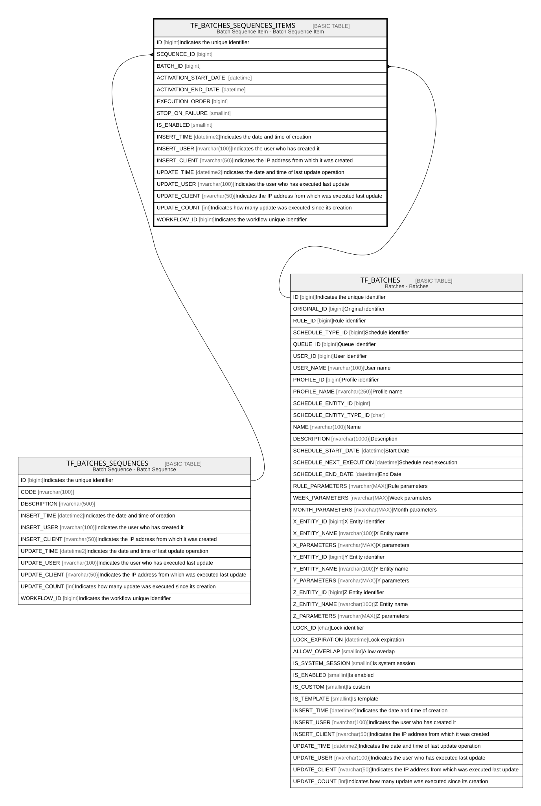

# TF_BATCHES_SEQUENCES_ITEMS

## Description

Batch Sequence Item - Batch Sequence Item  

## Columns

| Name | Type | Default | Nullable | Parents | Comment |
| ---- | ---- | ------- | -------- | ------- | ------- |
| ID | bigint |  | false |  | Indicates the unique identifier |
| SEQUENCE_ID | bigint |  | false | [TF_BATCHES_SEQUENCES](TF_BATCHES_SEQUENCES.md) |  |
| BATCH_ID | bigint |  | false | [TF_BATCHES](TF_BATCHES.md) |  |
| ACTIVATION_START_DATE | datetime |  | true |  |  |
| ACTIVATION_END_DATE | datetime |  | true |  |  |
| EXECUTION_ORDER | bigint | ((0)) | false |  |  |
| STOP_ON_FAILURE | smallint | ((0)) | false |  |  |
| IS_ENABLED | smallint | ((1)) | false |  |  |
| INSERT_TIME | datetime2 | (sysutcdatetime()) | false |  | Indicates the date and time of creation |
| INSERT_USER | nvarchar(100) | (N'MAIN') | false |  | Indicates the user who has created it |
| INSERT_CLIENT | nvarchar(50) | (N'localhost') | false |  | Indicates the IP address from which it was created |
| UPDATE_TIME | datetime2 | (sysutcdatetime()) | false |  | Indicates the date and time of last update operation |
| UPDATE_USER | nvarchar(100) | (N'MAIN') | false |  | Indicates the user who has executed last update |
| UPDATE_CLIENT | nvarchar(50) | (N'localhost') | false |  | Indicates the IP address from which was executed last update |
| UPDATE_COUNT | int | ((0)) | false |  | Indicates how many update was executed since its creation |
| WORKFLOW_ID | bigint |  | true |  | Indicates the workflow unique identifier |

## Constraints

| Name | Type | Definition |
| ---- | ---- | ---------- |
| PK_BATCHES_SEQUENCES_ITEMS | PRIMARY KEY | CLUSTERED, unique, part of a PRIMARY KEY constraint, [ ID ] |
| FK_BATCHES_SEQUENCES_BATCHES | FOREIGN KEY | FOREIGN KEY(BATCH_ID) REFERENCES TF_BATCHES(ID) ON UPDATE NO_ACTION ON DELETE CASCADE |
| FK_BATCHES_SEQUENCES_ITEMS | FOREIGN KEY | FOREIGN KEY(SEQUENCE_ID) REFERENCES TF_BATCHES_SEQUENCES(ID) ON UPDATE NO_ACTION ON DELETE CASCADE |

## Indexes

| Name | Definition |
| ---- | ---------- |
| PK_BATCHES_SEQUENCES_ITEMS | CLUSTERED, unique, part of a PRIMARY KEY constraint, [ ID ] |

## Relations

---

> Generated by [tbls](https://github.com/k1LoW/tbls)
